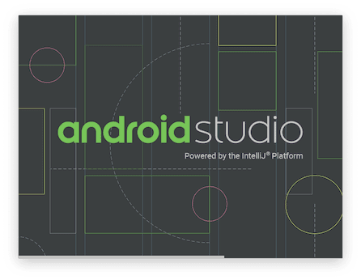
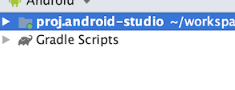
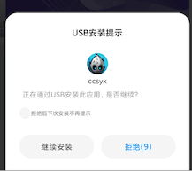
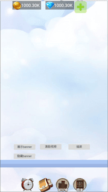
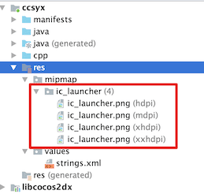

前面已经简单的介绍了如何配置Cocos Creator 原生平台环境，顺便简单的聊了聊导出包后的采坑，已经部分解决方案，接下来说说一些常见的游戏开发操作，记下来便于后续开发的时候查找。
<!--more-->
首先关于如何配置原生环境和导出包的可以参考另外两篇文章：

- [Mac系统Cocos Creator Native 原生Android和ios打包](http://blog.asroads.com/post/d130eaa6.html)
- [CocosCreator导出Android项目采坑指南](http://blog.asroads.com/post/d5575747.html)

其实最好的学习文档莫过于官方文档：

- [Android Gradle 插件版本说明](https://developer.android.com/studio/releases/gradle-plugin?hl=zh-cn)
- [NDK 下载](https://developer.android.google.cn/ndk/downloads/)
- [探索 Android Studio](https://developer.android.com/studio/intro?hl=zh-cn)

虽然官网写了很详细，但有时候我们只是用常见的几种，而且对于 Cocos Creator 生成的项目，最好是有关于 Cocos Creator 定制的 操作 前面介绍的知识点 本文不再赘述，下面介绍一些常见的操作。

### 构建项目-日志查看-更换图标&名字

首先我们假设Cocos Creator 环境已经配置好 我们开始 构建项目。


项目构建成功后 我们使用 Android Studio 打开 项目 项目路径是 build/jsb-link/frameworks/runtime-src/proj.android-studio



一般来说 打开项目 后 会自动构建一次 




如果 没有出现构建 这个进程  可以自己选择 File ->Sync Project With Gradle Files


此时 我们连上 我们的设备后 （需要开始开发者模式 USB调试 ）

这个时候 我们可以点击 debug  或者 运行游戏 此时 我们可以简单的预览游戏效果



如果 出现这个 安装提示 点击 继续安装 即可 



此时 我们可以看到 我们打出的 日志 Log 显示出来了


此时 游戏 可以正常预览。但是 此时 我们游戏 在 安装的后的图标是 


接下来 我们要修改一下我们的游戏的名字，比如我的游戏叫指南针 我们需要更换自定义的

### 更换 图标&名字

#### 图标更换

首先我们自己准备一张 1024X1024 的png 图片 然后打开这个网站 一键生成我们的图标

[图标工厂](http://icon.wuruihong.com/)    网站 [点击进入](http://icon.wuruihong.com/)


此时 我们这个 android 的文件夹 里面就是我们的图标



这个是我们项目原来的图标文件 我们选择替换即可

#### 更换游戏名字

首先 原来 游戏的名字是在这里配置的


```xml
<resources>
    <string name="app_name" translatable="false">ccsyx</string>
</resources>
```

我们修改 "ccsyx" 即可 比如：

```xml
<resources>
    <string name="app_name" translatable="false">指南针</string>
</resources>
```

### 卸载原来安装的 app 重新构建 运行


以上我们成功的 更换了自定义的 游戏名字 和游戏图标。

### 参考

- [【cocos2dx】改安装包名、app名、图标、包名](https://blog.csdn.net/hqq39/article/details/49821607)

