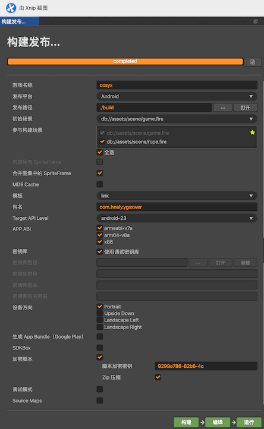
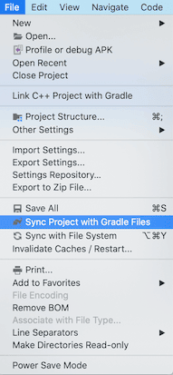
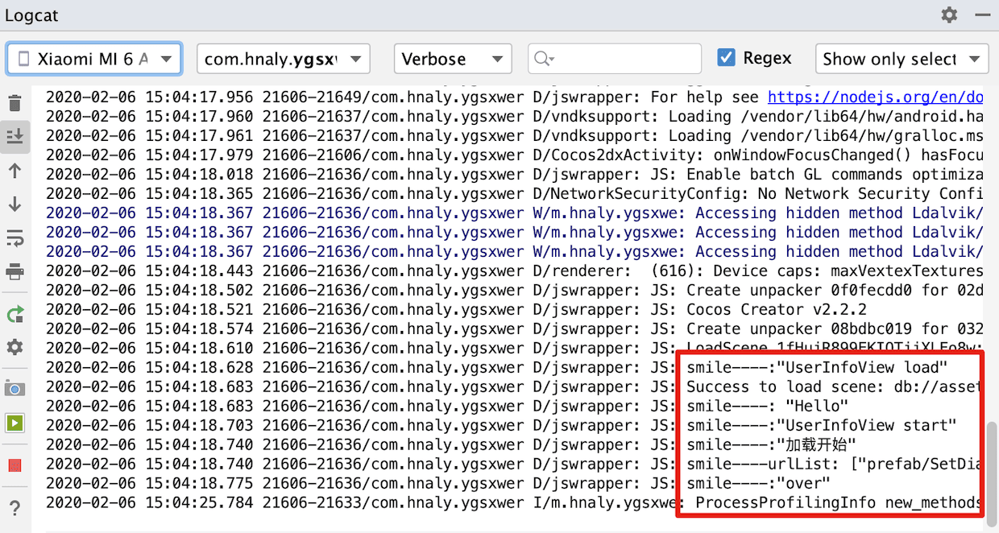
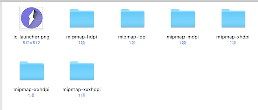

前面已经简单的介绍了如何配置Cocos Creator 原生平台环境，顺便简单的聊了聊导出包后的采坑，已经部分解决方案，接下来说说一些常见的游戏开发操作，记下来便于后续开发的时候查找。
<!--more-->
首先关于如何配置原生环境和导出包的可以参考另外两篇文章：

- [Mac系统Cocos Creator Native 原生Android和ios打包](http://blog.asroads.com/post/d130eaa6.html)
- [CocosCreator导出Android项目采坑指南](http://blog.asroads.com/post/d5575747.html)

其实最好的学习文档莫过于官方文档：

- [Android Gradle 插件版本说明](https://developer.android.com/studio/releases/gradle-plugin?hl=zh-cn)
- [NDK 下载](https://developer.android.google.cn/ndk/downloads/)
- [探索 Android Studio](https://developer.android.com/studio/intro?hl=zh-cn)

虽然官网写了很详细，但有时候我们只是用常见的几种，而且对于 Cocos Creator 生成的项目，最好是有关于 Cocos Creator 定制的 操作 前面介绍的知识点 本文不再赘述，下面介绍一些常见的操作。

### 构建项目-日志查看-更换图标&名字

首先我们假设Cocos Creator 环境已经配置好 我们开始 构建项目。




项目构建成功后 我们使用 Android Studio 打开 项目 项目路径是 build/jsb-link/frameworks/runtime-src/proj.android-studio


一般来说 打开项目 后 会自动构建一次 


如果 没有出现构建 这个进程  可以自己选择 File ->Sync Project With Gradle Files



此时 我们连上 我们的设备后 （需要开始开发者模式 USB调试 ）

这个时候 我们可以点击 debug  或者 运行游戏 此时 我们可以简单的预览游戏效果


如果 出现这个 安装提示 点击 继续安装 即可 


此时 我们可以看到 我们打出的 日志 Log 显示出来了



此时 游戏 可以正常预览。但是 此时 我们游戏 在 安装的后的图标是 


接下来 我们要修改一下我们的游戏的名字，比如我的游戏叫指南针 我们需要更换自定义的

### 更换 图标&名字

#### 图标更换

首先我们自己准备一张 1024X1024 的png 图片 然后打开这个网站 一键生成我们的图标

[图标工厂](http://icon.wuruihong.com/)    网站 [点击进入](http://icon.wuruihong.com/)




此时 我们这个 android 的文件夹 里面就是我们的图标


这个是我们项目原来的图标文件 我们选择替换即可

#### 更换游戏名字

首先 原来 游戏的名字是在这里配置的


```xml
<resources>
    <string name="app_name" translatable="false">ccsyx</string>
</resources>
```

我们修改 "ccsyx" 即可 比如：

```xml
<resources>
    <string name="app_name" translatable="false">指南针</string>
</resources>
```

### 卸载原来安装的 app 重新构建 运行


以上我们成功的 更换了自定义的 游戏名字 和游戏图标。

### 更改Cocos Creator apk 默认输出的名字

这个网上有很多方法：

我这边 最后验证成功的是：需要在 `build.gradle`文件内的 `android.applicationVariants.all` 里面配置

大概结构：

```groovy
android.applicationVariants.all { variant ->
    // delete previous files first
    delete "${buildDir}/intermediates/merged_assets/${variant.dirName}"

    variant.mergeAssets.doLast {
        def sourceDir = "${buildDir}/../../../../.."
        .........
        .........
        if (variant.buildType.name == 'release') {
        ..........
        }
    }
}
```

具体细节：

```groovy
 if (variant.buildType.name == 'release') {
        def buildTypeName = variant.buildType.name
        def createTime = new Date().format("YYYY-MM-dd HH-mm-ss", TimeZone.getTimeZone("GMT+08:00"))
        def releaseFileName = "${buildTypeName}-mobile ${createTime}"
//        def releaseApkName = "${project.name}-${android.defaultConfig.versionName}-${android.defaultConfig.versionCode}-${buildTypeName}.apk"
        def releaseApkName = "${project.name}-${android.defaultConfig.versionName}-${buildTypeName}.apk"
        println("版本名称--->" + android.defaultConfig.versionName + " 版本号--->" + android.defaultConfig.versionCode)
//        println(variant.getPackageApplication().outputDirectory)
//        println(createTime)
//        println(project.name)
//        println(rootProject.name)
        //新建一个文件夹 然后把输出app 放到新建的文件夹内
        variant.getPackageApplication().outputDirectory = new File(variant.getPackageApplication().outputDirectory,releaseFileName)
        variant.getPackageApplication().outputScope.apkDatas.forEach { apkData ->
            //这个修改输出APK的文件名
            println(apkData.outputFileName)
            apkData.outputFileName = releaseApkName
            println(apkData.outputFileName)
        }
    }
```

最初的输出路径：是在原有的  “release”目录下新建一个带时间 目录 （参考Xcode）然后修改APK 名字

效果如下：


#### Grade 升级后对应的改变  2021-01-08 更新

主要就是路径的修改 

将`variant.getPackageApplication()`替换为`variant.getPackageApplicationProvider().get()`

```groovy
    if (variant.buildType.name == 'release') {
        def buildTypeName = variant.buildType.name
        //渠道名称
        def flavorName = variant.flavorName
        def createTime = new Date().format("YYYY-MM-dd HH-mm-ss", TimeZone.getTimeZone("GMT+08:00"))
        def releaseFileName = "${buildTypeName}-${variant.versionName}-mobile-${createTime}"
        //def releaseApkName = "${project.name}-${android.defaultConfig.versionName}-${android.defaultConfig.versionCode}-${buildTypeName}.apk"
        //def releaseApkName = "${project.name}-${android.defaultConfig.versionName}-${buildTypeName}.apk"
        def releaseApkName = "${project.name}-${variant.versionName}-${buildTypeName}.apk"
//        println("版本名称--->" + android.defaultConfig.versionName + " 版本号--->" + android.defaultConfig.versionCode)
        println("版本名称--->" + variant.versionName + " 版本号--->" + variant.versionCode)
//        println(project.rootDir.absolutePath)
//        println(flavorName)
//        println(releaseFileName)
//        println(variant.dirName)
//        println(releaseApkName)
//        println(variant.versionName)
//        println(buildDir.getAbsolutePath())
//        println(buildDir.getCanonicalPath())
//        println(buildDir.getParentFile().path)
        //如果是正式包,将其输入到指定文件夹
//        def apkDir = buildDir.getAbsolutePath()+"\\outputs\\apk\\"+flavorName+"\\"+buildType
        //设置build安装包输出路径
//        variant.getPackageApplicationProvider().get().outputDirectory =  file(apkDir)

        //println(project.name)
        //println(rootProject.name)
        //新建一个文件夹 然后把输出app 放到新建的文件夹内
//        variant.getPackageApplication().outputDirectory = new File(variant.getPackageApplication().outputDirectory,releaseFileName)
//        variant.getPackageApplicationProvider().get().outputDirectory = new File(variant.getPackageApplicationProvider().get().outputDirectory,releaseFileName)
//        def apkDir = "${project.projectDir.absolutePath}/${variant.buildType.name}/${variant.flavorName}/${variant.versionName}"
        def apkDir = "${project.projectDir.absolutePath}/${variant.buildType.name}/${releaseFileName}"
        println(apkDir)
        variant.packageApplicationProvider.get().outputDirectory = new File(apkDir)
        variant.outputs.all { apkData ->
            println(apkData.outputFileName)
            apkData.outputFileName = releaseApkName
            println(apkData.outputFileName)
        }
        // 不同版本更改输出apk文件名方式
        /**
         *  gradleVersion 小于4.0
         */
        /*  variant.getPackageApplicationProvider().get().outputScope.apkDatas.forEach { apkData ->
              apkData.outputFileName = path
          }*/
        /*      *//**
         *  gradleVersion 大于4.0
         *//*
        variant.outputs.forEach {
            it.apkData.outputFileName = path
        }*/
        /**
         *  gradleVersion 大于4.1
         */
//        variant.outputs.forEach {apkData ->
//            println(apkData.outputFileName)
//            apkData.outputFileName = releaseApkName
//            println(apkData.outputFileName)
//        }
//        variant.getPackageApplication().outputScope.apkDatas.forEach { apkData ->
//            //这个修改输出APK的文件名
//            println(apkData.outputFileName)
//            apkData.outputFileName = releaseApkName
//            println(apkData.outputFileName)
//        }
    }
```


**附录：参考链接代码引用**

> 参考1
> Gradle升级了3.0后，output.outputFile变成了只读属性，不能再往里面写东西了
>
> Gradle3.0之后的配置
>
> ```groovy
>     android.applicationVariants.all { v ->
>         v.outputs.all {
>             /*指定输出到 ${project}/outputs/apk/release文件夹下*/
>             v.getPackageApplication().outputDirectory = new File(project.rootDir.absolutePath + "/outputs/apk/release")
>             /*修改输出apk名字*/
>             outputFileName = "testAPP.apk"
>         }
>     }
> ```
>
> 参考2
>
> ```groovy
> android {
>     applicationVariants.all { variant ->
>         variant.outputs.all { output ->
>             variant.packageApplicationProvider.get().outputDirectory = new File("path/to/output/dir")
>             outputFileName = "output_file_name.apk"
>         }
>     }
> }
> ```
>
> 需要注意：
>
> 1.如果是多种build type或多种flavor同时打包，记得在输出文件夹路径或文件名中引用相关变量。
>
> 2.Android Studio调试时，并不认输出目录，也就是编译打包会输出到指定目录下，但是Android Studio还是会在默认目录寻找apk，找不到就会报错，不会自动安装。
>
> 参考3 csdn 博客（文章有权限需要关注）

> ```groovy
>    applicationVariants.all { variant ->
>    // 打包完成后复制到的目录
>         def outputFileDir = "${project.projectDir.absolutePath}/${variant.buildType.name}/${variant.flavorName}/${variant.versionName}"
>     
> 
> //  此处可以根据需求配置相关渠道的默认输出路径,默认输出路径为“app/build/outputs/apk/${variant.flavorName}“”
> //        if (variant.buildType.name == "release"&&variant.flavorName == "online") {
> //            println("outputDirectory1:${variant.getPackageApplicationProvider().get().outputDirectory}")
> //            variant.getPackageApplicationProvider().get().outputDirectory = new File(outputFileDir)
> //        }
>       //确定输出文件名
>         def today = new Date()
>         def path = ((project.name != "app") ? project.name : rootProject.name.replace(" ","")) + "_" +
>                 variant.flavorName + "_" +
>                 variant.buildType.name + "_"+
>                 variant.versionName + "_" +
>                 today.format('yyyyMMddhhmm') +
>                 ".apk"
>         // 不同版本更改输出apk文件名方式
>         /**
>          *  gradleVersion 小于4.0
>          */
>         /*  variant.getPackageApplicationProvider().get().outputScope.apkDatas.forEach { apkData ->
>               apkData.outputFileName = path
>           }*/
>   /*      *//**
>          *  gradleVersion 大于4.0
>          *//*
>         variant.outputs.forEach {
>             it.apkData.outputFileName = path
>         }*/
>         /**
>          *  gradleVersion 大于4.1
>          */
>         variant.outputs.forEach {
>             it.outputFileName = path
>         }
> 	// 打包完成后做的一些事,复制apk到指定文件夹,复制mapping等
>         variant.assemble.doLast {
>             File out = new File(outputFileDir)
>             copy {
>                 from variant.mappingFile
>                 into  out
>                 rename {
>                     String fileName -> "${variant.buildType.name}-${variant.flavorName}-mapping-${variant.versionName}.txt"
>                 }
>                 variant.outputs.forEach{ file->
>                     copy{
>                         from file.outputFile
>                         into out
>                     }
>                 }
>             }
>         }
>     }
> 
> ```
>
> 

### API 'variant.getMergeAssets()' is obsolete and has been replaced with 'variant.getMergeAssetsProvider()'.


```shell
API 'variant.getMergeAssets()' is obsolete and has been replaced with 'variant.getMergeAssetsProvider()'.
It will be removed at the end of 2019.
For more information, see https://d.android.com/r/tools/task-configuration-avoidance.
To determine what is calling variant.getMergeAssets(), use -Pandroid.debug.obsoleteApi=true on the command line to display more information.
```

这个是升级 gradle 插件 和 gradle 版本后遇到的，直接打包后的不会遇到这个问题

看到这个警告的时候，我全局搜索了这个 `variant.getMergeAssets()`并没有找到这个，很奇怪，后面去网上搜索了才知道是

需要把  `variant.mergeAssets.doLast {`
换成
`variant.mergeAssetsProvider.get().doLast {`

这样 警告就消失了！

参考地址 [Cocos2d-x 3.17 and android studio 3.3 build Issue or Error?](https://discuss.cocos2d-x.org/t/cocos2d-x-3-17-and-android-studio-3-3-build-issue-or-error/45503)

> Just change string `variant.mergeAssets.doLast {`
> to
> `variant.mergeAssetsProvider.get().doLast {`

### 警告API 'variant.getMergeAssets()' is obsolete and has been replaced with 'variant.getMergeAssetsProvider()'.

解决方法：`variant.mergeAssets.doLast` 替换为 `variant.mergeAssetsProvider.get().doLast`


### 错误：Error: Invoke-customs are only supported starting with Android O (--min-api 26)

将代码添加到app的build.gradle的android节点下

```groovy
compileOptions {
        sourceCompatibility JavaVersion.VERSION_1_8
        targetCompatibility JavaVersion.VERSION_1_8
 }
```

### 升级完 打release包出现的错误

```sh
Error:Execution failed for task ':app:lintVitalRelease'. > Invalid main APK outputs : BuildOutput{apkInfo={type=MAIN, versionCode=0, filters=[]}, path=/Users/junan/Desktop/svnall/android/youcai_android/app/release/.DS_Store, properties=}
```

#### 解决方法1：

参考 [Android studio 4.0 update is giving lint infrastructure error, when used with gradle 6.1.1](https://stackoverflow.com/questions/62801499/android-studio-4-0-update-is-giving-lint-infrastructure-error-when-used-with-gr)

[Android Studio Build APK没有报错，但是Generate signed apk报错](https://www.shuzhiduo.com/A/MyJxX8XeJn/)

在`app`的`build.gradle`文件中添加

```groovy
android { 
    compileSdkVersion 28
    ...
    }
   
    //Invoke-customs are only supported starting with Android O (--min-api 26)
    android{
        compileOptions{
            sourceCompatibility JavaVersion.VERSION_1_8
            targetCompatibility JavaVersion.VERSION_1_8
        }
    }
}

```

#### 解决方法2：

参考 [Caused by: java.lang.reflect.InvocationTargetException](https://www.codetd.com/article/11976085)

解决方法：删除release目录下所有文件（这个其实是打出包的地方，因为我用了自定义修改名字，以前是支持多个包同时存在）

这样重新打包，正常出包。网上有人说打release包前，先打个debug包就好了，这个我没有测试，大家自己可以试试看。

> 里面并没有报是哪行代码或者哪些配置出错，搞得一脸懵。
>
> 搜索了下，基本上都是提示`Java反射异常`，What？？？之前打包都没问题，而且近期没有新增 Java 反射代码。
>
> 真是无从入手。
>
> 后面仔细看了异常日志，发现还报了这个异常：
>
> ```bash
> Caused by: java.lang.RuntimeException: Invalid main APK outputs : 
> EarlySyncBuildOutput(type=com.android.build.gradle.internal.scope.InternalArtifactType$APK@1c0767aa, 
> apkType=MAIN, filtersData=[], version=0, 
> output=/Users/bujinshidemao/Desktop/release/.DS_Store),
> EarlySyncBuildOutput(type=com.android.build.gradle.internal.scope.InternalArtifactType$APK@1c0767aa, 
> apkType=MAIN, filtersData=[], version=0, 
> output=/Users/bujinshidemao/Desktop/release/灵感.apk),
> EarlySyncBuildOutput(type=com.android.build.gradle.internal.scope.InternalArtifactType$APK@1c0767aa, 
> apkType=MAIN, filtersData=[], version=0, 
> output=/Users/bujinshidemao/Desktop/release/灵感_正式_26.apk)
> ```
>
> 初步看了下，是输出 Apk 的时候报的异常，并且关联到了之前的打包版本，于是，我采取了以下操作：
>
> - **删除输出路径**
> - **重新打包**
>
> 打包成功！

### Could not resolve all files for configuration ':app:debugCompileClasspath'.解决方案

解决方案如下： 
在project级别下的build.gradle文件中添加如下代码：

```groovy
buildscript {
 
    repositories {
        google()
        jcenter()
    }
    dependencies {
        classpath 'com.android.tools.build:gradle:3.1.1' //这里不用和我一样，和你项目里面的版本一样就行
        classpath 'com.google.gms:google-services:4.0.1'  //这行对谷歌服务库进行依赖
 
    }
}
 
allprojects {
    repositories {
        google()
        jcenter()
        mavenCentral ()
        maven {url 'https://dl.bintray.com/jetbrains/anko'} //这是你需要加入的，这个是解决这个问题的关键地方，我就是添加这个maven后不再报上面的错误了
        maven {url "https://maven.google.com"} //谷歌广告
    }
}
 
task clean(type: Delete) {
    delete rootProject.buildDir
}
```


### 参考

- [【cocos2dx】改安装包名、app名、图标、包名](https://blog.csdn.net/hqq39/article/details/49821607)
- [gradle脚本配置 记录](https://www.jianshu.com/p/b6c3f951b281)
- [使用Gradle管理你的Android Studio工程](https://www.flysnow.org/2015/03/30/manage-your-android-project-with-gradle.html)
- [android studio 打包自动生成版本号与日期，apk输入路径](https://blog.csdn.net/swer0808/article/details/78999949)
- [gradle 3.3 修改打包apk路径](https://www.jianshu.com/p/e088b6f1a59a)
- [Gradle 3.4.0以上版本自定义apk输出目录和输出文件名](https://imlushen.com/custom-gradle-apk-output-dir-and-filename/)
- [解决Android更新Gradle 报 'variantOutput.getPackageApplication()' is obsolete replace getPackageApplicati-CSDN](https://blog.csdn.net/jiabaokang/article/details/97772767)
- [最新最全Android Gradle 自定义打包输出路径和文件名,并复制到某一文件夹](https://blog.csdn.net/smallbabylong/article/details/111276762)
- [Cocos2d-x 3.17 and android studio 3.3 build Issue or Error?](https://discuss.cocos2d-x.org/t/cocos2d-x-3-17-and-android-studio-3-3-build-issue-or-error/45503)
- [Android Studio 升级3.4，Gradle升级5.1遇到的问题](https://blog.csdn.net/yechaoa/article/details/91040006)
- [Error: Invoke-customs are only supported starting with Android O (--min-api 26)- CSDN](https://blog.csdn.net/csdn9228/article/details/90905430)
- [Execution failed for task ':app:lintVitalRelease'. Invalid main APK outputs- CSDN](https://blog.csdn.net/aj2722465/article/details/79876885)
- [Android studio error : API ‘variant.getMergeAssets()’ is obsolete-cocos论坛](https://discuss.cocos2d-x.org/t/android-studio-error-api-variant-getmergeassets-is-obsolete/46978)
- [Caused by: java.lang.reflect.InvocationTargetException](https://www.codetd.com/article/11976085)
- [Could not resolve all files for configuration ':app:debugCompileClasspath'.解决方案](https://blog.csdn.net/yangaiyu/article/details/91411739)
