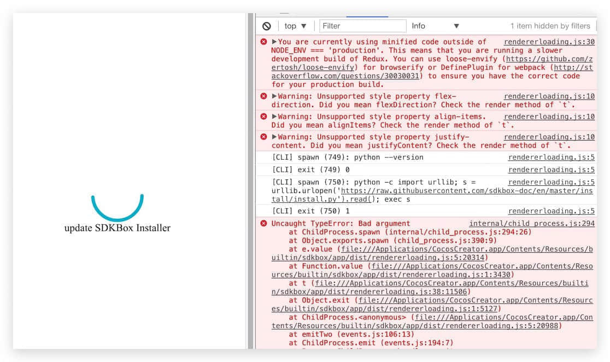
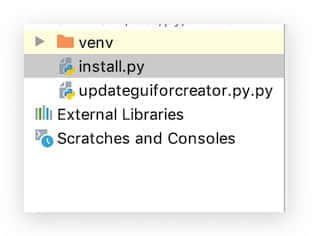
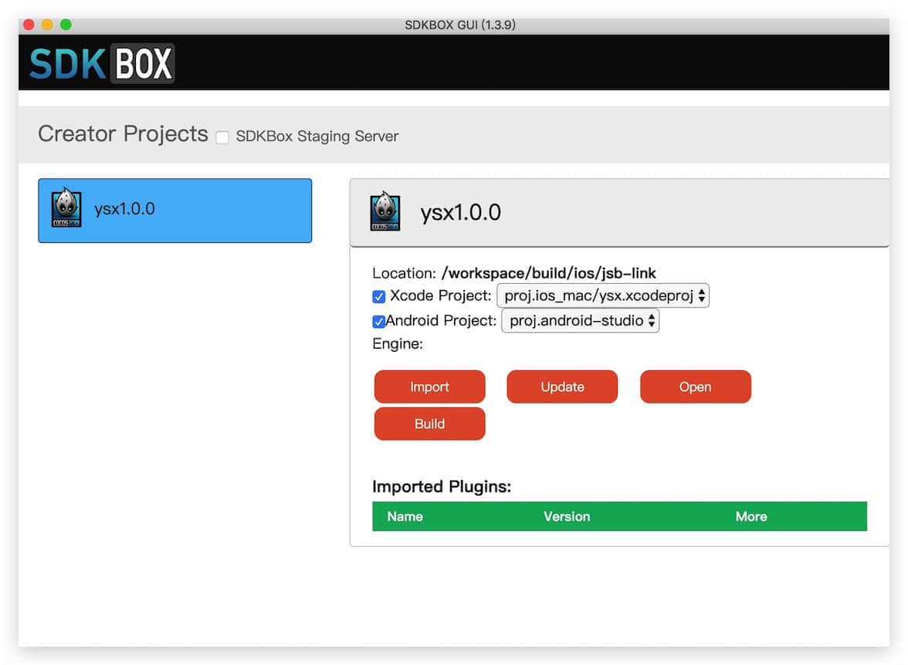

在使用Cocos Creator的时候 使用 Creator 自带的菜单 每次打开SDKBox 界面总是卡着 使用 command + alit +i 快捷键查看是一直报错。自己也检查了Python版本 都没有什么问题。用了很多办法都无解，后来升级了最新的Creator 根据提示，打开页面，恍然大悟，之前打开过这个页面只是没有注意。

<!--more-->
首先我们打开 Creator 运行是报错




自己查看了 Python版本 也是正确的

这个时候，问题陷入了僵局，找了很多办法都没有解决，后面打开最新的Creator 一个链接

[手动安装更新 SDKBox](https://docs.sdkbox.com/zh/qa/sdkbox_installer_issue/)

使用 手动方式，终于解决

首先 新建两个 Python脚本 



install.py 地址：https://raw.githubusercontent.com/sdkbox-doc/en/master/install/install.py

```python
#!/usr/bin/env python
# -*- coding: utf-8 -*-

import os
import sys
import urllib2
import json
import hashlib
import platform
import zipfile
import stat
import random

# install command
# python -c """import urllib; s = urllib.urlopen('https://raw.githubusercontent.com/sdkbox-doc/en/master/install/install.py').read(); exec(s)"""


class Utils:

    """ platforms """
    PLATFORM_MAC = 1
    PLATFORM_WINDOWS = 2
    PLATFORM_LINUX = 3

    @staticmethod
    def curl(url, destination=None, chunk_size=None, callback=None):
        try:
            response = urllib2.urlopen(url)
            content_length = 0
            if(response.headers.has_key('content-length')):
                    content_length = response.headers['content-length']
            if None == chunk_size or content_length == 0:
                data = response.read()
            else:
                data = ''
                size = 0
                total_size = content_length
                while True:
                    chunk = response.read(chunk_size)
                    if not chunk:
                        break
                    size += len(chunk)
                    if None != callback:
                        callback(size, total_size)
                    data += chunk
        except Exception as e:
            print('ERROR! url:' + url)
            return None
        if None != destination:
            Utils.create_dir_if(destination)
            f = open(destination, 'wb')
            if not f:
                print('ERROR! can not open file:' + destination)
                return None
            f.write(data)
            f.close()
        if None != callback:  # the cursor flyback needs a blank line after
            print ''
        return data

    @staticmethod
    def progress_bar(amount, total, width=35):
        perc = 100 * int(amount) / int(total)
        on = width * perc / 100
        off = width - on
        s = '[' + on * '#' + off * ' ' + '] ' + str(perc) + '%'
        if Utils.platform() == Utils.PLATFORM_WINDOWS:
            print s + '\r',
        else:
            print s + '\033[1A'

    @staticmethod
    def create_dir_if(path):
        if os.path.exists(path):
            return
        if path.endswith('/'):
            os.makedirs(path)
            return
        else:
            dir_name = os.path.dirname(path)
            if not os.path.exists(dir_name):
                os.makedirs(dir_name)

    @staticmethod
    def calculate_sha1(data):
        hasher = hashlib.sha1()
        hasher.update(data)
        sha1 = hasher.hexdigest()
        return sha1

    @staticmethod
    def platform():
        p = platform.system()
        if p == 'Windows':
            return Utils.PLATFORM_WINDOWS
        elif p.startswith('Linux'):
            return Utils.PLATFORM_LINUX
        elif p == 'Darwin':
            return Utils.PLATFORM_MAC
        raise RuntimeError('unsupported platform ' + p)

    @staticmethod
    def unzip_file(path, dir = None):
        if path.endswith('.zip'):
            f = open(path, 'rb')
            dir_name = dir
            if not dir_name:
                dir_name = os.path.dirname(path)
            z = zipfile.ZipFile(f)
            for info in z.infolist():
                n = info.filename
                outfile = open(os.path.join(dir_name, n), 'wb')
                try:
                    data = z.read(n)
                except:
                    raise RuntimeError('failed to find ' + n + 'in archive ' + path + name)
                outfile.write(data)
                outfile.close()
                unix_attributes = info.external_attr >> 16
                if unix_attributes:
                    os.chmod(os.path.join(dir_name, n), unix_attributes)
            f.close()

class Env(object):
    """docstring for Env"""

    BASH_FILES = ['.bash_profile', '.bash_login', '.profile']
    ZSH_FILES = ['.zshrc']
    BASH_LINUX_FILES = ['.bashrc']

    @staticmethod
    def set_env_if(key, val):
        value = Env.find_env_value(key)
        if value == val:
            print('INFO need not set environment variable:%s' % key)
            return False
        return Env.set_env(key, val)

    @staticmethod
    def set_env(key, val):
        if Utils.PLATFORM_MAC == Utils.platform():
            Env.set_env_unix(key, val)
        elif Utils.PLATFORM_WINDOWS == Utils.platform():
            Env.set_env_win(key, val)
            Env.add_windows_path_if(os.path.join(val, 'bin'))

    @staticmethod
    def set_env_unix(key, val):
        file_path = Env.get_env_file()
        file = open(file_path, 'a')
        file.write('\n# Add environment variable %s for sdkbox installer\n' % key)
        file.write('export %s=%s\n' % (key, val))
        file.write('export PATH=${%s}/bin:$PATH\n' % key)
        file.close()
        print('INFO Please execute command: "source %s" to make added system variables take effect' % file_path)
        return True

    @staticmethod
    def set_env_win(key, val):
        ret = False
        import _winreg
        try:
            env = None
            env = _winreg.OpenKeyEx(_winreg.HKEY_CURRENT_USER,
                                    'Environment',
                                    0,
                                    _winreg.KEY_SET_VALUE | _winreg.KEY_READ)
            _winreg.SetValueEx(env, key, 0, _winreg.REG_SZ, val)
            _winreg.FlushKey(env)
            _winreg.CloseKey(env)
            ret = True
        except Exception:
            if env:
                _winreg.CloseKey(env)
            ret = False

        if ret:
            print('\nPlease restart the terminal or restart computer to make added system variables take effect\n')

        return ret

    @staticmethod
    def add_windows_path_if(add_dir):
        ret = False
        import _winreg
        try:
            env = None
            path = None
            env = _winreg.OpenKeyEx(_winreg.HKEY_CURRENT_USER,
                                    'Environment',
                                    0,
                                    _winreg.KEY_SET_VALUE | _winreg.KEY_READ)
            path = _winreg.QueryValueEx(env, 'Path')[0]

            # add variable if can't find it in PATH
            path_lower = path.lower()
            add_dir_lower = add_dir.lower()
            if (path_lower.find(add_dir_lower) == -1):
                path = add_dir + ';' + path
                _winreg.SetValueEx(env, 'Path', 0, _winreg.REG_SZ, path)
                _winreg.FlushKey(env)

            _winreg.CloseKey(env)
            ret = True
        except Exception:
            if not path:
                path = add_dir
                _winreg.SetValueEx(env, 'Path', 0, _winreg.REG_SZ, path)
                _winreg.FlushKey(env)
                ret = True
            else:
                _winreg.SetValueEx(env, 'Path', 0, _winreg.REG_SZ, path)
                _winreg.FlushKey(env)
                ret = False

            if env:
                _winreg.CloseKey(env)

        if ret:
            print("INFO add directory \"%s\" into PATH succeed!\n" % add_dir)
        else:
            print("INFO add directory \"%s\" into PATH failed!\n" % add_dir)


    @staticmethod
    def get_env_file():
        file_list = Env.get_env_file_list()
        home = os.path.expanduser('~')
        target_file = None
        for file_name in file_list:
            file_path = os.path.join(home, file_name)
            if os.path.exists(file_path):
                target_file = file_path
                break

        if target_file is None:
            target_file = os.path.join(home, file_list[0])
            file_obj = open(target_file, 'w')
            file_obj.close()

        return target_file

    @staticmethod
    def is_zsh():
        shellItem = os.environ.get('SHELL')
        if shellItem is not None:
            if len(shellItem) >= 3:
                return shellItem[-3:] == "zsh"
        return False

    @staticmethod
    def get_env_file_list():
        if Utils.PLATFORM_WINDOWS == Utils.platform():
            return None
        elif Utils.PLATFORM_MAC == Utils.platform():
            if Env.is_zsh():
                return Env.ZSH_FILES
            else:
                return Env.BASH_FILES
        elif Utils.PLATFORM_LINUX == Utils.platform():
            if Env.is_zsh():
                return Env.ZSH_FILES
            else:
                return Env.BASH_LINUX_FILES

    @staticmethod
    def find_env_value(key):
        value = None
        try:
            value = os.environ[key]
            if not value:
                raise Exception('environment variable %s is not exist' % key)
            return value
        except Exception, e:
            # variable not exist, use another way to search
            pass

        if Utils.PLATFORM_MAC == Utils.platform():
            file_list = Env.get_env_file_list()
            home = os.path.expanduser('~')
            target_file = None
            for file_name in file_list:
                value = Env.search_env_variable(os.path.join(home, file_name), key)
                if value:
                    break
        elif Utils.PLATFORM_WINDOWS == Utils.platform():
            import _winreg
            try:
                env = None
                env = _winreg.OpenKeyEx(_winreg.HKEY_CURRENT_USER,
                                        'Environment',
                                        0,
                                        _winreg.KEY_READ)

                value = _winreg.QueryValueEx(env, key)[0]
                _winreg.CloseKey(env)
            except Exception:
                if env:
                    _winreg.CloseKey(env)
                value = None

        return value

    @staticmethod
    def search_env_variable(file_name, key_name):
        if not os.path.isfile(file_name):
            return None

        import re
        str_re = r'^export[ \t]+%s=(.+)' % key_name
        patten = re.compile(str_re)
        ret = None
        for line in open(file_name):
            str1 = line.lstrip(' \t')
            match = patten.match(str1)
            if match is not None:
                ret = match.group(1)

        return ret


def check_installer(sdkbox_dir):
    sdkbox_file = os.path.join(sdkbox_dir, 'bin', 'sdkbox')
    return os.path.isfile(sdkbox_file)

def download_installer(path, info):
    response = Utils.curl(info['url'], None, 1024, Utils.progress_bar)
    sha1 = Utils.calculate_sha1(response)
    if sha1 != info['sha1']:
        raise RuntimeError('ERROR! SHA1 of update does not match\nFound  : {0}\nNeeded : {1}'.format(sha1, info['sha1']))

    try:
        Utils.create_dir_if(path)
        f = open(path, 'wb')
        f.write(response)
        f.close()
    except:
        raise RuntimeError('ERROR! failed to save updated SDKBOX')

    return path

def get_installer_url():
    url = 'http://download.sdkbox.com/installer/v1/manifest.json'
    data = Utils.curl(url, None, 1024, None)
    if not data or 0 == len(data):
        raise Exception('ERROR! load manifest fail')
    manifest = json.loads(data)

    key = 'packages'
    if key not in manifest:
        raise Exception('ERROR! manifest format error')
    manifest = manifest[key]

    key = 'SDKBOX'
    if key not in manifest:
        raise Exception('ERROR! manifest format error')
    manifest = manifest[key]

    key = 'versions'
    if key not in manifest:
        raise Exception('ERROR! manifest format error')
    manifest = manifest[key]

    keys = manifest.keys()
    keys.sort()
    l = keys[-1:]
    if len(l):
        l = l[0]
    manifest = manifest[l]

    if 'bundle' not in manifest or 'sha1' not in manifest:
        raise Exception('ERROR! manifest format error')

    return {'url': 'http://download.sdkbox.com/installer/v1/{0}?v{1}.{2}'.format(manifest['bundle'], l, random.randint(0, 10000000)), 'bundle':manifest['bundle'], 'sha1': manifest['sha1']}

def main():
    SDKBOX_DIR = os.path.join(os.path.expanduser('~'), '.sdkbox')
    ENV_SDKBOX_HOME = 'SDKBOX_HOME'

    # 1. check instller if installed
    if check_installer(SDKBOX_DIR):
        print('SDKBox installer have been installed')
        sys.exit(0)

    # 2. get installer info (url, name, sha1) from remote manifest
    info = get_installer_url()

    # 3. download installer
    path = os.path.join(SDKBOX_DIR, 'bin', info['bundle'])
    print('Download SDKBox installer ...')
    download_installer(path, info)

    # 4. unzip installer zip
    Utils.unzip_file(path)

    # 5. set env for sdkbox installer
    Env.set_env_if(ENV_SDKBOX_HOME, os.path.join(SDKBOX_DIR))

    print('SUCCESS! SDBOX installer have been installed.')
    print('Next, type "sdkbox -h" to see the usage help.')

if __name__ == '__main__':
    main()

```

updateguiforcreator.py.py 

地址：https://raw.githubusercontent.com/sdkbox-doc/en/master/install/updateguiforcreator.py

 

```python
#!/usr/bin/env python
# -*- coding: utf-8 -*-

import os
import sys
import urllib2
import json
import hashlib
import platform
import zipfile
import shutil
import stat

# update sdkbox creator gui command
# python -c """import urllib; s = urllib.urlopen('https://raw.githubusercontent.com/sdkbox-doc/en/master/install/updateguiforcreator.py').read(); exec(s)"""


class Utils:

    """ platforms """
    PLATFORM_MAC = 1
    PLATFORM_WINDOWS = 2
    PLATFORM_LINUX = 3

    @staticmethod
    def curl(url, destination=None, chunk_size=None, callback=None):
        try:
            response = urllib2.urlopen(url)
            if None == chunk_size:
                data = response.read()
            else:
                data = ''
                size = 0
                total_size = response.headers['content-length']
                while True:
                    chunk = response.read(chunk_size)
                    if not chunk:
                        break
                    size += len(chunk)
                    if None != callback:
                        callback(size, total_size)
                    data += chunk
        except Exception as e:
            print('ERROR! url:' + url)
            return None
        if None != destination:
            Utils.create_dir_if(destination)
            f = open(destination, 'wb')
            if not f:
                print('ERROR! can not open file:' + destination)
                return None
            f.write(data)
            f.close()
        if None != callback:  # the cursor flyback needs a blank line after
            print ''
        return data

    @staticmethod
    def progress_bar(amount, total, width=35):
        perc = 100 * int(amount) / int(total)
        on = width * perc / 100
        off = width - on
        s = '[' + on * '#' + off * ' ' + '] ' + str(perc) + '%'
        if Utils.platform() == Utils.PLATFORM_WINDOWS:
            print s + '\r',
        else:
            print s + '\033[1A'

    @staticmethod
    def create_dir_if(path):
        if os.path.exists(path):
            return
        if path.endswith('/'):
            os.makedirs(path)
            return
        else:
            dir_name = os.path.dirname(path)
            if not os.path.exists(dir_name):
                os.makedirs(dir_name)

    @staticmethod
    def calculate_sha1(data):
        hasher = hashlib.sha1()
        hasher.update(data)
        sha1 = hasher.hexdigest()
        return sha1

    @staticmethod
    def platform():
        p = platform.system()
        if p == 'Windows':
            return Utils.PLATFORM_WINDOWS
        elif p.startswith('Linux'):
            return Utils.PLATFORM_LINUX
        elif p == 'Darwin':
            return Utils.PLATFORM_MAC
        raise RuntimeError('unsupported platform ' + p)

    @staticmethod
    def unzip_file(path, dir = None):
        if path.endswith('.zip'):
            dir_name = dir
            if not dir_name:
                dir_name = os.path.dirname(path)

            with zipfile.ZipFile(path, 'r') as zip_ref:
                zip_ref.extractall(dir_name)

    @staticmethod
    def remove_folder(path):
        if os.path.exists(path):
            shutil.rmtree(path)

    @staticmethod
    def move_folder(src, dst):
        if os.path.exists(src):
            shutil.move(src, dst)


def check_installer(sdkbox_dir):
    sdkbox_file = os.path.join(sdkbox_dir, 'bin', 'sdkbox')
    return os.path.isfile(sdkbox_file)

def load_local_gui_info(sdkbox_dir):
    info_file = os.path.join(sdkbox_dir, 'creator', 'data', 'info.json')
    try:
        with open(info_file) as json_data:
            info = json.load(json_data)
            tJson = info

            # make sure info['version']['gui']['local'] have default value
            key = 'version'
            if key not in tJson:
                tJson[key] = {}
            tJson = tJson[key]

            key = 'gui'
            if key not in tJson:
                tJson[key] = {}
            tJson = tJson[key]

            key = 'local'
            if key not in tJson:
                tJson[key] = ''

            key = 'remote'
            if key not in tJson:
                tJson[key] = ''

            return info
    except:
        return json.loads('{"version":{"gui":{"local":"","remote":""} } }')

def save_local_gui_info(sdkbox_dir, info):
    info_file = os.path.join(sdkbox_dir, 'creator', 'data')
    if not os.path.exists(info_file):
        os.makedirs(info_file)
    info_file = os.path.join(info_file, 'info.json')
    with open(info_file, 'w') as outfile:
        json.dump(info, outfile)

def load_remote_gui_version():
    url = 'http://download.sdkbox.com/gui/creator/version'
    data = Utils.curl(url, None, 1024, None)
    if not data or 0 == len(data):
        raise Exception('ERROR! load sdkbox creator gui fail')
    info = json.loads(data)

    key = 'version'
    if key not in info:
        raise Exception('ERROR! can not load sdkbox creator gui remote version')
    return info[key]

def download_gui_package(path, version):
    response = Utils.curl('http://download.sdkbox.com/gui/creator/sdkbox-{0}.zip'.format(version), None, 1024, Utils.progress_bar)
    try:
        Utils.create_dir_if(path)
        f = open(path, 'wb')
        f.write(response)
        f.close()
    except:
        raise RuntimeError('ERROR! failed to save SDKBOX creator GUI package')

    return path

def upgrade_gui(path, sdkbox_dir):
    Utils.unzip_file(path)
    Utils.remove_folder(os.path.join(sdkbox_dir, 'temp', 'backup', 'app'))
    Utils.move_folder(os.path.join(sdkbox_dir, 'creator', 'app'), os.path.join(sdkbox_dir, 'temp', 'backup', 'app'))
    Utils.move_folder(os.path.join(sdkbox_dir, 'temp', 'sdkbox', 'app'), os.path.join(sdkbox_dir, 'creator', 'app'))


def main():
    SDKBOX_DIR = os.path.join(os.path.expanduser('~'), '.sdkbox')

    # make sure creator is closed
    print('Please make sure Cocos Creator is closed. please ENTER to countinue')
    raw_input()

    # 1. check instller if installed
    if not check_installer(SDKBOX_DIR):
        print('SDKBox installer is not installed')
        sys.exit(0)

    # 2. load sdkbox creator gui local info
    local_info = load_local_gui_info(SDKBOX_DIR)
    local_version = local_info['version']['gui']['local']

    # 3. load sdkbox creator gui remote version
    remote_version = load_remote_gui_version()
    if remote_version == local_version:
        print("SDKBox create gui need't upgrade, local version:" + local_version)
        sys.exit(0)

    # 4. download sdkbox creator gui
    # path = os.path.join(SDKBOX_DIR, 'temp', 'sdkboxguiforcreator.zip')
    path = download_gui_package(os.path.join(SDKBOX_DIR, 'temp', 'sdkboxguiforcreator.zip'), remote_version)
    if not path:
        print('ERROR, download SDKBox creator gui failed')
        sys.exit(0)

    # 5. upgrade sdkbox creator gui
    upgrade_gui(path, SDKBOX_DIR)

    # 6. save version info
    local_info['version']['gui']['local'] = remote_version
    local_info['version']['gui']['remote'] = remote_version
    save_local_gui_info(SDKBOX_DIR, local_info)

    print('SUCCESS! SDBOX creator GUI have been updated.')

if __name__ == '__main__':
    main()


```

先运行install.py 成功后运行 updateguiforcreator.py.py

注意：要关闭 Cocos Creator 

Please make sure Cocos Creator is closed. please ENTER to countinue 

```bash
[################################## ] 99%
[################################## ] 99%
[###################################] 100%

SUCCESS! SDBOX creator GUI have been updated.
```

然后重新打开 Cocos Creator 运行升级后，成功解决，需要两次 启动



问题得以解决。

参考链接  https://docs.sdkbox.com/zh/qa/sdkbox_installer_issue/

