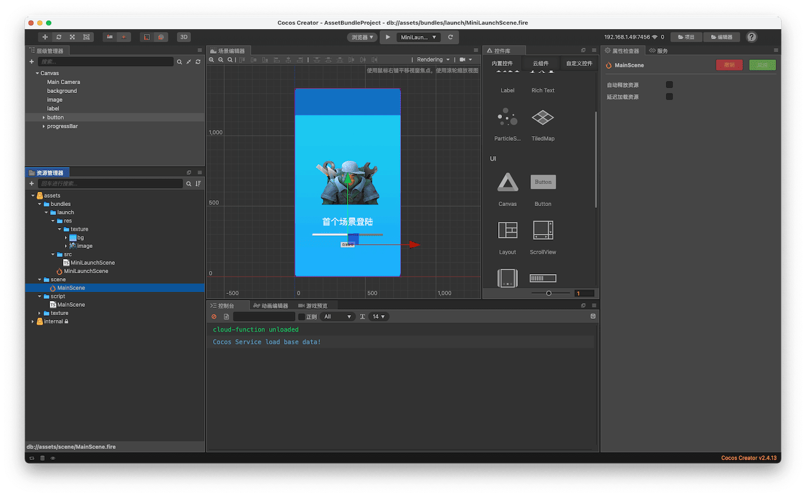
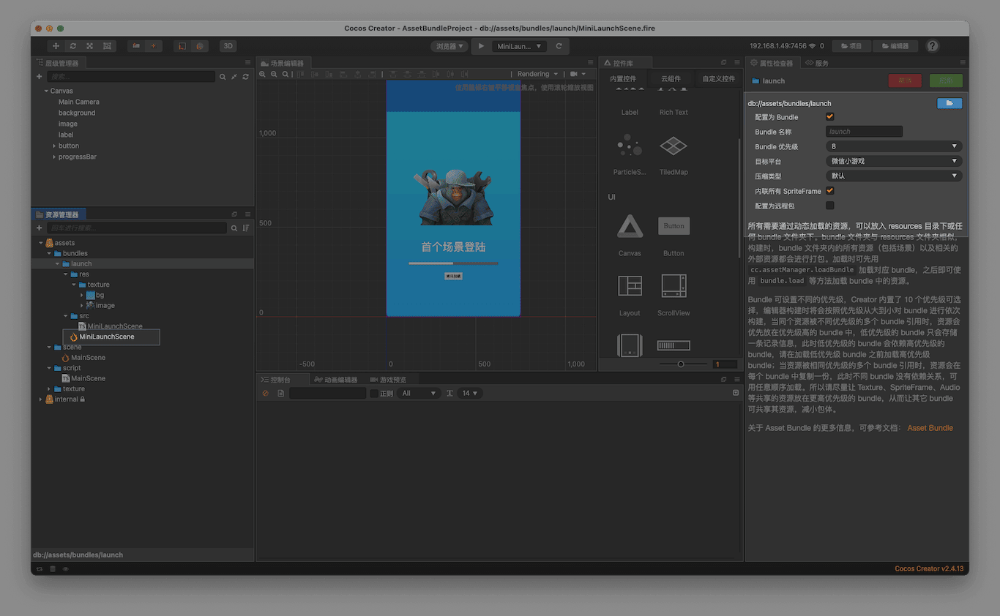
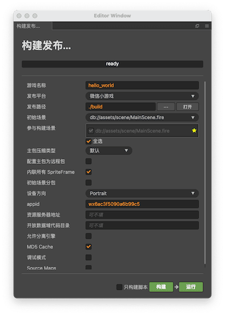
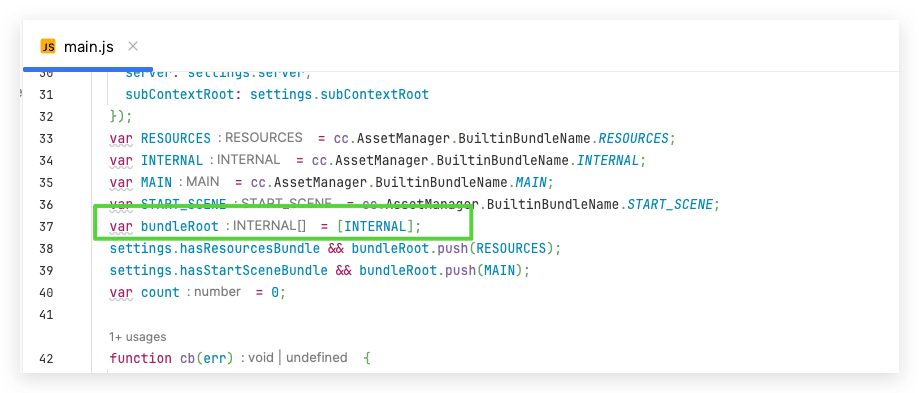
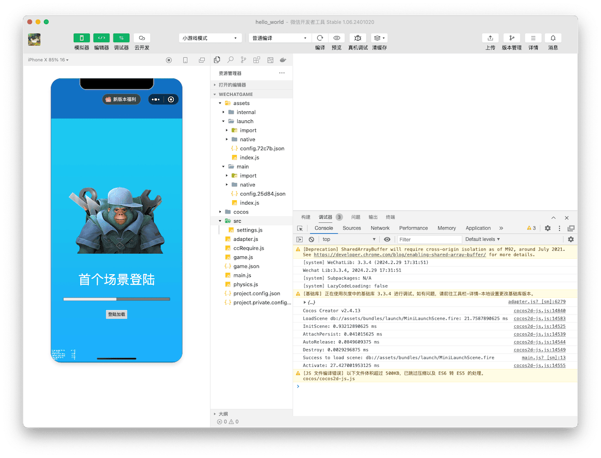
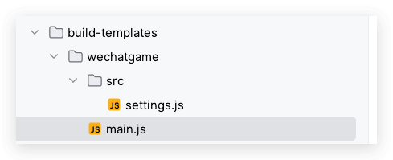
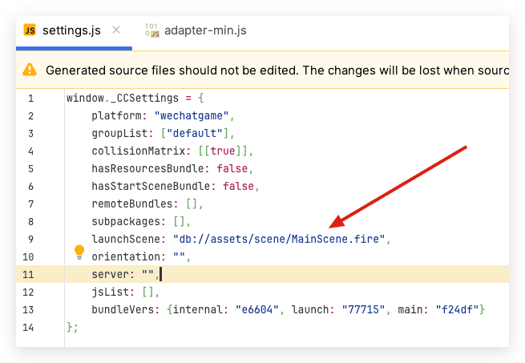
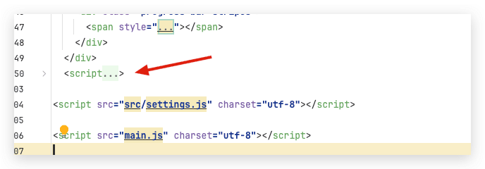

`CocosCreator`从2.4开始可以自定义[Asset Bundle](https://docs.cocos.com/creator/2.4/manual/zh/asset-manager/bundle.html)，这个功能给开发者带来了很多自由设计素材结构的空间，使得开发者更容易把游戏设计为模块化，使得开发者可以更自由的设置合理分配资源。在自己实践过程中，慢慢的积累了一些开发心得，下面就谈谈如何让`CocosCreator`启动自己自定义[Asset Bundle](https://docs.cocos.com/creator/2.4/manual/zh/asset-manager/bundle.html),其中包括使用插件代替手动更新方案。
<!--more-->

## 目前现状

### 新建项目



### 设置启动场景Bundle




### 构建项目



1. 此时我们发现 无法勾选 `bundle`内的场景为启动场景
   

2. 我们查看一下 构建后的`settings.js` 和 `main.js` 数据内容




## 项目改造

### 项目分析

此时我们静下来分析一下，按照`CocosCreator`的流程，如果我们想启动我们自己的`Bundle`内的场景，那么必须要加载我们的自定义的`Bundle` 然后设置启动场景为我们想要的启动场景。下面说一下具体步骤。

1. 修改`main.js` 的文件内容 将 我们自己自定义的`bundle`添加进去，个人建议添加到 内置`bundle`后面：

原来代码：

```javascript
var bundleRoot = [INTERNAL];
```

替换后：

```javascript
var bundleRoot = [INTERNAL,"launch"];
```

2. 修改setting.js文件（我这里勾选了调试模式，所以没有MD5）

原内容：

```javascript
launchScene: "db://assets/scene/MainScene.fire",
```

替换后:

```javascript
launchScene: "db://assets/bundles/launch/MiniLaunchScene.fire",
```

3. 此时我们使用微信开发者工具验证一下



4. 此时我们发现可以正常运行，证明思路可行。

### 进一步优化

此时，我们知道，构建后修改文件，就可以达到我们希望的效果，那么我们如何每次避免手动修改呢？问题来了。

是否可以使用 自定义发布模版 的 `build-templates`更改呢？

下面我们尝试一下：



但是构建后的`setting.js`没有被替换


那有没有其他方法呢？答案是有的，插件实现。

### 修改构建插件

1. 我们新建一个插件


2. `index.js` 内容：备注：此文件对插件无用，默认就行，可以跳过不看

```javascript
// panel/index.js, this filename needs to match the one registered in package.json
Editor.Panel.extend({
  // css style for panel
  style: `
    :host { margin: 5px; }
    h2 { color: #f90; }
  `,

  // html template for panel
  template: `
    <h2>excel-cmd</h2>
    <hr />
    <div>State: <span id="label">--</span></div>
    <hr />
    <ui-button id="btn">Send To Main</ui-button>
  `,

  // element and variable binding
  $: {
    btn: '#btn',
    label: '#label',
  },

  // method executed when template and styles are successfully loaded and initialized
  ready () {
    this.$btn.addEventListener('confirm', () => {
      Editor.Ipc.sendToMain('excel-cmd:clicked');
    });
  },

  // register your ipc messages here
  messages: {
    'excel-cmd:hello' (event) {
      this.$label.innerText = 'Hello!';
    }
  }
});
```

3. `package.json` 内容：

```json
{
  "name": "bundle-change-first",
  "version": "0.0.1",
  "description": "The package template for getting started.",
  "author": "jsroads",
  "main": "main.js",
  "main-menu": {
  },
  "panel": {
    "main": "panel/index.js",
    "type": "dockable",
    "title": "BundleFast",
    "width": 400,
    "height": 300
  }
}
```

4. `main.js`

```javascript
"use strict";
const fs = require("fs");
const path = require("path");
const miniAdapterActualPlatform = ["bytedance", "wechatgame"];
const webAdapterActualPlatform = ["web-mobile"];


const newLaunchScene = "db://assets/bundles/launch/MiniLaunchScene.fire";

const newLaunchBundle = `"launch"`;
function onBuildFinish(options, callback) {
    Editor.log("[bundle-change-first]", options.platform);
    if ("web-mobile" === options.platform) {
        if (webAdapterActualPlatform.indexOf(options.actualPlatform) === -1) {
            callback && callback();
            return;
        }
        modifySettings(options);
        modifyMainJS(options);
        Editor.success("[bundle-change-first]", "web-mobile首屏启动优化完成");
        callback();
    } else if ("mini-game" === options.platform) {
        if (miniAdapterActualPlatform.indexOf(options.actualPlatform) === -1) {
            callback && callback();
            return;
        }
        modifyMiniSettings(options);
        modifyMiniMainJS(options);
        Editor.success("[bundle-change-first]", "小游戏首屏启动优化完成");
        callback();
    }
}

function modifySettings(options) {
    const dirPath = path.join(options.dest, "src"); // 假设文件在 src 目录下


    // 列出目录中的所有文件
    fs.readdir(dirPath, function (err, files) {
        if (err) {
            console.error("Error reading the directory:", err);
            return;
        }

        // 正则表达式匹配文件名
        const regex = /^settings\.[0-9a-f]+\.js$/;
        files.forEach(function (file) {
            if (regex.test(file)) {
                // 匹配到的文件
                const filePath = path.join(dirPath, file);
                fs.readFile(filePath, "utf8", function (err, data) {
                    if (err) {
                        console.error("Error reading the file:", err);
                        return;
                    }
                    // 修改文件内容
                    let modifiedData = data.replace(/(launchScene\s*:\s*")([^"]*)(")/, `$1${newLaunchScene}$3`);

                    // 保存修改后的文件
                    fs.writeFile(filePath, modifiedData, "utf8", function (err) {
                        if (err) {
                            console.error("Error writing to the file:", err);
                            return;
                        }
                        console.log("File updated successfully");
                    });
                });
            }
        });
    });
}

function modifyMainJS(options) {
    const dirPath = options.dest; //main.js 目录下
    // 列出目录中的所有文件
    fs.readdir(dirPath, function (err, files) {
        if (err) {
            console.error("Error reading the directory:", err);
            return;
        }

        // 正则表达式匹配文件名
        const regex = /^main\.[0-9a-f]+\.js$/;
        files.forEach(function (file) {
            if (regex.test(file)) {
                // 匹配到的文件
                const filePath = path.join(dirPath, file);
                fs.readFile(filePath, "utf8", function (err, data) {
                    if (err) {
                        console.error("Error reading the file:", err);
                        return;
                    }
                    // 修改文件内容
                    let modifiedData = data.replace(/var bundleRoot = \[INTERNAL\];/, `var bundleRoot = [INTERNAL,${newLaunchBundle}];`);

                    // 保存修改后的文件
                    fs.writeFile(filePath, modifiedData, "utf8", function (err) {
                        if (err) {
                            console.error("Error writing to the file:", err);
                            return;
                        }
                        console.log("File updated successfully");
                    });
                });
            }
        });
    });
}

function modifyMiniSettings(options) {
    const filePath = path.join(options.dest, "src", "settings.js"); // settings.js 文件的实际路径
    fs.readFile(filePath, "utf8", function (err, data) {
        if (err) {
            console.error("Error reading the file:", err);
            return;
        }
        // 使用正则表达式查找和替换值
        let modifiedData = data.replace(/(launchScene\s*:\s*")([^"]*)(")/, `$1${newLaunchScene}$3`);
        // modifiedData = modifiedData.replace(/(server\s*:\s*")[^"]*(")/, `$1"${newServer}"`);

        // 将修改后的内容写回文件
        fs.writeFile(filePath, modifiedData, "utf8", function (err) {
            if (err) {
                console.error("Error writing to the file:", err);
                return;
            }
            console.log("File updated successfully");
        });
    });
}

function modifyMiniMainJS(options) {
    const filePath = path.join(options.dest, "main.js"); // main.js 文件的实际路径
    fs.readFile(filePath, "utf8", function (err, data) {
        if (err) {
            console.error("Error reading the file:", err);
            return;
        }

        // 使用正则表达式查找和替换值
        let modifiedData = data.replace(/var bundleRoot = \[INTERNAL\];/, `var bundleRoot = [INTERNAL,${newLaunchBundle}];`);

        // 将修改后的内容写回文件
        fs.writeFile(filePath, modifiedData, "utf8", function (err) {
            if (err) {
                console.error("Error writing to the file:", err);
                return;
            }
            console.log("File updated successfully");
        });
    });
}

module.exports = {
    load() {
        // Editor.Builder.on('build-start', onBuildStart);
        Editor.Builder.on("build-finished", onBuildFinish);
    },

    unload() {
        // Editor.Builder.removeListener('build-start', onBuildStart);
        Editor.Builder.removeListener("build-finished", onBuildFinish);
    },
    messages: {},
};
```

如果你的场景和我的不同 注意修改下面两行

```javascript
const newLaunchScene = "db://assets/bundles/launch/MiniLaunchScene.fire";

const newLaunchBundle = `"launch"`;
```

### 验证

我们分别构建`web-mobile`和微信小游戏发现插件在构建后已经完全按照我们的意愿修改了。如果`web` 版本想进一步优化，那么就结合我们上面的提到的自定义发布模版 ，具体内容可以参考：[CocosCreator构建出web-mobile项目的时候自动刷新定向index.html](https://blog.asroads.com/post/f50efc19.html)


其中 `index.html` 核心内容如下：



```html
  <script>
    // 当前URL
    let url = location.href;
    // 如果浏览器支持 window.performance 并且页面是通过刷新按钮加载的
    if (window.performance && window.performance.getEntriesByType("navigation")[0].type === "reload") {
      console.log("用户点击刷新，重新定向");
      // 生成随机数和时间戳
      const randomNumber = Math.floor(Math.random() * 100000) + 1;
      const timestamp = Date.now();
      // 如果URL已经包含查询字符串
      if (location.search) {
        // 正则替换已存在的v和t参数
        url = url.replace(/([?&])v=\d*/, '$1v=' + randomNumber);
        url = url.replace(/([?&])t=\d*/, '$1t=' + timestamp);

        // 如果URL中没有v和t参数，那么添加它们
        if (!url.includes('?v=') && !url.includes('&v=')) {
          url += '&v=' + randomNumber;
        }
        if (!url.includes('?t=') && !url.includes('&t=')) {
          url += '&t=' + timestamp;
        }
      } else {
        // 如果URL没有查询字符串，那么添加v和t参数
        url += '?v=' + randomNumber + '&t=' + timestamp;
      }
      // 重定向到新的URL
      location.href = url;
    }else {
      console.log("首次进入或用户非刷新的方式进入页面");
      // 随机数和时间戳
      const randomNumber = Math.floor(Math.random() * 100000) + 1;
      const timestamp = Date.now();
      // 如果URL已经包含查询字符串
      if (location.search) {
        // 如果URL中已经有了随机数和时间戳参数，就不再进行重定向
        if (url.includes('?v=') || url.includes('&v=') || url.includes('?t=') || url.includes('&t=')) {
          console.log("Already redirected, won't redirect again");
        } else {
          // 如果URL中没有随机数和时间戳参数，添加它们
          url += '&v=' + randomNumber;
          url += '&t=' + timestamp;
          // 重定向到新的URL
          location.href = url;
        }
      } else {
        // 如果URL没有查询字符串，那么添加随机数和时间戳参数，并进行重定向
        url += '?v=' + randomNumber;
        url += '&t=' + timestamp;
        location.href = url;
      }
    }
  </script>
```

## 总结

做完这些，回过头来看，其实只要我们善于思考和观察源码，分析+验证很多时候还是可以实现我们自己的需求。做技术就是不断的拓展自己的失业，废弃已经不再适用当下的知识，去攫取寻找能够在未来用的上的技术。
