很多手机厂商都开启了小游戏平台，从最初的微信小游戏，抖音小游戏，后面有百度、快手、B站、VIVO、OPPO和华为，以及新开启的支付宝小游戏，大家都开始在这个赛道抢流量，作为游戏开发方，尽可能的多上几个平台，给自己更多的流量，意味着更多的收入和用户量。下面简单的说说VIVO小游戏的开发。
<!--more-->

## 相关文档地址

VIVO小游戏官方地址：https://minigame.vivo.com.cn/documents/#/lesson/base/start

Cocos Creator 发布到 vivo 小游戏 https://docs.cocos.com/creator/2.4/manual/zh/publish/publish-vivo-instant-games.html

> ## [接入前须知](https://minigame.vivo.com.cn/documents/#/lesson/base/start?id=接入前须知)
>
> 1. 包名格式要求： com.公司名.游戏名.vivominigame
> 2. 小游戏是否接内购，请在对接组内告知。
> 3. 小游戏的icon不超过100k，包体不超过4M。
> 4. 记得签名做好妥善保存，以后更新都不能变更签名。每次更新版本时版本名称和版本号都要升级。
> 5. 支付和账号的对接，账号和支付各自有不同的appsecret的，要各自使用，不能混用。
> 6. 游戏包审核时间：1-2个工作日。
> 7. 提交审核建议写最新的全量版本，在/src/manifest.json文件minPlatformVersion字段配置，审核时，会按照这个最低版本引擎去审核，这个字段的[具体含义](https://minigame.vivo.com.cn/documents/#/lesson/configuration?id=支持的最小平台版本号)，全量版本的[更新日志](https://minigame.vivo.com.cn/documents/#/download/)
> 8. 审核被打回日志查找具体报错日志的方法 [点击跳转](https://minigame.vivo.com.cn/documents/#/lesson/dev/dev-log?id=审核打回日志查看路径)
> 9. 屏幕保持常亮[api地址](https://minigame.vivo.com.cn/documents/#/api/device/brightness?id=qgsetkeepscreenonobject-object)
> 10. 游戏强更接口[api地址](https://minigame.vivo.com.cn/documents/#/api/system/check-update?id=qgapplyupdate)

## 基本环境搭建

### 需要安装 nodejs版本>=8.9.0

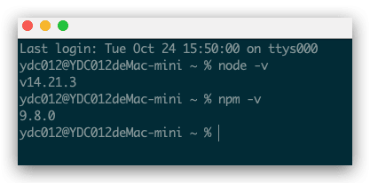

**注意**：安装 nodejs 后，需要注意 npm 源地址是否为 https://registry.npmjs.org/

```bash
  # 查看当前 npm 源地址
  npm config get registry
  # 若不是，重新设置 npm 源地址
  npm config set registry https://registry.npmjs.org/
```

### 需要安装 `vivo-minigame/cli`

```
npm install -g @vivo-minigame/cli
```

若 `vivo-minigame/cli` 安装失败，可能是因为 nodejs 版本过低导致的，请检查 node 版本并升级。

查看所有全局安装的软件包 **npm list -g**

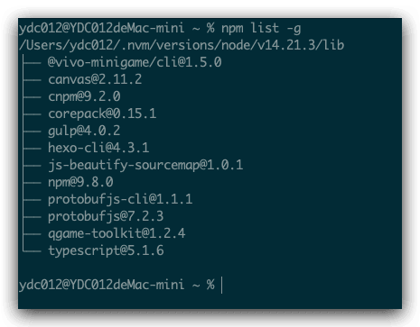

## 渠道修改

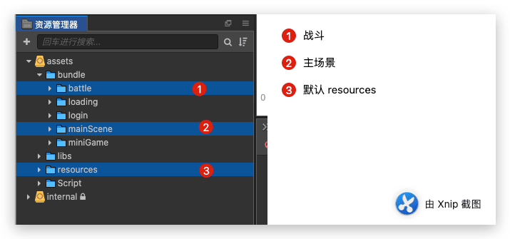


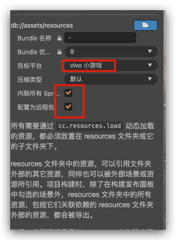

**这里选择内联，减少多次请求带来的时间过长问题。**

## 构建项目

### 构建vivo 渠道小游戏

**菜单栏 -> 项目** 中打开 **构建发布** 面板，**发布平台** 选择 **vivo 小游戏**

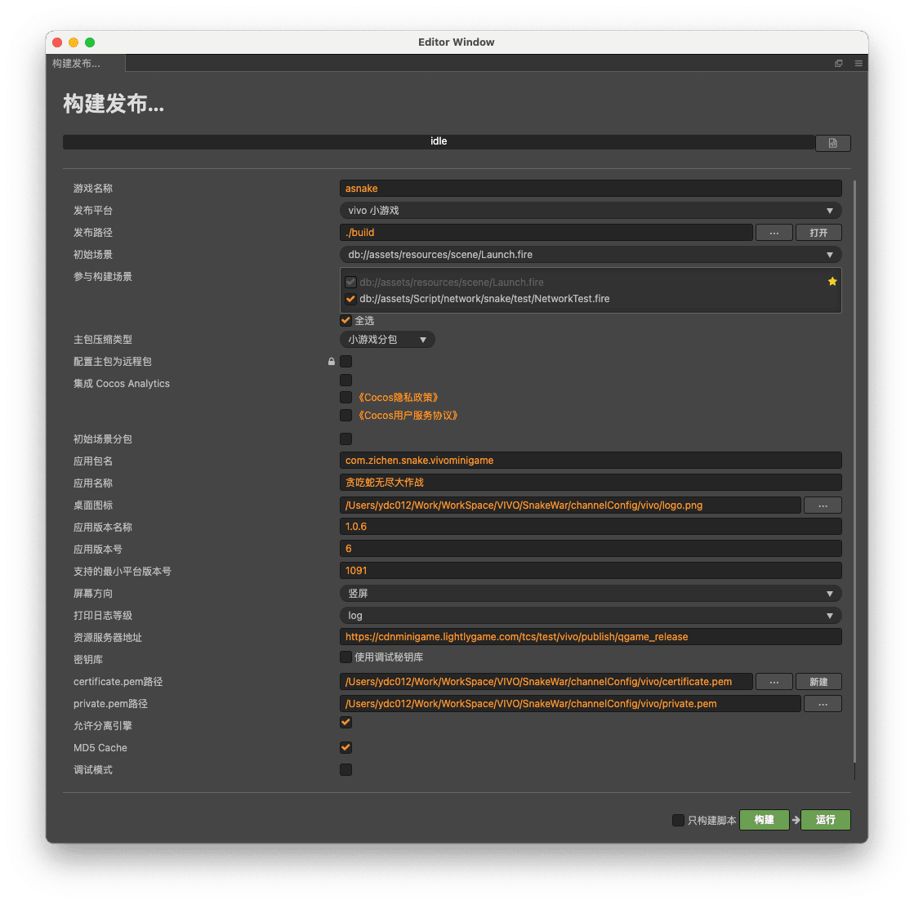

构建日志：


具体的配置信息：`settings/vivo-runtime.json`

```json
{
  "package": "com.zichen.snake.vivominigame",
  "name": "贪吃蛇无尽大作战",
  "icon": "/Users/ydc012/Work/WorkSpace/VIVO/SnakeWar/channelConfig/vivo/logo.png",
  "versionName": "1.0.6",
  "versionCode": "6",
  "minPlatformVersion": "1091",
  "deviceOrientation": "portrait",
  "logLevel": "log",
  "npmPath": "",
  "tinyPackageServer": "https://cdnminigame.lightlygame.com/tcs/test/vivo/publish/qgame_release",
  "useDebugKey": false,
  "privatePath": "/Users/ydc012/Work/WorkSpace/VIVO/SnakeWar/channelConfig/vivo/private.pem",
  "certificatePath": "/Users/ydc012/Work/WorkSpace/VIVO/SnakeWar/channelConfig/vivo/certificate.pem",
  "disabledMode": "",
  "showNpmPath": false,
  "packFirstScreenRes": false,
  "separateEngineMode": true
}
```

## 如何调试游戏

### 签名文件缺失

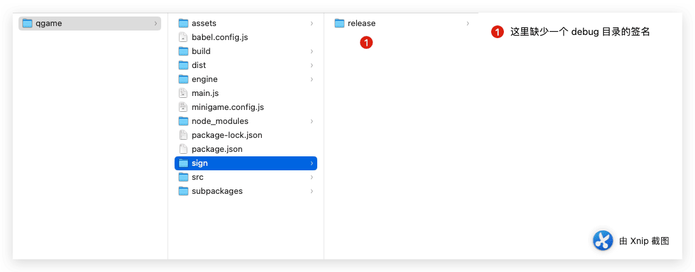

1. 正常构建版本后，构建目录sign目录下缺少 debug目录 导致快应用工具一致卡住 编译界面

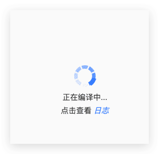

2. 添加debug 签名（复制release 一份命名为 debug）

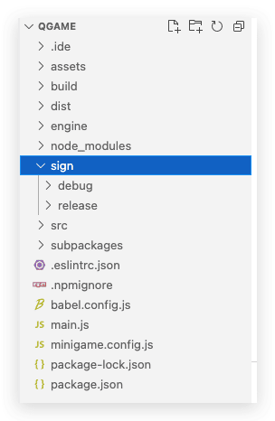


3. 此时 可以正常编译

## 如何调试游戏

> ### 调试游戏
>
> 1、下载快应用开发工具[3.9.0及以上版本](https://www.quickapp.cn/docCenter/post/97)
>
> 2、安装小游戏引擎[1091](https://vassets.vvstc.com/vassets/og2pg/o/com.vivo.hybrid_v1.9.1.402_1e600efc4_202105311534.apk)及其[以上](https://minigame.vivo.com.cn/documents/#/download/engine)，安装小游戏调试器[10900200](https://vassets.vvstc.com/vassets/og2pg/o/com.vivo.hybrid.debugger_v10900200_202105102109.apk)及其[以上](https://minigame.vivo.com.cn/documents/#/download/debugger)
>
> 3、安装vivo小游戏插件

## 开发者工具

功能介绍 ：https://minigame.vivo.com.cn/documents/#/ide/ide_func

#### [局域网调试](https://minigame.vivo.com.cn/documents/#/lesson/dev/dev-chrome?id=局域网调试)

1. **手机电脑一定要在局域网内**
2. 在[游戏工程目录](https://minigame.vivo.com.cn/documents/#/lesson/dev/dev-chrome?id=怎么去找vivo小游戏的工程目录)下，启动server服务 `npm run server`
3. 打开“快应用调试器”，点击“扫码安装”
   - 调试器的【调试模式】如果已经打开，那么会自动拉起Chrome浏览器打开调试页面
   - 调试器的【调试模式】如果未打开，扫码安装完成后，点击back键退出，再点击开始调试即可拉起Chrome浏览器并打开调试页面
   - 如果想调试其他游戏，扫码安装完成后，点击back键退出；点击“本地安装”后选择本地rpk包即可拉起Chrome浏览器并打开调试页面（注意打开调试模式，或者再次back键退出后点击开始调试）

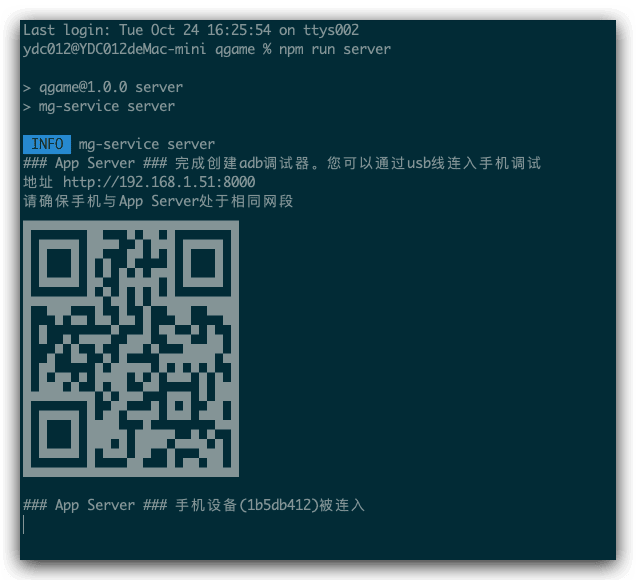


#### 扫码调试

1.点击右边按钮

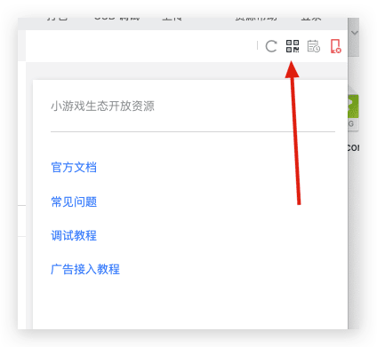

2.使用手机小游戏调试工具


### 添加VIVO vConsole日志

#### [使用方式一](https://minigame.vivo.com.cn/documents/#/lesson/dev/vConsole?id=使用方式一)

- 修改manifest.json配置文件，路径规则跟icon一致，是在src目录下

```js
{
   ......
   "vConsole": "true", //注意'vConsole'单词区分大小写 
   ......
}
```

- 使用**新版调试器打开审核模式开关**，点击VConsole按钮查看运行时的所有log

#### [使用方式二](https://minigame.vivo.com.cn/documents/#/lesson/dev/vConsole?id=使用方式二)

- 使用**新版调试器打开审核模式开关**
- 使用最新的小游戏引擎版本

## 出包验证

重点关注 打包：

> 打包的功能键在开发者工具右上角，支持的功能如下，**发布时请务必选择「打包」「正式版」**：
>
> - 选择构建类型，支持「正式版」、「开发版」、「测试版」、「体验版」
> - 打包，此时编译出release包，用于发布
> - 重新构建，此时编译出debug包，用于调试


**查看构建类型**

titlebar打开菜单弹窗，可以查看当前构建类型。**PS：正式版不显示后缀**

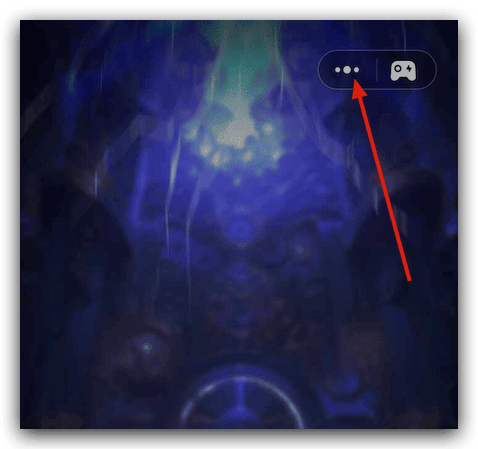

开发版包 显示 游戏名后面带 开发版

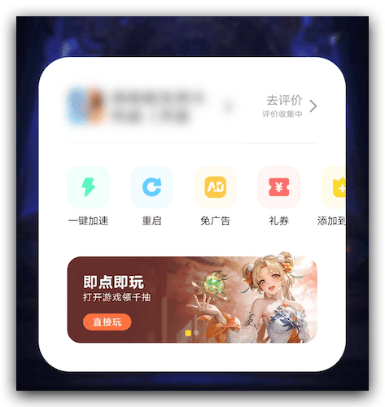

正式版本

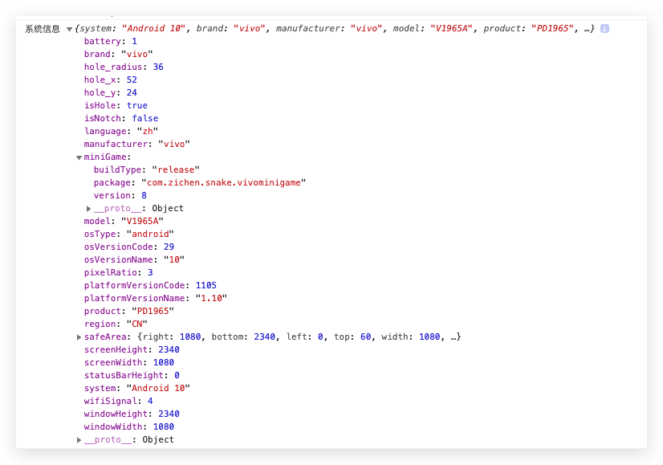

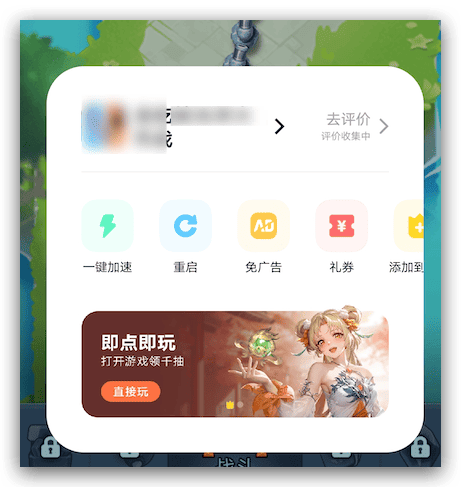

## 分包设置

官网文档地址：[分包加载](https://minigame.vivo.com.cn/documents/#/lesson/base/subpackage?id=%e5%88%86%e5%8c%85%e5%8a%a0%e8%bd%bd)

其实核心就是在 `manifest.json` 文件下配置，因这里使用`CocosCreator` 直接设置构建即可。

## 注意事项

### 文件过多导致加载时间过长

由于我所在的项目是一个App项目，开发设计的时候，并没有考虑小游戏环境，故而有很多个文件，在微信和抖音上面表现还能勉强接受，到了Vivo小游戏上面后，加载时间就特别长，后面通过修改 内联所有`SpriteFrame`选项，效果就可以接受了。


## 使用官方快应用工具构建包

由于项目有些操作是构建后需要的操作，故而我们使用了 `VIVO`官方的构建工具去构建包体，后面发现包体大了，当时解包发现是打包时候把`sourcemap`文件打进去了，故而包体变大。

后面反馈给官方后，官方目前给出的建议是使用命令打包：具体操作就是在 `Cocos Creator` 构建好的文件目录下，这里是 `qgame`文件夹下 运行命令 

```shell
npm run release
```

和 上面调试命令  `npm run server` 运行目录一样。

### 使用平台自带的小游戏自定义Loading组件

文档地址：[小游戏自定义Loading组件](https://minigame.vivo.com.cn/documents/#/api/system/loadingView?id=%e5%b0%8f%e6%b8%b8%e6%88%8f%e8%87%aa%e5%ae%9a%e4%b9%89loading%e7%bb%84%e4%bb%b6) 后面会特意写一个文章单独介绍这个功能。

### 构建包失败 清理缓存

```shell
npm cache clean --force
```

### 添加权限

```shell
sudo chown -R 501:20 /Users/ydc012/.nvm
```

```shell
sudo chown -R $(whoami) ~/.npm
```

