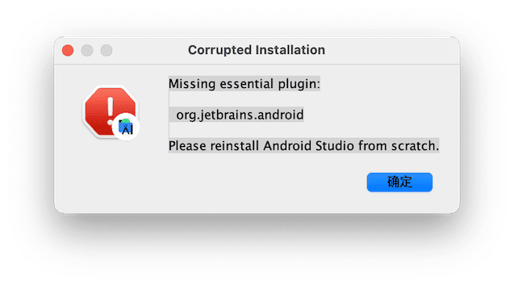
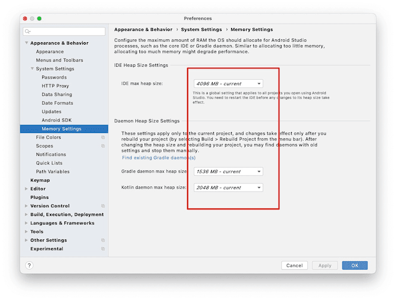

新年伊始，一切开始，努力加油，今天，第一天在家里远程办公，年后可能要离开小游戏一段时间，去做原生开发，应该还是用Cocos Creator吧，只是发布平台不太一样了，新的平台，新的挑战，新的开始，新的触发！
<!--more-->
下面就记录以下，我在尝试新平台开发摸索中的遇到的各种问题，以及解决问题的方法和对问题的理解。

## 常见踩坑点

### APP ABI 版本 不能一个也不勾选


虽然 Cocos Creator 官方的构建面板上面是 多选 但是我们再实际构建的时候，却不能一个也不选择。这样会导致我们项目运行报错。

### 勿要盲目的升级 Gradle 或者 Gradle插件（Android Studio插件）

盲目的追求新版本，导致和 Cocos 引擎不兼容，对于新手采坑很难解决，所以奉劝新手打包，就采用默认即可。

##### 理解Gradle 和Gradle插件

1. 对于刚刚学习使用 Android Studio 的人来讲，如果不搞明白 这个 基本后面是一路懵逼，之前我只是知道Gradle 是帮助 Android Studio 构建项目的一个工具，其他的了解很浅

2. 其实 Android Studio 官方网站写了很清楚，我摘抄几句

   > Android Studio 构建系统以 Gradle 为基础，并且 Android Gradle 插件添加了几项专用于构建 Android 应用的功能。虽然 Android 插件通常会与 Android Studio 的更新步调保持一致，但插件（以及 Gradle 系统的其余部分）可独立于 Android Studio 运行并单独更新。

3. 上面的意思很容易理解，Gradle 有自己的版本  ，Gradle 插件也有自己的版本，而且他们的版本号不是一致的，要想成功构建项目必须，保持二者匹配，看清楚是二者匹配，就是，这个 Gradle 和 Gradle 插件是两个东西。


> 在更新 Android Studio 时，您可能会收到一并将 Gradle 更新为最新可用版本的提示。您可以选择接受该更新，也可以根据项目的构建要求手动指定版本。
> 下表列出了各个 Android Gradle 插件版本所需的 Gradle 版本。要获得最佳性能，您应该使用 Gradle 和插件这两者的最新版本。

| 插件版本      | 所需的 Gradle 版本 |
| :------------ | :----------------- |
| 1.0.0 - 1.1.3 | 2.2.1 - 2.3        |
| 1.2.0 - 1.3.1 | 2.2.1 - 2.9        |
| 1.5.0         | 2.2.1 - 2.13       |
| 2.0.0 - 2.1.2 | 2.10 - 2.13        |
| 2.1.3 - 2.2.3 | 2.14.1+            |
| 2.3.0+        | 3.3+               |
| 3.0.0+        | 4.1+               |
| 3.1.0+        | 4.4+               |
| 3.2.0 - 3.2.1 | 4.6+               |
| 3.3.0 - 3.3.2 | 4.10.1+            |
| 3.4.0 - 3.4.1 | 5.1.1+             |
| 3.5.0+        | 5.4.1-5.6.4        |

> 您可以在 Android Studio 的 **File** > **Project Structure** > **Project** 菜单中指定 Gradle 版本，也可以通过在 `gradle/wrapper/gradle-wrapper.properties` 文件中修改 Gradle 分发引用来指定。以下示例在 `gradle-wrapper.properties` 文件中将 Gradle 的版本设置为 5.4.1。

> ```shell
   ...  distributionUrl = https\://services.gradle.org/distributions/gradle-5.4.1-all.zip  ...
   ```

4. 所以在我们构建项目的时候 要保证二者 能够匹配才能正常的构建项目

5. build.gralde里的classpath 'com.android.tools.build:gradle:3.0.1'指的是Android Studio的gradle插件版本，而gradle-wrapper.properties里的distributionUrl=https\://services.gradle.org/distributions/gradle-4.4-all.zip才是指定的gradle版本！

   Gradle是开源的自动化构建工具，而Gradle插件是google开发的在Android Studio中使用Gradle的插件。

##### 虽然下载构建时候下载很缓慢 

这个是 因为配置文件里面 的下载地址 在某些地方无法正常下载，解决办法三种：

A . 配置国内镜像

B. 下载后覆盖本地文件 

C 更改下载地址（2019年开始有 中国地区的CDN）

- 配置国内镜像

通过在 gradle.properties 中加大 connectionTimeout 和 socketTimeout 可以成功 gradle sync。

```json
org.gradle.jvmargs=-Xmx1536m -Dorg.gradle.internal.http.connectionTimeout=120000 -Dorg.gradle.internal.http.socketTimeout=120000
```

同时配置下面阿里云 镜像 （mirror）：修改项目根目录下的文件 build.gradle ：

第一种配置：

```json
buildscript {
    repositories {
        //google()
        //jcenter()
        maven { url 'https://maven.aliyun.com/repository/public/' }
        maven { url 'https://maven.aliyun.com/repository/google/'}
        maven { url 'https://maven.aliyun.com/repository/jcenter/'}
        mavenLocal()
        mavenCentral()
    }
...
}
allprojects {
    repositories {
        //google()
        //jcenter()
        maven { url 'https://maven.aliyun.com/repository/public/' }
        maven { url 'https://maven.aliyun.com/repository/google/'}
        maven { url 'https://maven.aliyun.com/repository/jcenter/'}
        mavenLocal()
        mavenCentral()
    }
}
```

第二种配置：

```json
buildscript {
    repositories {
        maven{ url 'http://maven.aliyun.com/nexus/content/groups/public/'}
    }
}

allprojects {
    repositories {
        maven{ url 'http://maven.aliyun.com/nexus/content/groups/public/'}
    }
}
.... 其他内容
```

- 本地配置

关闭Android Studio,进入

windows 系统

```text
C:\Users\xxx\.gradle\wrapper\dists
```

Mac 系统

```text
~/.gradle/wrapper/dists/
```

点击这个https://gradle.org/install/ 参考 https://gradle.org/releases/ 

https://services.gradle.org/distributions/ 下载列表（建议用这个）

选择下载 自己需要的版本

最后将刚刚下好的zip文件放到这个目录

windows 系统 注意 ：`gradle-4.10.3-all` 是你下载的版本的名字 这里只是举例 用 gradle-4.10.3-all

```text
C:\Users\xxx\.gradle\wrapper\dists\gradle-4.10.3-all 
```

Mac 系统 81msde2dx9p4vji0mjgtvxkcb 这个 可能 有所不同

```text
~/.gradle/wrapper/dists/gradle-4.10.3-all/81msde2dx9p4vji0mjgtvxkcb
```

重新启动 Android Studio 即可

- 更改下载地址

值得 喜大普奔 的是 2019年 官方给出了 中国地区的 CDN 地址 

就是 gradle文件夹下面的gradle-wrapper.properties中的[http://services.gradle.org](http://link.zhihu.com/?target=http%3A//services.gradle.org)为[http://downloads.gradle-dn.com](http://link.zhihu.com/?target=http%3A//downloads.gradle-dn.com)即可

### Android Studio中如何清理gradle缓存

as使用过程中，经常会遇到gradle缓存问题，常用的清理方式如下：

1、Build --> Clean Project

2、Build --> Rebuild Project

3、File -> Invalidate Caches/Restart

4、删除项目根目录下.idea/caches和.idea/libraries目录，然后Invalidate Caches/Restart

5、在as终端中执行./gradlew clean

### Could not install Gradle distribution

**报错如下**


Event Log 如下

```bash
ERROR: Could not install Gradle distribution from 'https://services.gradle.org/distributions/gradle-4.10.3-all.zip'.
```

解决办法：

#### 步骤：

1. 在用户根目录下执行

   ```sh
   ls -l ~/.gradle/wrapper/dists/
   ```

   显示如下

   ```shell
   total 0
   drwxr-xr-x  4 smile  staff  128  2  3 10:55 gradle-4.10.3-all
   ```

   发现有个 `gradle-4.10.3-all` 的目录

2. 删除这个目录

   ```shell
   rm -r gradle-4.10.3-all
   ```

3. 从地址下载并解压在这个文件夹 'https://services.gradle.org/distributions/gradle-4.10.3-all.zip'

4. 重新打开android studio正常。

**注意： 后续 用了 上面的 就没有使用这个办法，但是觉得可能问题不同吧，这个方法也是极好的。**

### “Check update” is not working in android studio

打开 Help>Check for Updates

遇到错误

```
Connection failed. Please check your network connection and try again
```

解决办法

1. Open configuration
2. Select Settings
3. Select HTTP Proxy
4. Set to use no proxy
5. Restart Andriod studio

### API 'variant.getMergeAssets()' is obsolete and has been replaced with 'variant.getMergeAssetsProvider()'.

警告如下

```
API 'variant.getMergeAssets()' is obsolete and has been replaced with 'variant.getMergeAssetsProvider()'.
```


原因分析：

是因为 Gradle 版本 比较新 造成的 版本回退 或者 修改

app目录下build.grade中，更改variant.mergeAssets.doLast  为 variant.mergeAssetsProvider.get().doLast ：

```dart
android.applicationVariants.all { variant ->
    // delete previous files first
    delete "${buildDir}/intermediates/assets/${variant.dirName}"

    variant.mergeAssets.doLast {
        copy {
           from "${buildDir}/../../../../../res"
           into "${buildDir}/intermediates/assets/${variant.dirName}/res"
        }
```

修改后为

```dart
android.applicationVariants.all { variant ->
    // delete previous files first
    delete "${buildDir}/intermediates/assets/${variant.dirName}"

    variant.mergeAssetsProvider.get().doLast {
        copy {
           from "${buildDir}/../../../../../res"
           into "${buildDir}/intermediates/assets/${variant.dirName}/res"
        }
```

### AndroidStudio开发安卓应用设置版本号

build.gradle(Module:app)

```json
compileSdkVersion 22
buildToolsVersion "21.1.2"
 
defaultConfig {
    applicationId "cn.wangbaiyuan.translate"
    minSdkVersion 15
    targetSdkVersion 22
    versionCode 1
    versionName "1.0"
}
```

versionCode （整形数字）这个是防止用户用低版本置换高版本的apk。  versionName "1.0"是展示给用户看的

### Android Studio 报错 “Cannot resolve symbol R”


找了一大圈原因 居然是 项目的AndroidManifest.xml中的manifest下的package标签标签有问题，定位不到到项目所在的包下面


### Program type already present:xxx.xxx错误的解决办法

报错现象：gradle编译出现Program type already present:com.xx.xx

```bash
Program type already present: com.hp.hpl.sparta.DefaultParseHandler
```

原因是 重复依赖 是我们对两个类或者两个库文件 添加重复了


**解决办法**：查看一下自己的 buid.gradle 文件里

比如下面 如果 打开注释 就会报错 因为 上面已经添加了 aar 文件

```groovy
dependencies {
		implementation fileTree(dir: '../libs', include: ['*.jar','*.aar'])
    implementation fileTree(dir: 'libs', include: ['*.jar','*.aar'])
    implementation fileTree(dir: "../../../cocos2d-x/cocos/platform/android/java/libs", include: ['*.jar'])
    implementation project(':libcocos2dx')
		//渠道聚合层，必加  implementation fileTree(dir: 'libs', include: ['*.jar','*.aar']) 已经包含
		//implementation(name: "usdk-release-1200", ext: 'aar')
}
```

### Missing essential plugin:org.jetbrains.android Please reinstall Android Studio from scratch.



网上常见的给出的答案是：

> For MacOS, Use following commands to reset Android Studio's configure files:
>
> ```bash
> rm -Rf ~/Library/Preferences/AndroidStudio*
> rm ~/Library/Preferences/com.google.android.studio.plist
> rm -Rf ~/Library/Application\ Support/AndroidStudio*
> rm -Rf ~/Library/Logs/AndroidStudio*
> rm -Rf ~/Library/Caches/AndroidStudio*
> ```
>
> For windows, I don't know the commands, but you can try to delete the following file:
>
> ```bash
> C:\Users\admin\.AndroidStudio4.0\config
> ```
>
> MacOS 以及 
>
> ```bash
> /Users/[your_name]/Library/Preferences/AndroidStudio4.0/disabled_plugin.txt
> ```
>
> 对于 `Windows` 用户。
>
> ```bash
> CopyC:\Users\YourUserName\AppData\Roaming\Google\AndroidStudioPreview4.1\disabled_plugins.txt
> ```
>
> 但是上面的并不能解决我的问题，最后我找到了这样一个路径，我是Mac 环境

#### 问题分析及解决

问题是新版本中的插件与本地设置中保留的插件列表冲突了导致的。删掉本地设置中的 kotlin 插件就可以了。插件的位置在

```bash
Windows：C:\Users\You\AppData\Roaming\Google\AndroidStudioPreview4.1
linux:~/.AndroidStudioPreview41
mac:~/Library/Application Support/Google/AndroidStudioPreview4.1
```

删掉目录（我这边整个删除了目录）中的 kotlin 文件夹，就可以打开新版本了。 不过开发人员也说他们在解决这个问题，所以也可以等下个版本。

参考地址：[Android Studio 4.1 Canary 9 available](https://www.v2ex.com/t/669626)


### OutofMemory Error

这个错误导致我一直打包失败，最后才知道是配置错误



参考地址：[Android Studio Gradle OutofMemory Error](https://stackoverflow.com/questions/23440647/android-studio-gradle-outofmemory-error)

## 参考文章

- [大家都是怎样处理Gradle中的这个文件下载慢的问题的？](https://www.zhihu.com/question/37810416)
- [COCOS2DX 安卓getMergeAssets 过期](https://www.jianshu.com/p/647cd8e96472)
- [Android Studio报错：Error:Could not find com.android.tools.build:gradle:4.1 记一次不长记性的坑](https://blog.csdn.net/zengsidou/article/details/79797417)
- [Cocos creator打包安卓APK](https://www.bilibili.com/read/cv4224091/)
- [Android Studio中如何清理gradle缓存](https://blog.csdn.net/qq_26287435/java/article/details/89842695)

