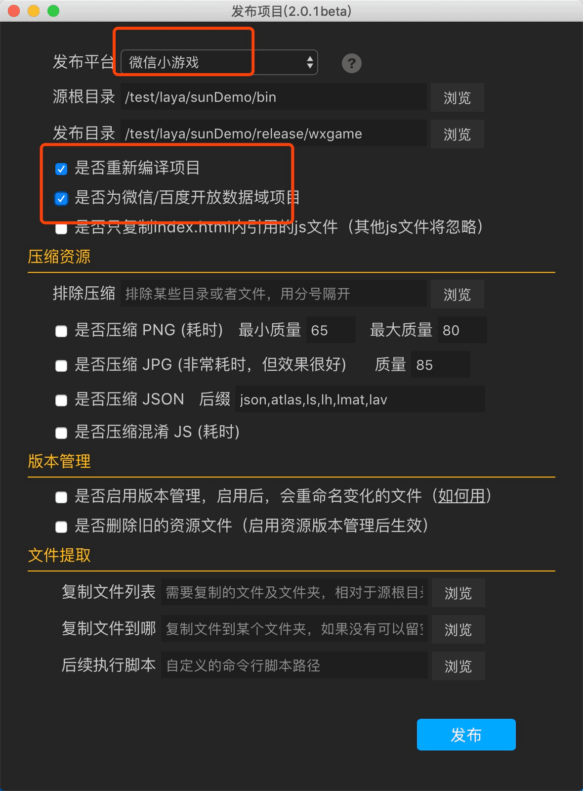
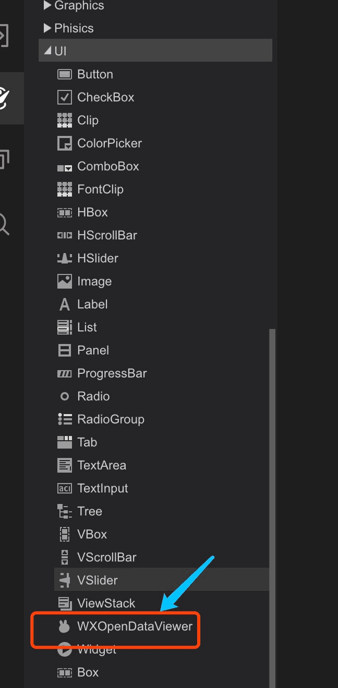
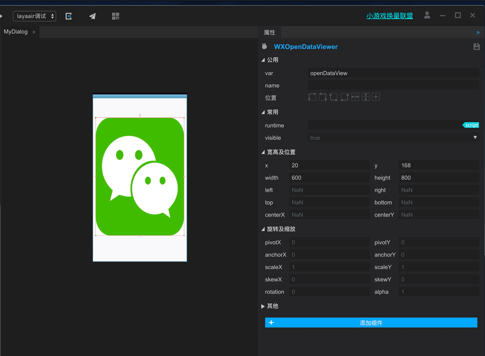
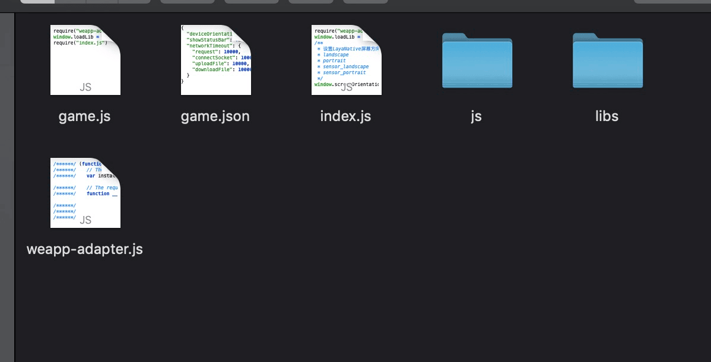
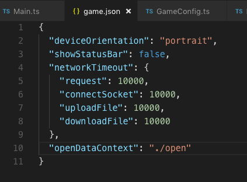
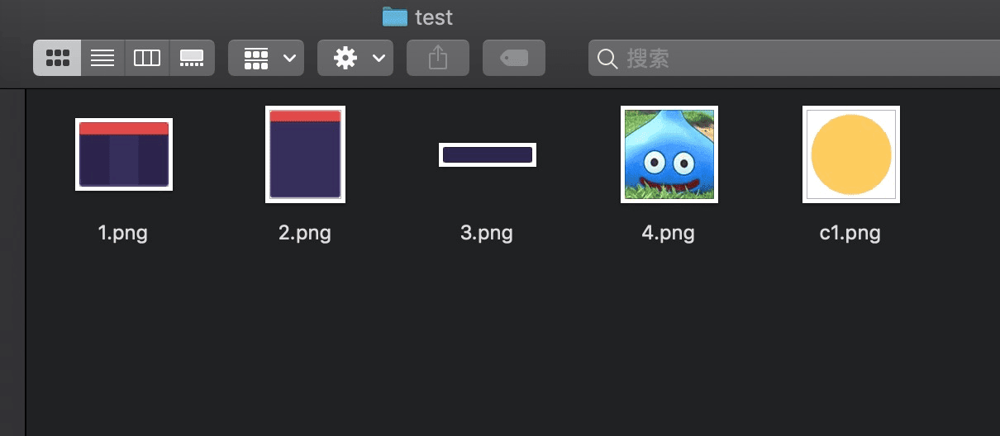
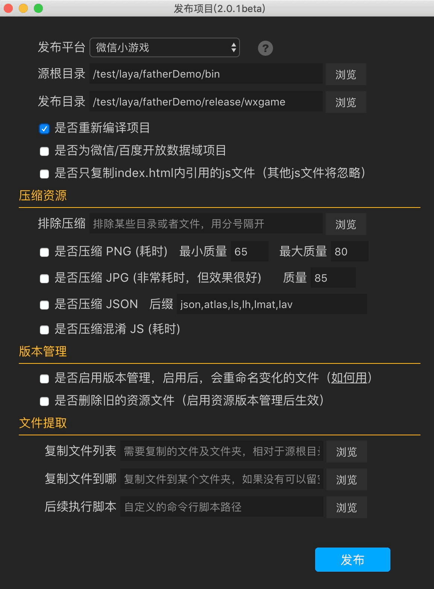
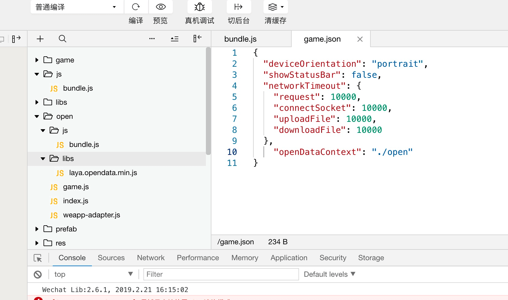

### Laya2.0 开放域简介

自从2018年秋开始，layabox 公司发布了2.0 版本，在2.0 版本里面多了一个组件，就是 `WXOpenDataViewer`组件这个歌组件是专门为 做微信小游戏 显示开放域使用的，我自己在论坛上找了很久没有找到合适的教程，官方文档也是写的模棱两可，于是自己探索了两天，终于悟得真经，准备记下来，便于以后查找，顺便分享给那些对这个组件不熟悉的开发者。

<!-- more -->

### 开发步骤

- 机器上已经安装了Layabox的2.0 版本
- 需要新建两个项目，一个主域项目，一个开放域项目（关于主域和开放域（子域）的概念此处不多说）
- 最好编译到微信预览效果

#### 新建子域（开放域）项目

- 首先打开 LayaAir 新建项目面板  新建项目 `sunDemo`


- 官方已经给我们搭建好了 基本的结构和框架，我们只需要修改部分细节即可 首先修改 Main下面的 方法


```typescript
class Main {
	constructor() {
		 //设置子域
		Laya.isWXOpenDataContext = true;
		Laya.isWXPosMsg = true;
		//根据IDE设置初始化引擎		
		Laya.init(GameConfig.width, GameConfig.height,false);
		Laya.stage.scaleMode = GameConfig.scaleMode;
		Laya.stage.screenMode = GameConfig.screenMode;
		Laya.stage.alignV = GameConfig.alignV;
		Laya.stage.alignH = GameConfig.alignH;
		// 关于透传接口，请参考: https://ldc2.layabox.com/doc/?nav=zh-ts-5-0-7
		var mark = 0;
		if(Laya.Browser.onMiniGame){
			Laya.Browser.window.wx.onMessage(function(data){//微信接受信息
				if(data.url == "res/atlas/test.atlas" || data.url == "test/1.png"
				||data.url == "test/2.png"||data.url == "test/3.png"){
					mark ++;
					console.log("------data.url:" + JSON.stringify(data.url));
					if(mark == 4)//确认数据全部接收后
						Laya.loader.load(["res/atlas/test.atlas", "test/1.png",
						 "test/2.png", "test/3.png"],Laya.Handler.create(this,this.onComplete));
				}
			}.bind(this));
		}else {
			Laya.loader.load("res/atlas/test.atlas",Laya.Handler.create(this,this.onComplete));
		}

				
	}

	onComplete(): void {
		//初始化rank排行榜
		var rank = new BigRank();
		//初始化
		rank.init();
	}
```


- 然后修改  BigRank 这个类 


```typescript
public init() {
            Laya.stage.addChild(this);
            //初始化list数据
            if(Laya.Browser.onMiniGame){
                //接受来自主域的信息
                wx.onMessage(this.recevieData.bind(this));
                // 直接展示数据
            }
        }
        
        /**
         * 接收信息
         * @param message 收到的主域传过来的信息
         */
        private recevieData(message):void{
            var _$this =this;
            var type:String = message.type;
            switch(type)
            {   
                default:
                    break;
            }
            // this.getFriendData();
            this.setlist(this.arr);
        }
```


- 然后 记得编译 素材  Ctrl+F12   和 编译项目  ，最后 发布项目 




- 做完这些之后，准备 主域的准备

#### 主域设置

- 新建项目fatherDemo  然后 新建一个素材页面 名字叫 MyDialog,然后新建一个Ts 文件，并且 继承这个类

  

  

- 我们此时 做上面的 图片 做背景 是衬托，你自己可以略过此步骤


- 我们开始拖入一个  开放域组件到舞台
- 
- 设置 宽高和位置



- 新建的 Typescript 文件 如下
- 

```typescript
import {ui} from "../ui/layaMaxUI";
import MyDialogUI = ui.game.MyDialogUI;

export class MyDialog extends MyDialogUI {
    constructor() {
        super();
    }

    onOpened(param: any): void {
        console.log("mylog------:" + JSON.stringify("onOpened"));
        this.openDataView.postMsg("test10086");
    }
}
```

此时 主域已经准备完毕。

#### 两个项目合并

- 把 刚刚 导出的 子域项目 sunDemo 的 导出文件夹 中的部分文件，复制到 主域项目fatherDemo 项目下面的bin 目录，并且自己新建一个目录，我这边 叫做 “open” 你可以自己定义你的目录名字



- 修改 fatherDemo 项目 bin  目录下面的 game.json 文件 添加开放域设置



```json
{
  "deviceOrientation": "portrait",
  "showStatusBar": false,
  "networkTimeout": {
    "request": 10000,
    "connectSocket": 10000,
    "uploadFile": 10000,
    "downloadFile": 10000
  },
  "openDataContext": "./open"
}
```

- 然后 把 sunDemo 子域项目 `laya/assets`里面的 test  复制到 fatherDemo主域项目的 对应文件夹 laya/assets 下面 ，然后 编译素材 和代码 

  

- 准备好一切后 开始 可以发布 项目 



项目发布文本 ，准备用微信模拟器预览效果

#### 微信模拟器预览效果

- 打开模拟器，导入项目，如果自己没有appid 自己可以申请一个 或者自己用系统测试 Appid



- 最后效果 如图


### 总结

这个项目我没有 访问微信的云，而是用了Laya官方自带的本地数据，主要是目录结构比较麻烦，如果用过LayaAir1.0版本，那么这个基本变化不大，但是要注意的是 Layabox 2.0 的Scene 的打开和加载的方式，如果打开不对，就会出现问题，我就遇到了，虽然可以正常显示，位置正确，但是 滑动交互区域不对，只有 四分之一，或者上面的一半是有效交互区域，其他区域可见，但不能交互，无法拖动，后来，我重新整理了这些，然后逐一分析，最终解决问题。

### 参考文章

- [LayaAir之小游戏开放域开发](https://blog.51cto.com/aonaufly/2315353)
- [微信开放数据域](https://ldc2.layabox.com/doc/?nav=zh-ts-5-0-7)
- [关系链数据使用指南](https://developers.weixin.qq.com/minigame/dev/tutorial/open-ability/open-data.html)
- [LayaAir之小游戏的坑之解决之道](https://blog.51cto.com/aonaufly/2315364)