今天看到新闻，Laya官方更新了新版本，新版本很多优势，有了很多更新，看到公众号下面有人留言说，希望有个外置的代码编辑器，其实我从学习开发Layabox一直都是用的Webstorm外置编辑器，打开了两个IDE，Webstorm主攻代码，配置了编译，LayaboxIDE主攻美术和项目构建。整体来讲和Cocos开发差不多，效率很快，特别是再用上快捷键。下面我就把这个配置分享一下，希望更多的人能够提高效率。

<!-- more -->

### 软件下载

- [Webstorm](http://www.jetbrains.com/webstorm/)
- [Layabox](https://layabox.com/)
- [npm](https://www.npmjs.cn/)环境（安装教程不再赘述）或者 [淘宝镜像npm](https://npm.taobao.org/)

### 环境配置

1. 首先打开我们的Layabox 

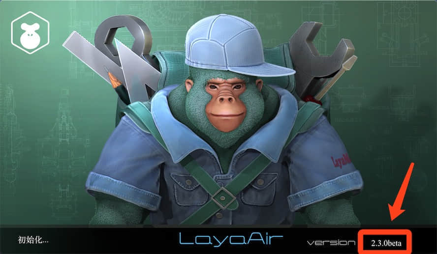

2. 新建一个项目 我这边起名字 idedemo 

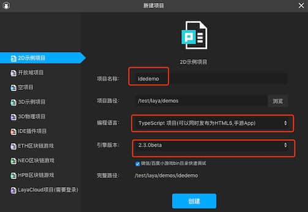

3. 我们看到 Layabox 的编译文件处于 .laya 文件夹下

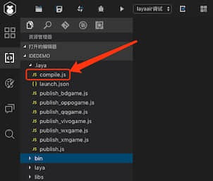

4. 我们打开我们Webstorm软件


5. 我们用Webstorm 打开我们刚刚新建的项目 选择项目文件夹即可

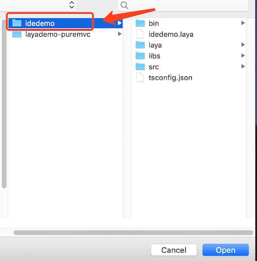

6. 我们打印一下compile.js文件的里面的 process.argv,准备替换（我们用LayaboxIDE）点击那个编译按钮，然后就能看的参数的值


```javascript
["/Applications/LayaAirIDE_beta2.3.0.app/Contents/Frameworks/Code Helper.app/Contents/MacOS/Code Helper","/Applications/LayaAirIDE_beta2.3.0.app/Contents/Resources/app/node_modules/gulp/bin/gulp.js","--gulpfile=/test/laya/demos/idedemo/.laya/compile.js","compile"]
```

7. 我们观察这个compile.js文件发现 Laya集合了几个工具

- gulp
- rollup
- rollup-plugin-typescript2
- rollup-plugin-glsl

8. 我们接下来用npm 安装上面几个插件
9. 安装成功后，在.laya目录下复制 compile.js 新建一个名字为 gulpfile.js (必须是这个名字)


10. 右键菜单 选择 

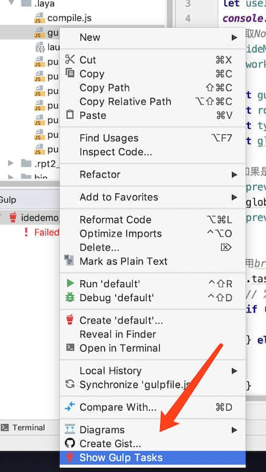

11. 修改我们这个参数配置


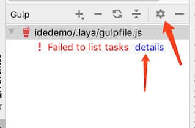

主要是修改我们这个 gulp 路径

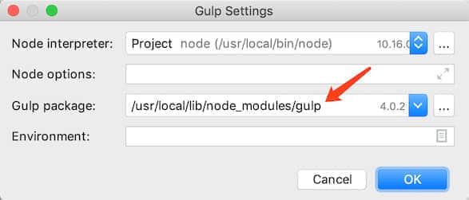

选择 Layabox 自带的 gulp 文件夹

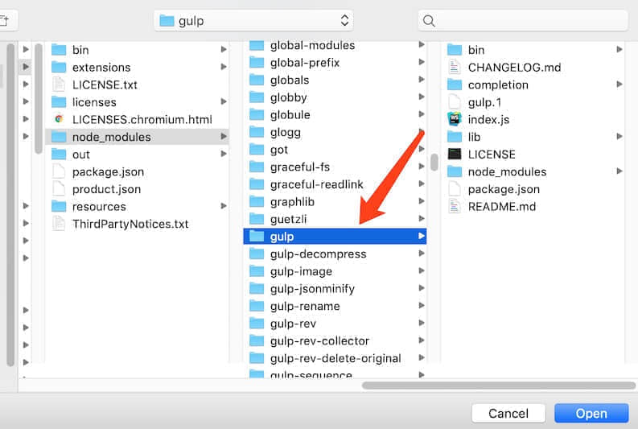

具体路径地址(你根据自己地址写)

```javascript
/Applications/LayaAirIDE_beta2.3.0.app/Contents/Resources/app/node_modules/gulp
```

12. 接下来修改 我们新建的文件 gulpfile.js 的代码

原代码

```javascript
let useIDENode = process.argv[0].indexOf("LayaAir") > -1 ? true : false;
```

修改为

```javascript
let addvalue = process.argv.splice(2,2)[1];
process.argv[process.argv.length-2] = addvalue+"="+process.argv[process.argv.length-2].replace("gulpfile","compile");
let useIDENode = process.argv[0].indexOf("node") > -1 ? true : false;
```

之所以这么修改是因为

layaIde 编译 compile.js 打印的 process.argv  内容是

```json
["/Applications/LayaAirIDE_beta2.3.0.app/Contents/Frameworks/Code Helper.app/Contents/MacOS/Code Helper","/Applications/LayaAirIDE_beta2.3.0.app/Contents/Resources/app/node_modules/gulp/bin/gulp.js","--gulpfile=/test/laya/demos/idedemo/.laya/compile.js","compile"]
```

而我本地的 Webstorm 编译 gulpfile.js 打印的 process.argv  内容是

```json
["/usr/local/bin/node","/Applications/LayaAirIDE_beta2.3.0.app/Contents/Resources/app/node_modules/gulp/bin/gulp.js","--no-color","--gulpfile","/test/laya/demos/idedemo/.laya/gulpfile.js","--tasks"]
```

读者可以根据自己的环境  更改内容，以上便是如果使用Webstorm 编译Laya2.0项目.

双击这个 compile 然后 发现 编辑通过


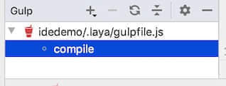

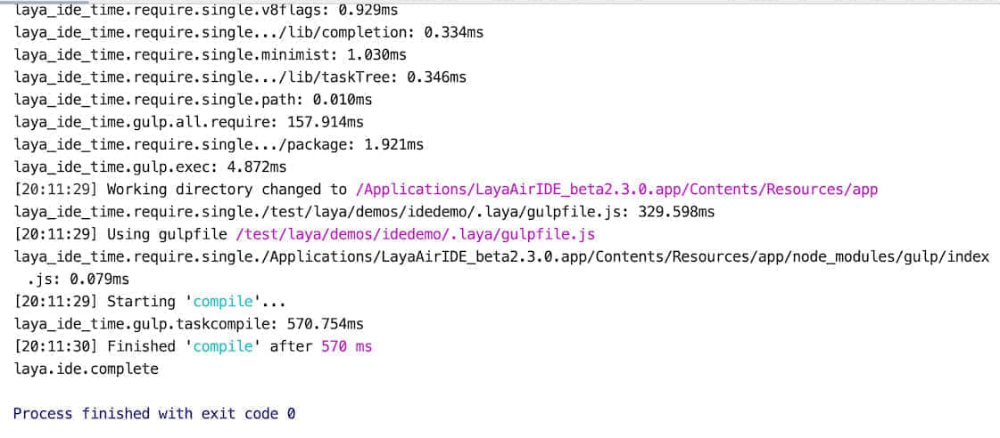

我们写一行输出

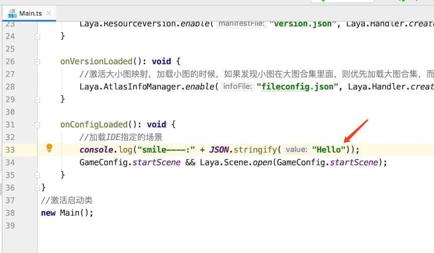

然后重新编译


我们发现 正确输出 但是 文件路径指向了我们生成的 js 文件 这个不是我们要的

注意: 这样编译后，我们发现在调试的时候，编译器总是指向编译后的JavaScript文件，这个是个很头疼的时候，上次因为忙，今天得以进一步了解，其实还是参数的问题

需要修改代码：

原代码：

```javascript
//使用browserify，转换ts到js，并输出到bin/js目录
gulp.task("compile", prevTasks, function () {
	// 发布时调用编译功能，判断是否点击了编译选项
	if (global.publish && !global.config.compile) {
		return;
	} else if (global.publish && global.config.compile) {
		// 发布时调用编译，workSpaceDir使用publish.js里的变量
		workSpaceDir = global.workSpaceDir;
	}

	return rollup.rollup({
		input: workSpaceDir + '/src/Main.ts',
		treeshake: true,//建议忽略
		plugins: [
			typescript({
				check: false, //Set to false to avoid doing any diagnostic checks on the code
				tsconfigOverride:{compilerOptions:{removeComments: true}}
			}),
			glsl({
				// By default, everything gets included
				include: /.*(.glsl|.vs|.fs)$/,
				sourceMap: false,
				compress:false
			}),
			/*terser({
				output: {
				},
				numWorkers:1,//Amount of workers to spawn. Defaults to the number of CPUs minus 1
				sourcemap: false
			})*/        
		]
	}).then(bundle => {
		return bundle.write({
			file: workSpaceDir + '/bin/js/bundle.js',
			format: 'iife',
			name: 'laya',
			sourcemap: false
		});
	});
});
```

修改后

```javascript
//使用browserify，转换ts到js，并输出到bin/js目录
gulp.task("compile", prevTasks, function () {
	// 发布时调用编译功能，判断是否点击了编译选项
	if (global.publish && !global.config.compile) {
		return;
	} else if (global.publish && global.config.compile) {
		// 发布时调用编译，workSpaceDir使用publish.js里的变量
		workSpaceDir = global.workSpaceDir;
	}

	return rollup.rollup({
		input: workSpaceDir + '/src/Main.ts',
		treeshake: true,//建议忽略
		plugins: [
			typescript({
				check: false, //Set to false to avoid doing any diagnostic checks on the code
				tsconfigOverride:{compilerOptions:{removeComments: true}}
			}),
			glsl({
				// By default, everything gets included
				include: /.*(.glsl|.vs|.fs)$/,
				sourceMap: false,
				compress:false
			}),
			/*terser({
				output: {
				},
				numWorkers:1,//Amount of workers to spawn. Defaults to the number of CPUs minus 1
				sourcemap: false
			})*/        
		]
	}).then(bundle => {
		return bundle.write({
			file: workSpaceDir + '/bin/js/bundle.js',
			format: 'iife',
			name: 'laya',
			sourcemap: true
		});
	});
});
```

其实就是修改 sourcemap: true 而已

另外去修改 我们的项目配置文件 tsconfig.json 里面 的 tsconfig.json

```json
{
  "compilerOptions": {
    "module": "es6",
    "target": "es6",
    "noEmitHelpers": true,
    "sourceMap": true
  },
  "exclude": [
    "node_modules"
  ]
}
```

同理也是  sourcemap: true 然后重新编译我们的项目 


同理 也可以断点调试


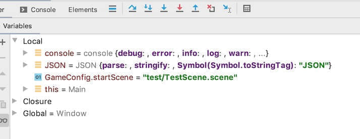

以上 全部搞定

**另外关于Layabox1.x版本 和前面的2.x 版本 细节可以参考我的另外一篇文章**

- [Webstorm如何配置Layabox2.0项目](http://www.asroads.com/2019/03/01/tool/Webstorm%E5%A6%82%E4%BD%95%E9%85%8D%E7%BD%AELayabox2-0%E9%A1%B9%E7%9B%AE/)
- [Mac下开启Chrome非安全模式](http://www.asroads.com/2019/04/12/tool/Mac%E4%B8%8B%E5%BC%80%E5%90%AFChrome%E9%9D%9E%E5%AE%89%E5%85%A8%E6%A8%A1%E5%BC%8F/)

