Cocos Creator是个能发布多平台的引擎工具，之前一直用来发布Web项目，微信小游戏，头条小游戏，QQ小游戏的项目，今天尝试了一下如何发布Native 安卓（Android）apk和ios的ipa 文件。
<!--more-->

Cocos Creator 使用基于 cocos2d-x 引擎的 JSB 技术实现跨平台发布原生应用。在使用 Cocos Creator 打包发布到原生平台之前，需要先配置好 cocos2d-x 相关的开发环境。

## 前期准备

### 环境准备

- Android 环境（Android Studio）[点击下载](http://www.android-studio.org/)
- ios环境  （Xcode）（可以Appstore下载）[进入官网](https://developer.apple.com/xcode/)
- Cocos Creator [进入官网](https://www.cocos.com/creator)
- Python2.75+（Mac电脑自带）（[进入官网](https://www.python.org/downloads/)）
- Java SDK （JDK）[点击下载](https://www.oracle.com/technetwork/java/javase/downloads/jdk8-downloads-2133151.html)

#### 配置环境

- Java SDK

```shell
java -version
```

本地输出

```shell
Last login: Thu Oct 17 14:39:48 on ttys001
bogon:~ smile$ java -version
java version "12.0.1" 2019-04-16
Java(TM) SE Runtime Environment (build 12.0.1+12)
Java HotSpot(TM) 64-Bit Server VM (build 12.0.1+12, mixed mode, sharing)
bogon:~ smile$
```

如果不能正确输出，请重新配置JDK环境，如何配置JDK，在此不再赘述。

- Python

```shell
Python
```

本地输出

```shell
bogon:~ smile$ Python
Python 2.7.16 (v2.7.16:413a49145e, Mar  2 2019, 14:32:10)
[GCC 4.2.1 Compatible Apple LLVM 6.0 (clang-600.0.57)] on darwin
Type "help", "copyright", "credits" or "license" for more information.
>>>
```

- 安装Xcode和Android Studio

- 安装 Android Studio 完成后，参考官方文档，打开 SDK Manager

- [SDK Manager 使用说明（需要使用 VPN）](https://developer.android.com/studio/intro/update.html#sdk-manager)

  > 1. 在 SDK Platforms 分页栏，勾选你希望安装的 API Level，也就是支持安卓系统的版本，推荐选择最低兼容的 API Level 16（4.1) 和所需的主流 API Level 23（6.0）、API Level 26（8.0）和 API Level 28（9.0）。
  >
  > 2. 在 SDK Tools 分页栏，首先勾选右下角的 `Show Package Details`，显示分版本的工具选择。
  >
  > 3. 在 `Android SDK Build-Tools` 里，选择最新的 build tools 版本。
  >
  > 4. 勾选 `Android SDK Platform-Tools`, `Android SDK Tools` 和 `Android Support Library`
  >
  > 5. 勾选 `NDK`，确保版本在 r16 及以上。
  >
  > 6. 记住窗口上方所示的 Android SDK Location 指示的目录，稍后我们需要在 Cocos Creator 里填写这个 SDK 所在位置。
  >
  > 7. 点击 `OK`，根据提示完成安装。
  >
  >    Cocos2d-x 自带的编译工具 Cocos Console 需要以下运行环境：
  >
  >    - Python 2.7.5+，[下载页](https://www.python.org/downloads/)，注意不要下载 Python 3.x 版本。
  >    - Windows 下需要安装 Visual Studio 2015 或 2017 社区版，[下载页](https://www.visualstudio.com/downloads/download-visual-studio-vs)
  >    - Mac 下需要安装 Xcode 和命令行工具，[下载页](https://developer.apple.com/xcode/download/)

**注意：如果没有`Android Support Library` 那么用最后一个就可以出来Android Support Repository 就可以了**

  - 推荐几个镜像服务器：

    > [http://1.mirrors.neusoft.edu.cn](https://link.zhihu.com/?target=http%3A//1.mirrors.neusoft.edu.cn) //东软信息学院，端口：80
    >
    > [http://2.ubuntu.buct.edu.cn/ubuntu.buct.cn](https://link.zhihu.com/?target=http%3A//2.ubuntu.buct.edu.cn/ubuntu.buct.cn) //北京化工大学，端口：80
    >
    > [http://3.mirrors.opencas.cn](https://link.zhihu.com/?target=http%3A//3.mirrors.opencas.cn) ([http://mirrors.opencas.org/mirrors.opencas.ac.cn](https://link.zhihu.com/?target=http%3A//mirrors.opencas.org/mirrors.opencas.ac.cn)) //中国科学院开源协会
    >
    > [http://4.sdk.gdgshanghai.com](https://link.zhihu.com/?target=http%3A//4.sdk.gdgshanghai.com) 端口：8000 //上海GDG镜像服务器
    >
    > [http://5.mirrors.dormforce.net](https://link.zhihu.com/?target=http%3A//5.mirrors.dormforce.net) //（栋力无限）电子科技大学，端口：80

- 最终效果


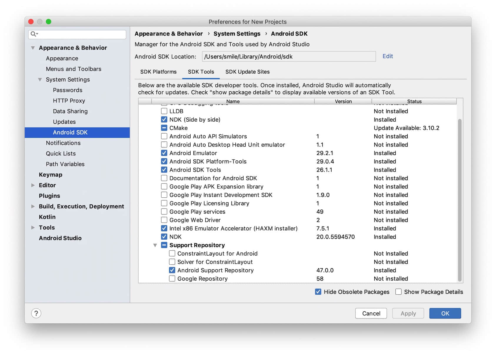

- 安装ios 需要的Xcode 

- 在这里需要配置以下两个路径：

  - **NDK 路径**，选择 `Android SDK Location` 路径下的 `ndk-bundle` 文件夹（NDK 是其根目录），不需要编译 Android 平台的话这里可以跳过。
  - **Android SDK 路径**，选择刚才在 SDK Manager 中记下的 `Android SDK Location` 路径（Android SDK 的目录下应该包含 build-tools、platforms 等文件夹），不需要编译 Android 平台的话这里可以跳过。

  配置完成后点击 **保存** 按钮，保存并关闭窗口。

  **注意**：这里的配置会在编译 **原生工程** 的时候生效。如果没有生效（一些 Mac 机器有可能出现这个情况），可能需要您尝试到 **系统环境变量** 设置这些值：COCOS_CONSOLE_ROOT, NDK_ROOT, ANDROID_SDK_ROOT。

#### 新建项目

- 我们大家Cocos Creator新建一个项目,我这里叫 mynativedemo

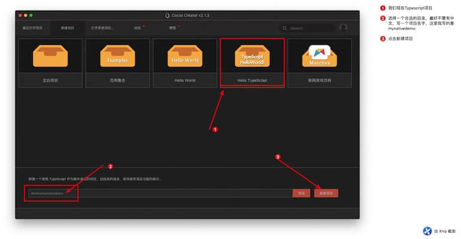

- 等待项目生成


- 我们项目生成，我们需要更改一下项目的参数设置

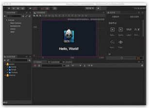

- 打开菜单--> 偏好设置


- 偏好设置-->原生开发环境配置
  - **NDK 路径**，选择 `Android SDK Location` 路径下的 `ndk-bundle` 文件夹（NDK 是其根目录）
  - **Android SDK 路径**，选择刚才在 SDK Manager 中记下的 `Android SDK Location` 路径（Android SDK 的目录下应该包含 build-tools、platforms 等文件夹）

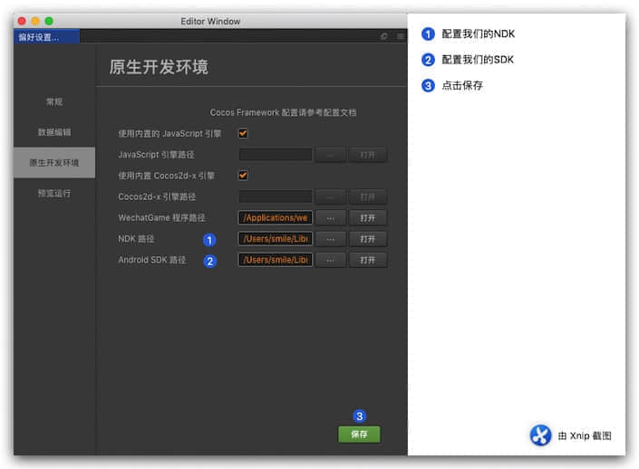

- 偏好设置-->预览运行 修改 我这里写 750 X 1334 竖屏 

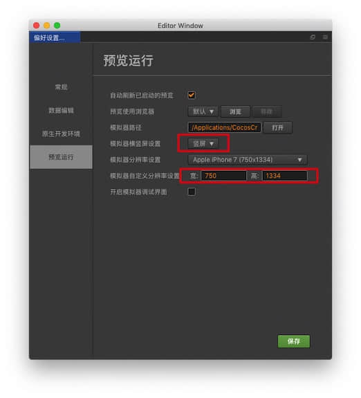

- 打开  项目-->项目设置


- 项目设置-->项目预览  设置分辨率、 适配宽度

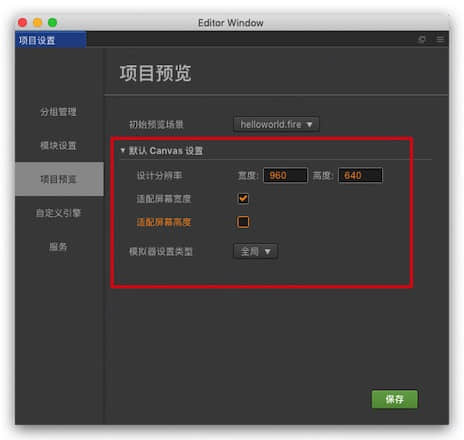

## 安卓平台（apk）

- 选择  项目-->构建发布


- 设置需要的选项

  

> Portrait ---> 这个是竖屏展示；
>
> Upside Down    --> 这个是手机竖屏，但是你的手机需要倒过来；
>
> Landscape Left      --> 这个是横屏，屏幕在home键左边；（常用的）
>
> Landscape Right    --> 这个也是横屏，屏幕在home右边。

- 等待发布成功


控制台没有输出错误log

```bash
Start building assets
Enable "内联所有 SpriteFrame" in native platform will increase the package size used in hot update.
Finish building assets
Start building plugin scripts
Checked Python Version [2.7.16]
Built to "/test/cc/mynativedemo/build/jsb-link" successfully
```

- 此时我们的项目已经生成 在 .build 文件夹下
- 修改我们的项目 自定义部分
- 然后点击 编译按钮


- 等待项目完成


```bash
Skipping task ':hello_world:assembleRelease' as it has no actions.
:hello_world:assembleRelease (Thread[Task worker for ':' Thread 3,5,main]) completed. Took 0.0 secs.
BUILD SUCCESSFUL in 14m 13s
59 actionable tasks: 59 executed
Move apk to /test/cc/mynativedemo/build/jsb-link/publish/android
Build succeed.
Compile native project successfully.
```

路径 `build/jsb-link/publish/android`下 生成我们的APK文件

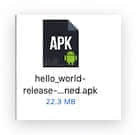

- 点击安装 运行效果


关于返回键不能正常关掉游戏的问题，此处先不谈这些，只讨论如何正确发布，这个问题，后面再说如何解决

## ios 平台（ipad）

### 准备工作

- 需要正确安装的Xcode
- 然后需要安装开发者证书
- 需要再证书添加调试设备者账号ID

### 开始构建设置

- 选择  项目-->构建发布


- 设置需要的选项

  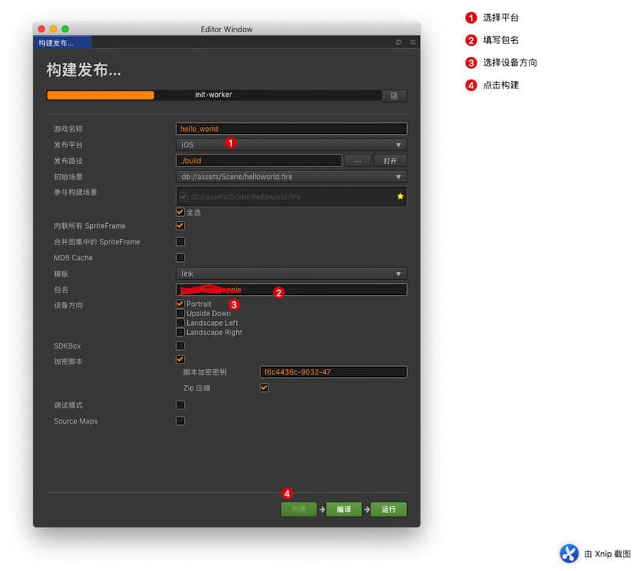

- 成功构建后


```bash
Checked Python Version [2.7.16]
Start building assets
Enable "内联所有 SpriteFrame" in native platform will increase the package size used in hot update.
Finish building assets
Start building plugin scripts
Checked Python Version [2.7.16]
Built to "/test/cc/mynativedemo/build/jsb-link" successfully
```

- 找到 构建目录.build 目录下面的 jsb-link-->frameworks-->runtime-src-->proj.ios_mac-->hello_world.xcodeproj 使用 Xcode 打开

  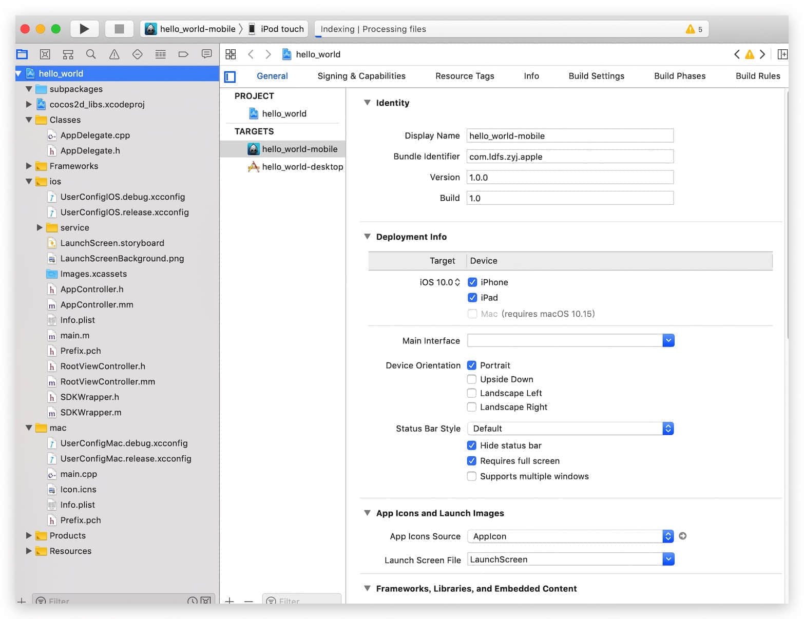

  

- 修改我们项目的配置

  - 修改秘钥

  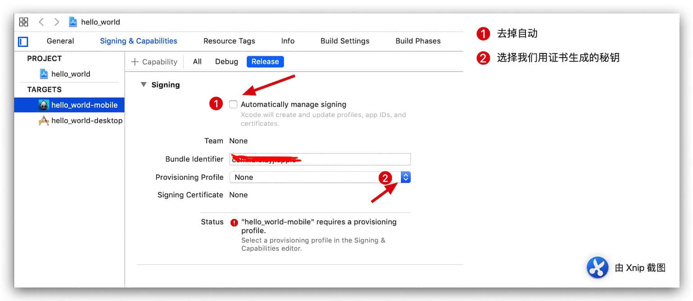

  - 修改后

    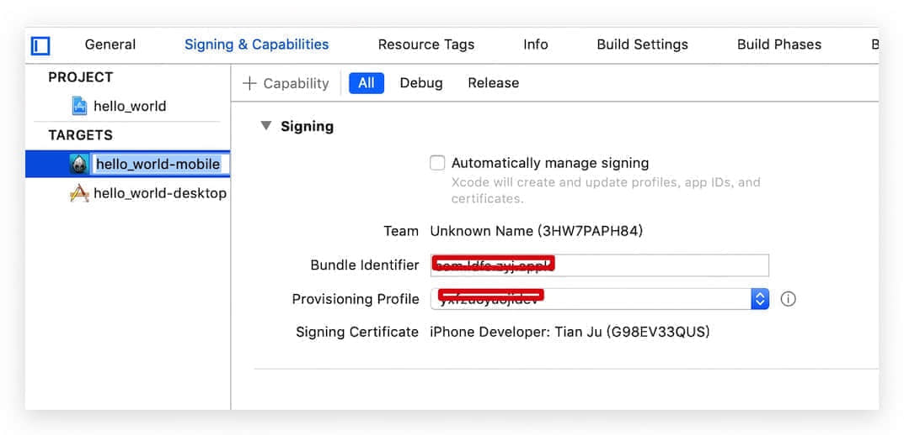

- 修改我们调试设备 Build Settings

  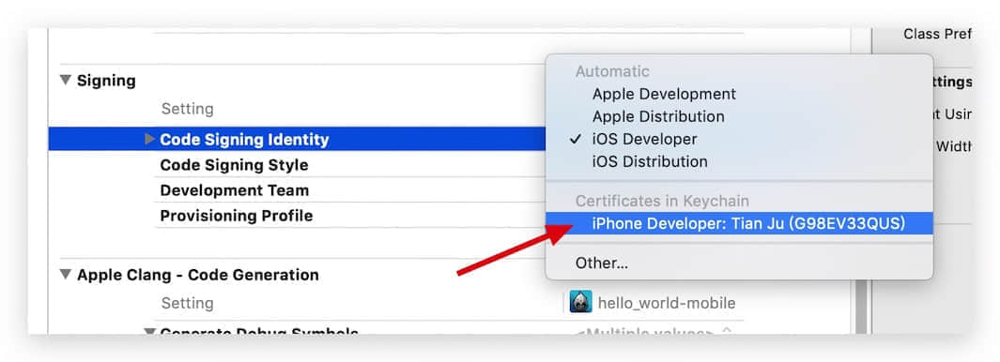

  

  - 连接我们的设备 然后点击运行按钮等待

  

  

  - 编译结束

  

  

  OK 调试结束

- 导出我们的ipad 文件

  - 选择 Achieve 

    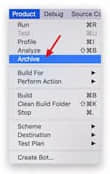

    等待编译结束

    

  - 结束后 会主动弹出一个窗口 或者我们自己打开 Window--> Organizer 打开窗口

    

    选择 Development 点击 Next 然后 继续 Next 

    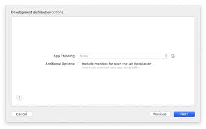

    然后选择 Profile 点击 Next

    

    

- 最后选择 导出 export 我们的项目


选择导出目录

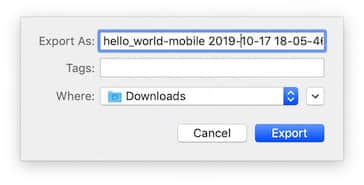

最后 打开已经生成 ipa文件

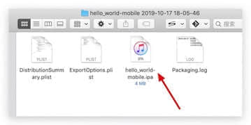

备注 导出的项目 目录 `/Users/smile/Library/Developer/Xcode/Archives` 点击小箭头 可以打开


### 使用iTools 安装 ipa 文件

- 下载 iTools [进入官网](http://www.itools.cn/)
- 安装iTools
- 打开iTools软件

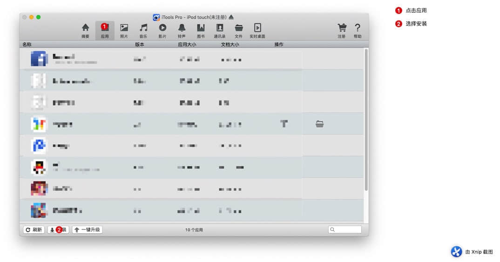

安装我们生成的ipa 文件

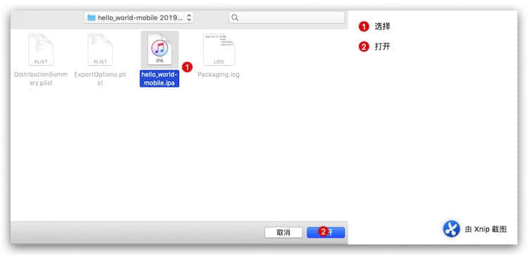

安装成功


打开运行成功

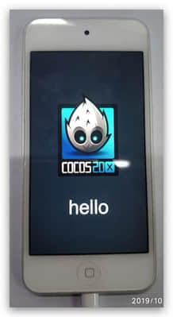

## 总结

打包Native安装包，应该了解安卓环境或者Xcode环境，熟悉项目目录结构文件配置，能更轻松顺利的解决遇到的问题。