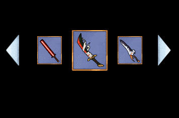
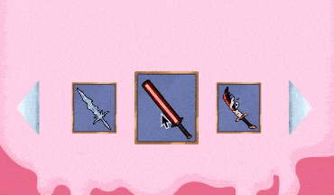
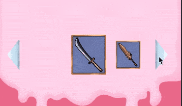
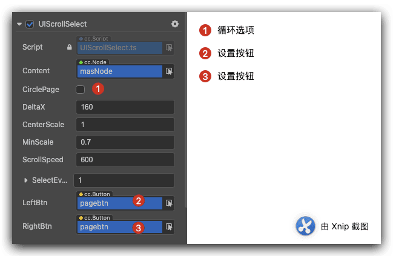

两年前还在使用`Layabox` 的时候 就做过一个类似的翻页组件，[LayaBox2.0横向滑动特效](http://blog.asroads.com/post/86c31a9c.html) 做了`Cocos` 这些日子一直想做个类似的功能，但是一直没有时间，于是无意间在论坛发现了一个，于是开始了这篇文章，作者用的是2.4.x 版本，最初我只是做了`Cocos Creator`的语法兼容，并未修改功能，后面有网友提出 想要一个不循环的版本，于是做了个加强版本。
<!--more-->
首先要感谢原作者，所有逻辑都是建立在原作者的基础上，大家要感谢，首先感谢这位仁兄的无私精神，我只是搬运工，在使用的过程中，二次加工而已。

## 最终效果：

### 作者原 2.4.x 版本循环翻页效果



原作者 代码下载   [ScrollSelect.zip](https://forum.cocos.org/uploads/default/original/3X/4/8/4863dece46a8d1c432cdcdf2d8ddea7a58912f30.zip) 

### 3.x 语法兼容循环翻页效果：



### 3.x 语法兼容设置不循环翻页效果：



## 设置选项



### 最后放上源码

3.x 语法翻译版本

```typescript

import {_decorator, Component,Node, CCInteger, EventHandler, EventTouch, UITransform, v2, v3, CCFloat} from 'cc';
const {ccclass, property} = _decorator;
export enum EventType {
    SCROLL_START,
    SCROLL_ING,
    SCROLL_END
}
@ccclass('UIScrollSelect')
export class UIScrollSelect extends Component {
    public static EventType = EventType;
    @property(Node)
    content :Node = null;
    @property({
        type:CCInteger,
        tooltip:'单个控件之间的距离'
    })
    deltaX : number = 100 //x间隔距离
    @property({
        type:CCFloat,
        tooltip:'中心点的缩放比例'
    })
    centerScale : number = 1.0
    @property({
        type:CCFloat,
        tooltip:'边缘点的缩放比例'
    })
    minScale : number = 1.0
    @property({
        type:CCFloat,
        tooltip:'滚动时的速度'
    })
    scrollSpeed: number = 300;
    @property({
        type: EventHandler,
        tooltip: "选择后的回调"
    })
    selectEvents:Array<EventHandler> = [];

    private childs:Array<Node> = [];
    private isTouching : boolean = false;
    private hasTouchMove : boolean = false;
    private isTestX : boolean = false;
    private _touchId: any = null;
    private currentIndex:number = 0;
    private _toMoveX:number = 1; //移动方向
    private dx:number = 0;
    private moveAim : number = 0;

    onLoad(){
        this.childs = [];
        for(let i=0; i<this.content.children.length; i++){
            this.childs[i] = this.content.children[i];
            this.childs[i].position = v3(this.deltaX*(i-1),this.childs[i].position.y,0)
        }
        this.isTouching = false
        this.hasTouchMove = false
        this.isTestX = false;
        this._touchId = null;
        // this.currentIndex = 0;
        this.scrollTo(0,false);
    }
    /** 滚动到指定节点
     * @param idx
     * @param anim 是否带移动动画
     */
    scrollTo(idx:number,anim:boolean=true){
        if(idx < 0 && idx >= this.childs.length){
            return console.error(this.node.name+'->移动超出边界面')
        }
        this.currentIndex = idx;
        this.moveAim = idx;
        if(!anim){
            for(let i=0; i<this.childs.length; i++){
                this._checkChildX(this.childs[i],(i-idx) *this.deltaX)
            }
        } else {
            this.isTestX = true
            EventHandler.emitEvents(this.selectEvents, {target :this,
                type :EventType.SCROLL_START,
                index : this.currentIndex});
        }
    }
    /** 向左滚一个点 */
    scrollToLeft(){
        this._toMoveX = 1
        this.scrollTo((this.currentIndex-1+this.childs.length)%this.childs.length)
    }

    /** 向左滚一个点 */
    scrollToRight(){
        this._toMoveX = -1
        this.scrollTo((this.currentIndex+1+this.childs.length)%this.childs.length)
    }

    _checkChildX(child:Node,x:number){
        if(x > this.childs.length/2 * this.deltaX){
            x-=this.childs.length * this.deltaX
        } else if(x < -this.childs.length/2 * this.deltaX){
            x+=this.childs.length * this.deltaX
        }
        child.position = v3(x,child.position.y,child.position.z)
        let dx = Math.min(Math.abs(x),this.deltaX)
        let scale:number = (1-dx/this.deltaX)*(this.centerScale-this.minScale) + this.minScale
        child.scale = v3(scale,scale,1)
    }

    start(){
        this.content.on(Node.EventType.TOUCH_START,this._onTouch,this);
        this.content.on(Node.EventType.TOUCH_MOVE,this._onTouch,this);
        this.content.on(Node.EventType.TOUCH_END,this._onTouchEnd,this);
        this.content.on(Node.EventType.TOUCH_CANCEL,this._onTouchEnd,this);
    }
    _onTouch(event:EventTouch ){
        if(this._touchId != null && event.touch != this._touchId){
            return;
        }
        if(event.type == Node.EventType.TOUCH_START){
            this.isTouching = true;
            this.hasTouchMove = false
            this.isTestX = false;
            this._touchId = event.touch;
            this.dx = event.getUIStartLocation().x
            let evt = {
                target :this,
                type :EventType.SCROLL_START,
                index : this.currentIndex
            }
            EventHandler.emitEvents(this.selectEvents, evt);
            return;
        }
        this.hasTouchMove = true;
        let dx = event.getUILocation().x - this.dx
        this._move(dx);
        this.dx = event.getUILocation().x
        let evt = {
            target :this,
            type :EventType.SCROLL_ING,
            dx:this.dx
        }
        EventHandler.emitEvents(this.selectEvents, evt);
    }
    _onTouchEnd(event){
        if(this._touchId != null && event.touch != this._touchId){
            return;
        }
        this.isTouching = false;
        if(event.type == Node.EventType.TOUCH_END || event.type == Node.EventType.TOUCH_CANCEL){
            this._touchId = null;
        }
        let tf = this.node.getComponent(UITransform)
        let lo = tf.convertToNodeSpaceAR(event.getUILocation())
        if(!this.hasTouchMove){

            let mx = Math.ceil((lo.x - this.deltaX / 2) / this.deltaX)
            if(mx === 0){
                let event1 = {
                    target :this,
                    type :EventType.SCROLL_END,
                    index : this.currentIndex
                }
                EventHandler.emitEvents(this.selectEvents, event1);
            } else {
                this.moveAim = (this.currentIndex+mx+this.childs.length)%this.childs.length
                this._toMoveX = mx > 0 ? -1 : 1
                this.isTestX = true;
            }
            return;
        }
        let max = this.deltaX;
        let minidx = 0
        for(let i=0; i<this.childs.length; i++){
            if(Math.abs(this.childs[i].position.x)<=max){
                max = Math.abs(this.childs[i].position.x)
                minidx = i;
            }
        }
        this.moveAim = minidx
        this._toMoveX = this.childs[minidx].position.x >= 0 ? -1 : 1
        this.isTestX = true;
    }
    _move(dt){
        for(let i=0; i<this.childs.length; i++){
            this._checkChildX(this.childs[i],this.childs[i].position.x+dt)
        }
    }


    update(dt){
        if(this.isTouching || !this.isTestX){
            return;
        }
        let stepx = this._toMoveX * dt * this.scrollSpeed
        let lx = this.childs[this.moveAim].position.x
        for(let i=0; i<this.childs.length; i++){
            this._checkChildX(this.childs[i],this.childs[i].position.x+stepx)
        }

        let x = this.childs[0].position.x;
        let idx = Math.round(x/this.deltaX);
        let tox = this.deltaX * idx;
        let cx = this.childs[this.moveAim].position.x
        if(lx * cx < 0 && Math.abs(cx) < this.deltaX){
            this.isTestX = false;
            for(let i=0; i<this.childs.length; i++){
                if(Math.abs(this.childs[i].position.x)<=Math.abs(stepx)){
                    this.currentIndex = i;
                    break;
                }
            }
            for(let i=0; i<this.childs.length; i++){
                this._checkChildX(this.childs[i],this.childs[i].position.x+tox-x)
            }
            let event = {
                target :this,
                type :EventType.SCROLL_END,
                index : this.currentIndex
            }
            EventHandler.emitEvents(this.selectEvents, event);
        }
    }
}

```

可以配置 不循环翻页加强版本：

```typescript

import {_decorator, Button, CCFloat, CCInteger, Component, EventHandler, EventTouch, Node, UITransform, v3} from 'cc';

const {ccclass, property} = _decorator;

export enum EventType {
    SCROLL_START,
    SCROLL_ING,
    SCROLL_END
}

@ccclass('UIScrollSelect')
export class UIScrollSelect extends Component {
    public static EventType = EventType;
    @property(Node)
    content: Node = null;
    @property({
        tooltip: "是否无限翻页"
    })
    circlePage: boolean = true;
    @property({
        type: Button,
        tooltip: '左边按钮',
        visible(this: UIScrollSelect) {
            return !this.circlePage;
        }
    })
    leftBtn: Button = null;
    @property({
        type: Button,
        tooltip: '右边按钮',
        visible(this: UIScrollSelect) {
            return !this.circlePage;
        }
    })
    rightBtn: Button = null;

    @property({
        type: CCInteger,
        tooltip: '单个控件之间的距离'
    })
    deltaX: number = 100; //x间隔距离
    @property({
        type: CCFloat,
        tooltip: '中心点的缩放比例'
    })
    centerScale: number = 1.0;
    @property({
        type: CCFloat,
        tooltip: '边缘点的缩放比例'
    })
    minScale: number = 1.0;
    @property({
        type: CCFloat,
        tooltip: '滚动时的速度'
    })
    scrollSpeed: number = 300;
    @property({
        type: EventHandler,
        tooltip: "选择后的回调"
    })
    selectEvents: Array<EventHandler> = [];


    private childs: Array<Node> = [];
    private isTouching: boolean = false;
    private hasTouchMove: boolean = false;
    private isTestX: boolean = false;
    private _touchId: any = null;
    private currentIndex: number = 0;
    private _toMoveX: number = 1; //移动方向
    private dx: number = 0;
    private moveAim: number = 0;

    onLoad() {
        this.childs = [];
        for (let i = 0; i < this.content.children.length; i++) {
            this.childs[i] = this.content.children[i];
            this.childs[i].position = v3(this.deltaX * (i - 1), this.childs[i].position.y, 0);
        }
        this.isTouching = false;
        this.hasTouchMove = false;
        this.isTestX = false;
        this._touchId = null;
        // this.currentIndex = 0;
        this.scrollTo(0, false);
    }

    /** 滚动到指定节点
     * @param idx
     * @param anim 是否带移动动画
     */
    scrollTo(idx: number, anim: boolean = true) {
        if (idx < 0 && idx >= this.childs.length) {
            return console.error(this.node.name + '->移动超出边界面');
        }
        this.currentIndex = idx;
        this.moveAim = idx;
        if (!anim) {
            for (let i = 0; i < this.childs.length; i++) {
                this._checkChildX(this.childs[i], (i - idx) * this.deltaX);
            }
        } else {
            this.isTestX = true;
            EventHandler.emitEvents(this.selectEvents, {
                target: this,
                type: EventType.SCROLL_START,
                index: this.currentIndex
            });
        }
    }

    /** 向左滚一个点 */
    scrollToLeft() {
        this._toMoveX = 1;
        this.scrollTo((this.currentIndex - 1 + this.childs.length) % this.childs.length);
        this._setPageBtnsStatus();
    }

    /** 向左滚一个点 */
    scrollToRight() {
        this._toMoveX = -1;
        this.scrollTo((this.currentIndex + 1 + this.childs.length) % this.childs.length);
        this._setPageBtnsStatus();

    }

    /**
     * 更新按钮状态
     */
    _setPageBtnsStatus() {
        const isRightEdge: boolean = this.currentIndex >= this.childs.length - 1;
        if (!this.circlePage && isRightEdge) {
            console.log("已经到了最右边", this.currentIndex);
            if (this.rightBtn) this.rightBtn.interactable = false;
        } else {
            if (this.rightBtn) this.rightBtn.interactable = true;
        }
        const isLeftEdge: boolean = this.currentIndex <= 0;
        if (!this.circlePage && isLeftEdge) {
            console.log("已经到了最左边", this.currentIndex);
            if (this.leftBtn) this.leftBtn.interactable = false;
        } else {
            if (this.leftBtn) this.leftBtn.interactable = true;
        }
    }

    _checkChildX(child: Node, x: number) {
        if (this.circlePage) {
            if (x > this.childs.length / 2 * this.deltaX) {
                x -= this.childs.length * this.deltaX;
            } else if (x < -this.childs.length / 2 * this.deltaX) {
                x += this.childs.length * this.deltaX;
            }
        }
        child.position = v3(x, child.position.y, child.position.z);
        let dx = Math.min(Math.abs(x), this.deltaX);
        let scale: number = (1 - dx / this.deltaX) * (this.centerScale - this.minScale) + this.minScale;
        child.scale = v3(scale, scale, 1);
    }

    start() {
        this.content.on(Node.EventType.TOUCH_START, this._onTouch, this);
        this.content.on(Node.EventType.TOUCH_MOVE, this._onTouch, this);
        this.content.on(Node.EventType.TOUCH_END, this._onTouchEnd, this);
        this.content.on(Node.EventType.TOUCH_CANCEL, this._onTouchEnd, this);
    }

    _onTouch(event: EventTouch) {
        if (this._touchId != null && event.touch != this._touchId) {
            return;
        }
        if (event.type == Node.EventType.TOUCH_START) {
            this.isTouching = true;
            this.hasTouchMove = false;
            this.isTestX = false;
            this._touchId = event.touch;
            this.dx = event.getUIStartLocation().x;
            let evt = {
                target: this,
                type: EventType.SCROLL_START,
                index: this.currentIndex
            };
            EventHandler.emitEvents(this.selectEvents, evt);
            return;
        }
        this.hasTouchMove = true;
        let dx = event.getUILocation().x - this.dx;
        this._move(dx);
        this.dx = event.getUILocation().x;
        let evt = {
            target: this,
            type: EventType.SCROLL_ING,
            dx: this.dx
        };
        EventHandler.emitEvents(this.selectEvents, evt);
    }

    /**
     * 是否到达左右边缘
     * @returns {{left: boolean, right: boolean}}
     */
    _isMoveEdge() {
        const leftEdge = this.childs[0].position.x >= 0;
        const rightEdge = this.childs[this.childs.length - 1].position.x <= 0;
        return {left: leftEdge, right: rightEdge};
    }

    _onTouchEnd(event) {
        if (this._touchId != null && event.touch != this._touchId) {
            return;
        }
        this.isTouching = false;
        if (event.type == Node.EventType.TOUCH_END || event.type == Node.EventType.TOUCH_CANCEL) {
            this._touchId = null;
        }
        if (!this.circlePage) {
            let edge = this._isMoveEdge();
            if (edge.right) {
                console.log("最右边 无法动");
                return;
            }
            if (edge.left) {
                console.log("最左边 无法动");
                return;
            }
        }
        let tf = this.node.getComponent(UITransform);
        let lo = tf.convertToNodeSpaceAR(event.getUILocation());
        if (!this.hasTouchMove) {

            let mx = Math.ceil((lo.x - this.deltaX / 2) / this.deltaX);
            if (mx === 0) {
                let event1 = {
                    target: this,
                    type: EventType.SCROLL_END,
                    index: this.currentIndex
                };
                EventHandler.emitEvents(this.selectEvents, event1);
            } else {
                this.moveAim = (this.currentIndex + mx + this.childs.length) % this.childs.length;
                this._toMoveX = mx > 0 ? -1 : 1;
                this.isTestX = true;
            }
            return;
        }
        let max = this.deltaX;
        let minidx = 0;
        for (let i = 0; i < this.childs.length; i++) {
            if (Math.abs(this.childs[i].position.x) <= max) {
                max = Math.abs(this.childs[i].position.x);
                minidx = i;
            }
        }
        this.moveAim = minidx;
        this._toMoveX = this.childs[minidx].position.x >= 0 ? -1 : 1;
        this.isTestX = true;
    }

    _move(dt) {
        if (dt === 0) return;
        if (!this.circlePage) {
            let edge = this._isMoveEdge();
            if (dt < 0 && edge.right) {
                console.log("最右边 无法动");
                return;
            }
            if (dt > 0 && edge.left) {
                console.log("最左边 无法动");
                return;
            }
        }
        for (let i = 0; i < this.childs.length; i++) {
            this._checkChildX(this.childs[i], this.childs[i].position.x + dt);
        }
    }


    update(dt) {
        if (this.isTouching || !this.isTestX) {
            return;
        }
        let stepx = this._toMoveX * dt * this.scrollSpeed;
        let lx = this.childs[this.moveAim].position.x;
        for (let i = 0; i < this.childs.length; i++) {
            this._checkChildX(this.childs[i], this.childs[i].position.x + stepx);
        }

        let x = this.childs[0].position.x;
        let idx = Math.round(x / this.deltaX);
        let tox = this.deltaX * idx;
        let cx = this.childs[this.moveAim].position.x;
        if (lx * cx < 0 && Math.abs(cx) < this.deltaX) {
            this.isTestX = false;
            for (let i = 0; i < this.childs.length; i++) {
                if (Math.abs(this.childs[i].position.x) <= Math.abs(stepx)) {
                    this.currentIndex = i;
                    break;
                }
            }
            for (let i = 0; i < this.childs.length; i++) {
                this._checkChildX(this.childs[i], this.childs[i].position.x + tox - x);
            }
            let event = {
                target: this,
                type: EventType.SCROLL_END,
                index: this.currentIndex
            };
            EventHandler.emitEvents(this.selectEvents, event);
        }
    }
}

```

## 参考

- [【源码工具】分享一个UI左右无限翻页组件](https://forum.cocos.org/t/topic/91675)

