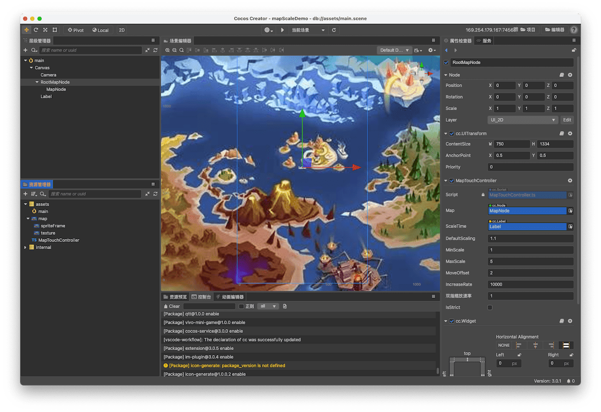
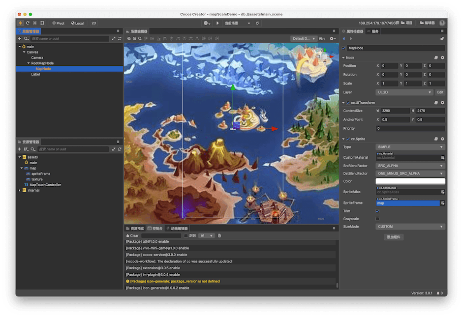
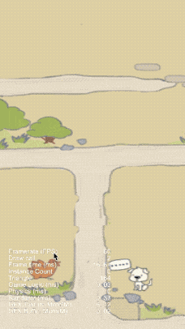

随着手游的兴起，越来越多的玩法涌现出来，地图拖动缩放组件在很多玩法中都有用到，这里给出一个Cocos Creator 3.6.2的组件

<!--more-->

## 无惯性简单版本

### 效果

先展示一下 效果：


### 核心

主要是给Node节点添加事件，根据触摸或者滚轮的方向和速度来控制地图的缩放或者拖动。

#### 用到的事件类型

- **Node.EventType.MOUSE_WHEEL**  Web 下鼠标滚轮滚动缩放地图
- **Node.EventType.TOUCH_START**
- **Node.EventType.TOUCH_MOVE**
- **Node.EventType.TOUCH_END**
- **Node.EventType.TOUCH_CANCEL**

触摸事件（Event.EventTouch）的处理

#### 用到的API

- **getLocation** 获取鼠标位置对象，对象包含 x 和 y 属性。
- **getUILocation** 获取当前鼠标在 UI 窗口内相对于左下角的坐标位置，对象包含 x 和 y 属性。

其他API 可以查看 [全局与节点触摸和鼠标事件 API](https://docs.cocos.com/creator/3.0/manual/zh/engine/event/event-api.html#%E8%A7%A6%E6%91%B8%E4%BA%8B%E4%BB%B6-API)

### 步骤

项目结构截图---RootMapNode



MapNode



2.4.10 版本 核心代码：`MapTouchController.ts`  [源码查看](https://github.com/jsroads/mylibs/tree/main/mapScaleDemo/2.4.10%20assets)

3.0 核心代码：`MapTouchController.ts`（待优化...）

```typescript
import {
    _decorator,
    CCBoolean,
    CCFloat,
    Component,
    EventMouse,
    EventTouch,
    isValid,
    Label,
    misc,
    Node,
    Rect,
    rect,
    Touch,
    UITransform,
    v2,
    v3,
    Vec2,
    Vec3
} from "cc";

/**
 * Created by jsroads on 2021/4/15.4:35 下午
 * Note:
 */
const {ccclass, property} = _decorator;

@ccclass('MapTouchController')
export class MapTouchController extends Component {
    @property({
        type: Node,
        tooltip: '目标节点'
    })
    public map: Node = null!;

    @property(Label)
    public scaleTime: Label = null!;

    @property({
        tooltip: '图片初始缩放'
    })
    public defaultScaling: number = 1.1;

    @property({
        tooltip: '图片缩放最小scale'
    })
    public minScale: number = 1;

    @property({
        tooltip: '图片缩放最大scale'
    })
    public maxScale: number = 3;

    @property({
        tooltip: '单点触摸容忍误差'
    })
    public moveOffset: number = 2;

    @property({
        tooltip: '滚轮缩放比率'
    })
    public increaseRate: number = 10000;

    @property({
        displayName: '双指缩放速率',
        max: 10,
        min: 0.001,
    })
    public fingerIncreaseRate: number = 1;

    public locked: boolean = false; // 操作锁
    public singleTouchCb: Function = null!; // 点击回调函数

    private isMoving: boolean = false; // 是否拖动地图flag
    private mapTouchList: any[] = []; // 触摸点列表容器

    @property(CCBoolean)
    public isStrict: boolean = false; // 默认为非严格模式
    protected onLoad(): void {

    }

    protected start() {
        this.addEvent();
        // this.defaultScaling = 1
        this.smoothOperate(this.map, v3(0, 0, 0), this.defaultScaling);
        this.map.setPosition(0, 225);
    }


    private canStartMove(touch: Touch): boolean {
        // 有些设备单点过于灵敏，单点操作会触发TOUCH_MOVE回调，在这里作误差值判断
        return touch.getDelta().length() > this.moveOffset;
    }

    private addEvent(): void {
        this.node.on(Node.EventType.TOUCH_MOVE, (event: EventTouch) => {
            if (this.locked) return;
            let touches: Touch[] = event.getTouches(); // 获取所有触摸点
            if (this.isStrict) { // 严格模式下过滤掉初始点击位置不在目标节点范围内的触摸点
                touches
                    .filter(v => {
                        let startPos: Vec2 = v2(v.getStartLocation()); // 触摸点最初的位置
                        let transform = <UITransform>this.node.getComponent(UITransform);
                        let worldPos: Vec3 = transform.convertToWorldSpaceAR(v3(0, 0, 0));
                        let worldRect: Rect = rect(
                            worldPos.x - transform.width / 2,
                            worldPos.y - transform.height / 2,
                            transform.width,
                            transform.height
                        );
                        return worldRect.contains(startPos);
                    })
                    .forEach(v => { // 将有效的触摸点放在容器里自行管理
                        let intersection: any[] = this.mapTouchList.filter(v1 => v1.id === v.getID());
                        if (intersection.length === 0)
                            this.mapTouchList[this.mapTouchList.length] = ({id: v.getID(), touch: v});
                    });
                touches = this.mapTouchList.map(v => v.touch);
            }

            if (touches.length >= 2) {
                // console.log('multi touch');
                // multi touch
                this.isMoving = true;
                let touch1: Touch = touches[0];
                let touch2: Touch = touches[1];
                let delta1: Vec2 = v2(touch1.getDelta());
                let delta2: Vec2 = v2(touch2.getDelta());
                let transform = <UITransform>this.node.getComponent(UITransform);
                let touchPoint1: Vec3 = transform.convertToNodeSpaceAR(v3(touch1.getUILocation().x, touch1.getUILocation().y));
                let touchPoint2: Vec3 = transform.convertToNodeSpaceAR(v3(touch2.getUILocation().x, touch2.getUILocation().y));

                let distance: Vec3 = touchPoint1.subtract(touchPoint2);
                // const rateV2: Vec2 = v2(this.fingerIncreaseRate, this.fingerIncreaseRate);
                let delta: Vec2 = delta1.subtract(delta2).multiplyScalar(this.fingerIncreaseRate);
                let scale: number = 1;
                if (Math.abs(distance.x) > Math.abs(distance.y)) {
                    scale = (distance.x + delta.x) / distance.x * this.map.getScale().x;
                } else {
                    scale = (distance.y + delta.y) / distance.y * this.map.getScale().y;
                }
                let pos: Vec3 = touchPoint2.add(v3(distance.x / 2, distance.y / 2));
                this.smoothOperate(this.map, pos, scale);
            } else if (touches.length === 1) {
                // console.log('single touch');
                // single touch
                let touch: Touch = touches[0];
                if (this.isMoving || this.canStartMove(touch)) {
                    this.isMoving = true;
                    const distance:Vec3 = v3(touch.getDelta().x, touch.getDelta().y,0);
                    this.dealMove(distance, this.map, this.node);
                } else {
                    console.log("不能移动")
                }
            } else {
                console.log("未知触摸类型")
            }
            event.propagationStopped = true;
        }, this);
        this.node.on(Node.EventType.TOUCH_START, (event: EventTouch) => {
            if (this.locked) return;
            event.propagationStopped = true;
        }, this);
        this.node.on(Node.EventType.TOUCH_END, (event: EventTouch) => {
            if (this.locked) return;

            let touches: any[] = this.isStrict ? this.mapTouchList : event.getTouches();
            if (touches.length <= 1) {
                if (!this.isMoving) {
                    let worldPos: Vec3 = v3(event.getLocation().x, event.getLocation().y);
                    let transform = <UITransform>this.map.getComponent(UITransform);
                    let nodePos: Vec3 = transform.convertToNodeSpaceAR(worldPos);
                    this.dealSelect(nodePos);
                }
                this.isMoving = false; // 当容器中仅剩最后一个触摸点时将移动flag还原
            }
            if (this.isStrict) this.removeTouchFromContent(event, this.mapTouchList);
            event.propagationStopped = true;
        }, this);

        this.node.on(Node.EventType.TOUCH_CANCEL, (event: EventTouch) => {
            if (this.locked) return;

            let touches: any[] = this.isStrict ? this.mapTouchList : event.getTouches();
            // 当容器中仅剩最后一个触摸点时将移动flag还原
            if (touches.length <= 1) this.isMoving = false;

            if (this.isStrict)
                this.removeTouchFromContent(event, this.mapTouchList);
            event.propagationStopped = true;
        }, this);

        this.node.on(Node.EventType.MOUSE_WHEEL, (event: EventMouse) => {
            if (this.locked) return;
            let scrollDelta: number = event.getScrollY();
            let scale: number = (this.map.getScale().x + (scrollDelta / this.increaseRate));
            // scale = this.map.getScale().x+0.2
            let target: Node = this.map;
            let transform = <UITransform>this.node.getComponent(UITransform);
            let pos: Vec3 = transform.convertToNodeSpaceAR(v3(event.getUILocation().x, event.getUILocation().y));
            // pos = v3(50,50)
            this.smoothOperate(target, pos, scale);
            event.propagationStopped = true;
        }, this);
    }

    public removeTouchFromContent(event: EventTouch, content: any[]): void {
        let eventToucheIDs: number[] = event['getTouches']().map(v => v.getID());
        for (let len = content.length, i = len - 1; i >= 0; --i) {
            if (eventToucheIDs.indexOf(content[i].id) > -1)
                content.splice(i, 1); // 删除触摸
        }
    }

    private smoothOperate(target: Node, pos: Vec3, scale: number): void {
        // 放大缩小
        if (this.minScale <= scale && scale <= this.maxScale) {
            // 获取速率的小数后几位，防止速率过小时取整直接舍弃掉了变化
            scale = Number(scale.toFixed(2));
            // let deltaScale: number = scale - target.getScale().x;
            let uiScaleVec3: Vec3 = v3(target.getScale().x, target.getScale().y, 1)
            let uiTouchPos: Vec3 = (pos.clone().subtract(target.position.clone())).divide(uiScaleVec3);
            let mapPos: Vec3 = pos.clone().subtract(uiTouchPos.multiplyScalar(scale));
            //UI setScale z 必须为非0
            target.setScale(v3(scale, scale, 1));
            this.dealScalePos(v3(mapPos.x, mapPos.y), target);
        } else {
            console.log("smile----:", JSON.stringify("特殊情况"));
            scale = misc.clampf(scale, this.minScale, this.maxScale);
        }
        // render ui
        if (isValid(this.scaleTime))
            this.scaleTime.string = `${Math.floor(scale * 100)}%`;
    }

    private dealScalePos(pos: Vec3, target: Node): void {
        let transform = <UITransform>this.node.getComponent(UITransform);
        let worldPos: Vec3 = transform.convertToWorldSpaceAR(pos);
        let nodePos: Vec3 = transform.convertToNodeSpaceAR(worldPos);
        let edge: any = this.calculateEdge(target, this.node, nodePos);
        if (edge.left > 0) {
            pos.x -= edge.left;
        }
        if (edge.right > 0) {
            pos.x += edge.right;
        }
        if (edge.top > 0) {
            pos.y += edge.top;
        }
        if (edge.bottom > 0) {
            pos.y -= edge.bottom;
        }
        target.setPosition(v3(pos.x, pos.y, 0));
    }

    private dealMove(dir: Vec3, map: Node, container: Node): void {
        let worldPos: Vec3 = (<UITransform>map.getComponent(UITransform)).convertToWorldSpaceAR(v3(Vec3.ZERO));
        let nodePos: Vec3 = (<UITransform>container.getComponent(UITransform)).convertToNodeSpaceAR(worldPos);
        nodePos.add(dir);
        let edge: any = this.calculateEdge(map, container, nodePos);
        if (edge.left <= 0 && edge.right <= 0) {
            map.setPosition(map.position.x + dir.x, map.position.y);
        }
        if (edge.top <= 0 && edge.bottom <= 0) {
            map.setPosition(map.position.x, map.position.y + dir.y)
        }
    }

    private dealSelect(nodePos: Vec3): void {
        console.log(`click map on (${nodePos.x}, ${nodePos.y})`);
        // do sth
        if (this.singleTouchCb) this.singleTouchCb(nodePos);
    }

    // 计算map的四条边距离容器的距离，为负代表超出去
    public calculateEdge(target: Node, container: Node, nodePos: Vec3): any {
        // distance to the edge when anchor is (0.5, 0.5)

        let containerTransform: UITransform = <UITransform>container.getComponent(UITransform);
        let targetTransform: UITransform = <UITransform>target.getComponent(UITransform);
        let targetScale = target.scale

        let horizontalDistance: number = (containerTransform.width - targetTransform.width * targetScale.x) / 2;
        let verticalDistance: number = (containerTransform.height - targetTransform.height * targetScale.y) / 2;

        let left: number = horizontalDistance + nodePos.x;
        let right: number = horizontalDistance - nodePos.x;
        let top: number = verticalDistance - nodePos.y;
        let bottom: number = verticalDistance + nodePos.y;

        return {left, right, top, bottom};
    }

    /**
     * @brief 设置是否严格模式，如果为严格模式，则会过滤不在目标身上的触摸点， 反之不作处理
     *              默认为非严格模式
     * @param isStrict
     */
    public setStrictPattern(isStrict: boolean): void {
        this.isStrict = isStrict;
    }

    public getStrictPattern(): boolean {
        return this.isStrict;
    }

}
```

**注意**： `target.setScale(v3(scale, scale, 1));` 重点说明一下 设置UI界面 `scale` 属性的时候 这个 `Vec3` 类型的 `z` 一定要为非`0` 的值 否则会影响其他的 `touch`事件传递

### 具体操作

1. 新建一个场景 名字这里为 `main.scene`
2. 新建`Node`节点 名字为 `RootMapNode` 挂载一个系统组件 `Widget` left、 right、 top、 bottom 均为 0
3. `RootMapNode`节点下面新建一个 `Node` 节点 为 `MapNode` 
4. `RootMapNode` 同级 新建一个 Label 节点
5. 以上所有UI和节点 layer 选择 UI_2D
6. 把 脚本 `MapTouchController.ts`组件 挂载到 `RootMapNode` 上面
7. 把 `MapNode` 节点 指向 脚本的属性 `map`
8. 把 新建的`Label` 节点 指向脚本的属性 `scaleTime`
9. 运行游戏 查看效果

### 注意点：

转换坐标的关键核心点：

1. Vec2 和 Vec3 转换
2. getUILocation() 和 getLocation() 的区别

注意：本脚本参考来自于  [Cocos Creator组件化开发之——地图类缩放拖动点击组件](https://blog.csdn.net/faker_in_c/article/details/103500238) 作者是用 Cocos Creator2.x 实现（[查看](https://github.com/fakerincocos/MapControl-master)）

我这里改成了3.6.2 另外 缩放的核心算法 有细微改动。

最后 源码地址：[点击查看](https://github.com/jsroads/mylibs/tree/main/mapScaleDemo)

## 惯性缓动优化版本2022-11-27更新

### 效果：



### 步骤

上面的版本已经完整的可以拖拽，但如果拖拽结束后如何惯性再运动一段距离呢？此时我们需要求出速度V 和摩擦力阻尼系数，然后做匀减速运动即可，此时我们先设置几个变量如下：

```typescript
   const NUMBER_OF_GATHERED_TOUCHES_FOR_MOVE_SPEED = 5;//统计最大移动次数个数

    public brake: number = 0.5; //惯性系数
    public friction: number = 0.85; //阻尼系数，摩擦力
    protected touchMoveDisplacements: Vec3[] = [];//统计位置数组
    protected touchMoveTimeDeltas: number[] = [];//统计时间数组
    protected touchMovePreviousTimestamp = 0;//前一次事件时间戳
    protected autoScrolling: boolean = false;//是否在惯性移动中
    protected speed: Vec3 = new Vec3();//当前速度
    protected targetPos: Vec3 = new Vec3();//目标移动位置
```

然后在 点击触摸开始时候TOUCH_START或者触摸取消TOUCH_CANCEL开始重置统计 ：

```typescript
  protected handleReleaseLogic() {
        if (!this.inertia) return;
        this.touchMovePreviousTimestamp = Date.now();
        this.touchMoveDisplacements.length = 0;
        this.touchMoveTimeDeltas.length = 0;
        this.autoScrolling = false;
   }
```

移动的时候开始记录数据：

```typescript
    private dealMove(dir: Vec3, map: Node, container: Node): void {
        const clampDt = dir.clone();
        let worldPos: Vec3 = (<UITransform>map.getComponent(UITransform)).convertToWorldSpaceAR(v3(Vec3.ZERO));
        let nodePos: Vec3 = (<UITransform>container.getComponent(UITransform)).convertToNodeSpaceAR(worldPos);
        nodePos.add(dir);
        let edge: any = this.calculateEdge(map, container, nodePos), targetPos: Vec3 = map.position.clone();
        if (edge.left <= 0 && edge.right <= 0) {
            targetPos.x += dir.x;
        } else {
            clampDt.x = 0;
        }
        if (edge.top <= 0 && edge.bottom <= 0) {
            targetPos.y += dir.y;
        } else {
            clampDt.y = 0;
        }

        this.gatherTouchMove(clampDt);
        // this.targetPos = this.targetPos.lerp(this.targetPos,0.016 * 2.0);
        map.setPosition(targetPos.x, targetPos.y, targetPos.z)
    }

    protected gatherTouchMove(clampDt: Vec3) {
        while (this.touchMoveDisplacements.length >= NUMBER_OF_GATHERED_TOUCHES_FOR_MOVE_SPEED) {
            this.touchMoveDisplacements.shift();
            this.touchMoveTimeDeltas.shift();
        }
        this.touchMoveDisplacements.push(clampDt);
        const timeStamp = Date.now();
        this.touchMoveTimeDeltas.push((timeStamp - this.touchMovePreviousTimestamp) / 1000);
        this.touchMovePreviousTimestamp = timeStamp;
    }

```

触摸结束的时候，开始统计结束时候的速度：

```typescript
    protected processInertiaScroll() {
        if (this.inertia) {
            this.speed = this.calculateTouchMoveVelocity();
            if (Math.abs(this.speed.x) > 0 || Math.abs(this.speed.y) > 0) {
                this.autoScrolling = true;
                return;
            }
        }
    }
    protected calculateTouchMoveVelocity(): Vec3 {
        let totalTime = 0;
        totalTime = this.touchMoveTimeDeltas.reduce((a, b) => a + b, totalTime);
        if (totalTime <= 0 || totalTime > 0.75) {
            return new Vec3();
        }
        let totalMovement = new Vec3();
        totalMovement = this.touchMoveDisplacements.reduce((a, b) => {
            a.add(b);
            return a;
        }, totalMovement);
        let result = new Vec3(totalMovement.x * (1 - this.brake),
            totalMovement.y * (1 - this.brake), 0);
        return result;
    }
```

最后在 update 函数里 开始惯性运行：

```typescript
    protected update(dt: number) {
        if (!this.inertia) return;
        if (!this.autoScrolling) return;
        let speed = this.speed.clone();
        speed.multiplyScalar(this.friction);
        let worldPos: Vec3 = (<UITransform>this.map.getComponent(UITransform)).convertToWorldSpaceAR(v3(Vec3.ZERO)).clone();
        let nodePos: Vec3 = (<UITransform>this.node.getComponent(UITransform)).convertToNodeSpaceAR(worldPos).clone();
        nodePos.add(speed);
        let edge: any = this.calculateEdge(this.map, this.node, nodePos), targetPos: Vec3 = this.map.position.clone();
        if (edge.left > 0 || edge.right > 0) {
            speed.x = 0;
        }
        if (edge.top > 0 || edge.bottom > 0) {
            speed.y = 0;
        }
        this.speed = v3(Math.round(speed.x * 100) / 100, Math.round(speed.y * 100) / 100, speed.z);
        if (Math.abs(this.speed.x) < 0.1 && Math.abs(this.speed.y) < 0.1) {
            this.autoScrolling = false;
            return;
        }
        targetPos.add(this.speed);
        this.map.setPosition(targetPos.x, targetPos.y, targetPos.z);
    }
```

MapTouchBetterController.ts 完整代码如下：

```typescript
import {
    _decorator,
    CCBoolean,
    Component,
    EventMouse,
    EventTouch,
    isValid,
    Label,
    misc,
    Node,
    Rect,
    rect,
    Touch,
    UITransform,
    v2,
    v3,
    Vec2,
    Vec3
} from "cc";

/**
 * Created by jsroads on 2021/4/15.4:35 下午
 * Note:
 */
const {ccclass, property} = _decorator;
const NUMBER_OF_GATHERED_TOUCHES_FOR_MOVE_SPEED = 2;//统计最大移动次数个数
@ccclass('MapTouchBetterController')
export class MapTouchBetterController extends Component {
    @property({
        type: Node,
        tooltip: '目标节点'
    })
    public map: Node = null!;

    @property(Label)
    public scaleTime: Label = null!;

    @property({
        tooltip: '图片初始缩放'
    })
    public defaultScaling: number = 1.1;

    @property({
        tooltip: '图片缩放最小scale'
    })
    public minScale: number = 1;

    @property({
        tooltip: '图片缩放最大scale'
    })
    public maxScale: number = 3;

    @property({
        tooltip: '单点触摸容忍误差'
    })
    public moveOffset: number = 2;

    @property({
        tooltip: '滚轮缩放比率'
    })
    public increaseRate: number = 10000;

    @property({
        displayName: '双指缩放速率',
        max: 10,
        min: 0.001,
    })
    public fingerIncreaseRate: number = 1;

    public locked: boolean = false; // 操作锁
    public singleTouchCb: Function = null!; // 点击回调函数
    @property(CCBoolean)
    public isStrict: boolean = false; // 默认为非严格模式
    @property({
        tooltip: "是否开启滚动惯性"
    })
    public inertia: boolean = true; // 是否开启滚动惯性
    @property({
        tooltip: "惯性系数，范围 0~1, 1表示立刻停止 ",
        min: 0.01,
        max: 1,
        step: 0.01,
        range: [0.01, 1],
        slide: true,
        visible: function (this: MapTouchBetterController) {
            return this.inertia;
        }
    })
    public brake: number = 0.5; //惯性系数
    @property({
        tooltip: "阻尼系数，摩擦力 范围大于 0 ",
        min: 0.01,
        max: 10,
        step: 0.01,
        visible: function (this: MapTouchBetterController) {
            return this.inertia;
        }
    })
    public friction: number = 0.85; //阻尼系数，摩擦力
    protected touchMoveDisplacements: Vec3[] = [];//统计位置数组
    protected touchMoveTimeDeltas: number[] = [];//统计时间数组
    protected touchMovePreviousTimestamp = 0;//前一次事件时间戳
    protected autoScrolling: boolean = false;//是否在惯性移动中
    protected speed: Vec3 = new Vec3();//当前速度
    protected targetPos: Vec3 = new Vec3();//目标移动位置
    private isMoving: boolean = false; // 是否拖动地图flag
    private mapTouchList: any[] = []; // 触摸点列表容器

    public removeTouchFromContent(event: EventTouch, content: any[]): void {
        let eventToucheIDs: number[] = event['getTouches']().map(v => v.getID());
        for (let len = content.length, i = len - 1; i >= 0; --i) {
            if (eventToucheIDs.indexOf(content[i].id) > -1)
                content.splice(i, 1); // 删除触摸
        }
    }

    // 计算map的四条边距离容器的距离，为负代表超出去
    public calculateEdge(target: Node, container: Node, nodePos: Vec3): any {
        // distance to the edge when anchor is (0.5, 0.5)

        let containerTransform: UITransform = <UITransform>container.getComponent(UITransform);
        let targetTransform: UITransform = <UITransform>target.getComponent(UITransform);
        let targetScale: Vec3 = target.scale;

        let horizontalDistance: number = (containerTransform.width - targetTransform.width * targetScale.x) / 2;
        let verticalDistance: number = (containerTransform.height - targetTransform.height * targetScale.y) / 2;

        let left: number = horizontalDistance + nodePos.x;
        let right: number = horizontalDistance - nodePos.x;
        let top: number = verticalDistance - nodePos.y;
        let bottom: number = verticalDistance + nodePos.y;

        return {left, right, top, bottom};
    }

    /**
     * @brief 设置是否严格模式，如果为严格模式，则会过滤不在目标身上的触摸点， 反之不作处理
     *              默认为非严格模式
     * @param isStrict
     */
    public setStrictPattern(isStrict: boolean): void {
        this.isStrict = isStrict;
    }

    public getStrictPattern(): boolean {
        return this.isStrict;
    }

    protected onLoad(): void {

    }

    protected start() {
        this.addEvent();
        // this.defaultScaling = 1
        this.smoothOperate(this.map, v3(0, 0, 0), this.defaultScaling);
        this.map.setPosition(0, 225);
    }

    protected handleReleaseLogic() {
        if (!this.inertia) return;
        this.touchMovePreviousTimestamp = Date.now();
        this.touchMoveDisplacements.length = 0;
        this.touchMoveTimeDeltas.length = 0;
        this.autoScrolling = false;
    }

    protected gatherTouchMove(clampDt: Vec3) {
        while (this.touchMoveDisplacements.length >= NUMBER_OF_GATHERED_TOUCHES_FOR_MOVE_SPEED) {
            this.touchMoveDisplacements.shift();
            this.touchMoveTimeDeltas.shift();
        }
        this.touchMoveDisplacements.push(clampDt);
        const timeStamp = Date.now();
        this.touchMoveTimeDeltas.push((timeStamp - this.touchMovePreviousTimestamp) / 1000);
        this.touchMovePreviousTimestamp = timeStamp;
    }

    protected processInertiaScroll() {
        if (this.inertia) {
            this.speed = this.calculateTouchMoveVelocity();
            if (Math.abs(this.speed.x) > 0 || Math.abs(this.speed.y) > 0) {
                this.autoScrolling = true;
                return;
            }
        }
    }

    protected calculateTouchMoveVelocity(): Vec3 {
        let totalTime = 0;
        totalTime = this.touchMoveTimeDeltas.reduce((a, b) => a + b, totalTime);
        if (totalTime <= 0 || totalTime > 0.75) {
            return new Vec3();
        }
        let totalMovement = new Vec3();
        totalMovement = this.touchMoveDisplacements.reduce((a, b) => {
            a.add(b);
            return a;
        }, totalMovement);
        let result = new Vec3(totalMovement.x * (1 - this.brake),
            totalMovement.y * (1 - this.brake), 0);
        return result;
    }

    protected update(dt: number) {
        if (!this.inertia) return;
        if (!this.autoScrolling) return;
        let speed = this.speed.clone();
        speed.multiplyScalar(this.friction);
        let worldPos: Vec3 = (<UITransform>this.map.getComponent(UITransform)).convertToWorldSpaceAR(v3(Vec3.ZERO)).clone();
        let nodePos: Vec3 = (<UITransform>this.node.getComponent(UITransform)).convertToNodeSpaceAR(worldPos).clone();
        nodePos.add(speed);
        let edge: any = this.calculateEdge(this.map, this.node, nodePos), targetPos: Vec3 = this.map.position.clone();
        if (edge.left > 0 || edge.right > 0) {
            speed.x = 0;
        }
        if (edge.top > 0 || edge.bottom > 0) {
            speed.y = 0;
        }
        this.speed = v3(Math.round(speed.x * 100) / 100, Math.round(speed.y * 100) / 100, speed.z);
        if (Math.abs(this.speed.x) < 0.1 && Math.abs(this.speed.y) < 0.1) {
            this.autoScrolling = false;
            return;
        }
        targetPos.add(this.speed);
        this.map.setPosition(targetPos.x, targetPos.y, targetPos.z);
    }

    private canStartMove(touch: Touch): boolean {
        // 有些设备单点过于灵敏，单点操作会触发TOUCH_MOVE回调，在这里作误差值判断
        return touch.getDelta().length() > this.moveOffset;
    }

    // 有些设备单点过于灵敏，单点操作会触发TOUCH_MOVE回调，在这里作误差值判断
    private moveDistance(touch: Touch): Vec3 {
        return v3(touch.getDelta().x, touch.getDelta().y,0);
    }

    private addEvent(): void {
        this.node.on(Node.EventType.TOUCH_MOVE, (event: EventTouch) => {
            if (this.locked) return;
            let touches: Touch[] = event.getTouches(); // 获取所有触摸点
            if (this.isStrict) { // 严格模式下过滤掉初始点击位置不在目标节点范围内的触摸点
                touches
                    .filter(v => {
                        let startPos: Vec2 = v2(v.getStartLocation()); // 触摸点最初的位置
                        let transform = <UITransform>this.node.getComponent(UITransform);
                        let worldPos: Vec3 = transform.convertToWorldSpaceAR(v3(0, 0, 0));
                        let worldRect: Rect = rect(
                            worldPos.x - transform.width / 2,
                            worldPos.y - transform.height / 2,
                            transform.width,
                            transform.height
                        );
                        return worldRect.contains(startPos);
                    })
                    .forEach(v => { // 将有效的触摸点放在容器里自行管理
                        let intersection: any[] = this.mapTouchList.filter(v1 => v1.id === v.getID());
                        if (intersection.length === 0)
                            this.mapTouchList[this.mapTouchList.length] = ({id: v.getID(), touch: v});
                    });
                touches = this.mapTouchList.map(v => v.touch);
            }

            if (touches.length >= 2) {
                // console.log('multi touch');
                // multi touch
                this.isMoving = true;
                let touch1: Touch = touches[0];
                let touch2: Touch = touches[1];
                let delta1: Vec2 = v2(touch1.getDelta());
                let delta2: Vec2 = v2(touch2.getDelta());
                let transform = <UITransform>this.node.getComponent(UITransform);
                let touchPoint1: Vec3 = transform.convertToNodeSpaceAR(v3(touch1.getUILocation().x, touch1.getUILocation().y));
                let touchPoint2: Vec3 = transform.convertToNodeSpaceAR(v3(touch2.getUILocation().x, touch2.getUILocation().y));

                let distance: Vec3 = touchPoint1.subtract(touchPoint2);
                // const rateV2: Vec2 = v2(this.fingerIncreaseRate, this.fingerIncreaseRate);
                let delta: Vec2 = delta1.subtract(delta2).multiplyScalar(this.fingerIncreaseRate);
                let scale: number = 1;
                if (Math.abs(distance.x) > Math.abs(distance.y)) {
                    scale = (distance.x + delta.x) / distance.x * this.map.getScale().x;
                } else {
                    scale = (distance.y + delta.y) / distance.y * this.map.getScale().y;
                }
                let pos: Vec3 = touchPoint2.add(v3(distance.x / 2, distance.y / 2));
                this.smoothOperate(this.map, pos, scale);
            } else if (touches.length === 1) {
                // console.log('single touch');
                // single touch
                const touch: Touch = touches[0];
                if (this.isMoving || this.canStartMove(touch)) {
                    this.isMoving = true;
                    const distance: Vec3 = this.moveDistance(touch);
                    this.dealMove(distance, this.map, this.node);
                } else {
                    //const distance: Vec3 = this.moveDistance(touch);
                    // console.log("smile----this.isMoving:" + JSON.stringify(this.isMoving));
                    // console.log("smile----distance:" + JSON.stringify(distance));
                    console.log("不能移动");
                }
            } else {
                console.log("未知触摸类型");
            }
            event.propagationStopped = true;
        }, this);
        this.node.on(Node.EventType.TOUCH_START, (event: EventTouch) => {
            if (this.locked) return;
            this.handleReleaseLogic();
            event.propagationStopped = true;
        }, this);

        this.node.on(Node.EventType.TOUCH_END, (event: EventTouch) => {
            if (this.locked) return;
            let touches: any[] = this.isStrict ? this.mapTouchList : event.getTouches();
            if (touches.length <= 1) {
                if (!this.isMoving) {
                    let worldPos: Vec3 = v3(event.getLocation().x, event.getLocation().y);
                    let transform = <UITransform>this.map.getComponent(UITransform);
                    let nodePos: Vec3 = transform.convertToNodeSpaceAR(worldPos);
                    this.dealSelect(nodePos);
                }
                this.isMoving = false; // 当容器中仅剩最后一个触摸点时将移动flag还原
                this.processInertiaScroll();
            }
            if (this.isStrict) this.removeTouchFromContent(event, this.mapTouchList);
            event.propagationStopped = true;
        }, this);

        this.node.on(Node.EventType.TOUCH_CANCEL, (event: EventTouch) => {
            if (this.locked) return;

            let touches: any[] = this.isStrict ? this.mapTouchList : event.getTouches();
            // 当容器中仅剩最后一个触摸点时将移动flag还原
            if (touches.length <= 1) this.isMoving = false;
            this.handleReleaseLogic();
            if (this.isStrict)
                this.removeTouchFromContent(event, this.mapTouchList);
            event.propagationStopped = true;
        }, this);

        this.node.on(Node.EventType.MOUSE_WHEEL, (event: EventMouse) => {
            if (this.locked) return;
            let scrollDelta: number = event.getScrollY();
            let scale: number = (this.map.getScale().x + (scrollDelta / this.increaseRate));
            // scale = this.map.getScale().x+0.2
            let target: Node = this.map;
            let transform = <UITransform>this.node.getComponent(UITransform);
            let pos: Vec3 = transform.convertToNodeSpaceAR(v3(event.getUILocation().x, event.getUILocation().y));
            // pos = v3(50,50)
            this.smoothOperate(target, pos, scale);
            event.propagationStopped = true;
        }, this);
    }

    private smoothOperate(target: Node, pos: Vec3, scale: number): void {
        // 放大缩小
        if (this.minScale <= scale && scale <= this.maxScale) {
            // 获取速率的小数后几位，防止速率过小时取整直接舍弃掉了变化
            scale = Number(scale.toFixed(2));
            // let deltaScale: number = scale - target.getScale().x;
            let uiScaleVec3: Vec3 = v3(target.getScale().x, target.getScale().y, 1);
            let uiTouchPos: Vec3 = (pos.clone().subtract(target.position.clone())).divide(uiScaleVec3);
            let mapPos: Vec3 = pos.clone().subtract(uiTouchPos.multiplyScalar(scale));
            //UI setScale z 必须为非0
            target.setScale(v3(scale, scale, 1));
            this.dealScalePos(v3(mapPos.x, mapPos.y), target);
        } else {
            scale = misc.clampf(scale, this.minScale, this.maxScale);
        }
        // render ui
        if (isValid(this.scaleTime))
            this.scaleTime.string = `${Math.floor(scale * 100)}%`;
    }

    private dealScalePos(pos: Vec3, target: Node): void {
        let transform = <UITransform>this.node.getComponent(UITransform);
        let worldPos: Vec3 = transform.convertToWorldSpaceAR(pos);
        let nodePos: Vec3 = transform.convertToNodeSpaceAR(worldPos);
        let edge: any = this.calculateEdge(target, this.node, nodePos);
        if (edge.left > 0) {
            pos.x -= edge.left;
        }
        if (edge.right > 0) {
            pos.x += edge.right;
        }
        if (edge.top > 0) {
            pos.y += edge.top;
        }
        if (edge.bottom > 0) {
            pos.y -= edge.bottom;
        }
        target.setPosition(v3(pos.x, pos.y, 0));
    }

    private dealMove(dir: Vec3, map: Node, container: Node): void {
        const clampDt = dir.clone();
        let worldPos: Vec3 = (<UITransform>map.getComponent(UITransform)).convertToWorldSpaceAR(v3(Vec3.ZERO));
        let nodePos: Vec3 = (<UITransform>container.getComponent(UITransform)).convertToNodeSpaceAR(worldPos);
        nodePos.add(dir);
        let edge: any = this.calculateEdge(map, container, nodePos), targetPos: Vec3 = map.position.clone();
        if (edge.left <= 0 && edge.right <= 0) {
            targetPos.x += dir.x;
        } else {
            clampDt.x = 0;
        }
        if (edge.top <= 0 && edge.bottom <= 0) {
            targetPos.y += dir.y;
        } else {
            clampDt.y = 0;
        }

        this.gatherTouchMove(clampDt);
        // this.targetPos = this.targetPos.lerp(this.targetPos,0.016 * 2.0);
        map.setPosition(targetPos.x, targetPos.y, targetPos.z);
    }

    private dealSelect(nodePos: Vec3): void {
        // console.log(`click map on (${nodePos.x}, ${nodePos.y})`);
        if (this.singleTouchCb) this.singleTouchCb(nodePos);
    }


}
```

最后 源码地址：[点击查看](https://github.com/jsroads/mylibs/tree/main/mapScaleDemo)

## 参考

- [Cocos Creator组件化开发之——地图类缩放拖动点击组件](https://blog.csdn.net/faker_in_c/article/details/103500238)
- [Cocos2d-js中实现惯性滑动效果](https://blog.csdn.net/T910107/article/details/41322565)
- [cocos-creator-**scroll-view.ts**](https://github.com/cocos-creator/engine/blob/314ede133/cocos/ui/scroll-view.ts) 

