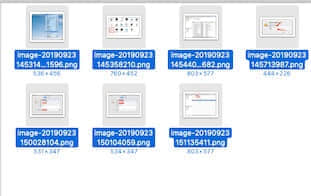
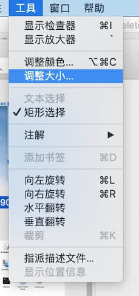
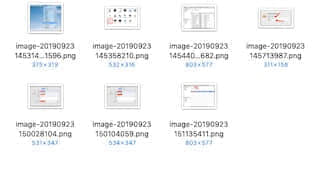
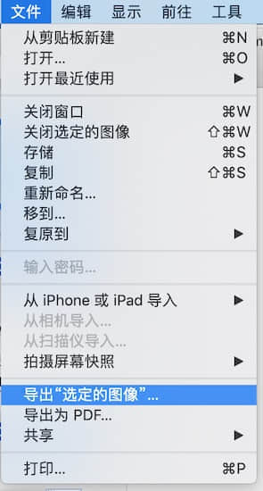
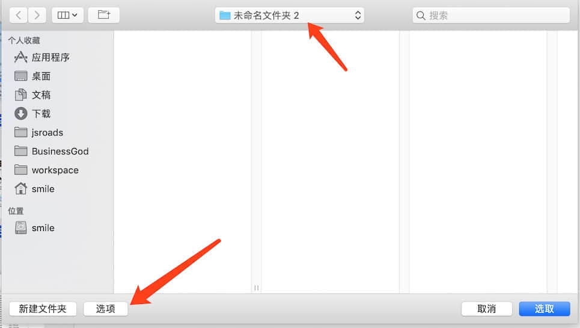

---


title: 简单优化一下个人博客
date: 2019-09-25 14:21:12
categories: "other"
tags:
- Windows
---

个人博客开了一年多，平常大都是发布一下文章，写一下工作的感想，很多文章都用了图片，今天发现我好多图片都是后缀png的，而且尺寸都显得很大，要想然自己的博客文章打开的快速，减少读者的加载是一个工程，另外每个文章写的时候，里面有很多图片，最后都重新替换了，可很难找出那些是没有引用的，于是乎，有了这篇文章。

<!-- more -->

### 优化三部曲

- 更改图片格式，比如后缀为 png的改成JPEG
- 更改图片尺寸。比如原来是1000X600的 可以适当比例缩放
- 删除多余的没有用到的图片

#### 更改格式

- Mac系统自带预览图片可以搞定

因为我文章不多，所以我一个个操作

1. 比如我们这个文章的博客

   

   

2. 我们打开文件夹,全选我们的图片



3. 继续全选我们的图片


4. 

5. 修改我们需要的满意的尺寸 我是按照百分比修改的


6. 我们发现 图片尺寸已经 缩小 



#### 更改格式

1. 前面几步和上面一致，只是在打开编辑的时候选择的是 导出选定的图像
2. 

2. 选择我们要存放的文件夹 和 选项 选择 格式




3. 把生成的图片替换


4. 我们用 Typora 编辑器打开我们的文章 选择查找 --替换 后缀名即可


5.我们发现 可以正常显示我们新的图片了

#### 删除多余的图片

这个我自己去看了 编辑器的设置没有这样的功能，就想着用Python3 自己写个脚本吧

脚本如下：

```python
#!/usr/bin/env -S -P${HOME}/anaconda/bin python
# -*- coding:utf-8 -*-
import re, os
from itertools import chain

blogDirsList = []
img_patten = r'!\[.*?\]\((.*?)\)|'
# 博客文件夹 本地目录指向 source/_posts 源文件
myblogPath = '/jsroads/blog/asroads.github.io/source/_posts'
blogPath = os.path.abspath(myblogPath)
blogfiles = os.listdir(blogPath)
for blogfile in blogfiles:
    # 得到该文件下所有目录的路径
    m = os.path.join(blogPath, blogfile)
    # 判断该路径下是否是文件夹
    if (os.path.isdir(m)):
        h = os.path.split(m)
        # 把符合要求的目录加进去
        blogDirsList.append(os.path.join(blogPath, h[1]))
print("博客目录", blogDirsList)
# 遍历目录地址
mdList = []  # md 文件里引用的图片
pngList = []  # 本地同名文件夹文件的图片
for source_path in blogDirsList:
    if os.path.exists(source_path):
        for parent, dirs, files in os.walk(source_path):
            for file in files:
                file_path = os.path.join(parent, file)
                if os.path.splitext(file)[-1] == ".png" or os.path.splitext(file)[-1] == ".jpeg":  # 获取后缀
                    picUrl = os.path.join(parent, file)
                    pngList.append(picUrl)
                    # print('jsroads',file_path)
                if os.path.splitext(file)[-1] == ".md":  # 获取后缀
                    with open(os.path.join(source_path, file), 'r', encoding='utf-8') as f:  # 使用utf-8 编码打开
                        post = f.read()
                        matches = re.compile(img_patten).findall(post)
                        if matches and len(matches) > 0:
                            # print("jsroads:",matches)
                            # 多个group整合成一个列表
                            for match in list(chain(*matches)):
                                if match and len(match) > 0:
                                    picUrl = os.path.join(parent, match)
                                    mdList.append(picUrl)
        # 对比一下 两个文件夹的不同 删除没有使用的
        for picPath in pngList:
            if picPath not in mdList:
                print("picPath", picPath)
                # 删除 没有使用的素材（这里主要删除图片）
                os.remove(picPath)

```

下面是我的输出：

```json
博客目录 ['/jsroads/blog/asroads.github.io/source/_posts/other', '/jsroads/blog/asroads.github.io/source/_posts/about', '/jsroads/blog/asroads.github.io/source/_posts/life', '/jsroads/blog/asroads.github.io/source/_posts/game', '/jsroads/blog/asroads.github.io/source/_posts/tool']
picPath /jsroads/blog/asroads.github.io/source/_posts/game/Layabox2-0引入puremvc框架/image-20190824183550706.png
picPath /jsroads/blog/asroads.github.io/source/_posts/game/Layabox2-0引入puremvc框架/image-20190824184345625.png
picPath /jsroads/blog/asroads.github.io/source/_posts/game/Layabox2-0引入puremvc框架/image-20190824184445658.png
picPath /jsroads/blog/asroads.github.io/source/_posts/game/LayaBox2-0-圆形进度条制作/image-20190327200707147.png
picPath /jsroads/blog/asroads.github.io/source/_posts/game/Cocos-Creator-引入TweenMax-Uncaught-TypeError-container-appendChild-解决方法/image-20190916104222217.png
picPath /jsroads/blog/asroads.github.io/source/_posts/game/Cocos-Creator-引入TweenMax-Uncaught-TypeError-container-appendChild-解决方法/image-20190916104642302.png
picPath /jsroads/blog/asroads.github.io/source/_posts/game/LayaAir2-0-LayaBox-之小游戏开放域开发/image-20190307202019424.png
picPath /jsroads/blog/asroads.github.io/source/_posts/game/微信小游戏Laya2-0粒子特效实现/image-20190823142029613.jpeg
picPath /jsroads/blog/asroads.github.io/source/_posts/game/微信小游戏Laya2-0粒子特效实现/image-20190823141529866.jpeg
picPath /jsroads/blog/asroads.github.io/source/_posts/game/Layabox2-0引入puremvc框架/image-20190824183550706.png
picPath /jsroads/blog/asroads.github.io/source/_posts/game/Layabox2-0引入puremvc框架/image-20190824184345625.png
picPath /jsroads/blog/asroads.github.io/source/_posts/game/Layabox2-0引入puremvc框架/image-20190824184445658.png
picPath /jsroads/blog/asroads.github.io/source/_posts/game/LayaBox2-0-圆形进度条制作/image-20190327200707147.png
picPath /jsroads/blog/asroads.github.io/source/_posts/game/Cocos-Creator-引入TweenMax-Uncaught-TypeError-container-appendChild-解决方法/image-20190916104222217.png
picPath /jsroads/blog/asroads.github.io/source/_posts/game/Cocos-Creator-引入TweenMax-Uncaught-TypeError-container-appendChild-解决方法/image-20190916104642302.png
picPath /jsroads/blog/asroads.github.io/source/_posts/game/LayaAir2-0-LayaBox-之小游戏开放域开发/image-20190307202019424.png
picPath /jsroads/blog/asroads.github.io/source/_posts/game/微信小游戏Laya2-0粒子特效实现/image-20190823142029613.jpeg
picPath /jsroads/blog/asroads.github.io/source/_posts/game/微信小游戏Laya2-0粒子特效实现/image-20190823141529866.jpeg
picPath /jsroads/blog/asroads.github.io/source/_posts/tool/Webstorm如何配置Layabox2-0项目/image-20190302194904756.png
picPath /jsroads/blog/asroads.github.io/source/_posts/tool/Webstorm如何配置Layabox2-0项目/image-20190302195857734.png
picPath /jsroads/blog/asroads.github.io/source/_posts/tool/如何下载微信公众号的文章和媒体文件/image-20190516123503663.png

```

其实删除多余素材 并不能 加速 用户体验，但是对于自己日常开发要求干净的洁癖还是很重要的，自己试试吧。

### 后记

其实很多事情，有了目标，就朝着这个目标努力，虽然未必能真正做到自己最初的想法，但是起码不会原地不动，至少是开卷有益，有时候还有意外的学习收获。