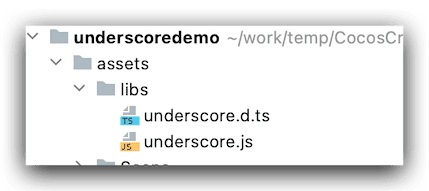
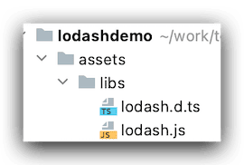

`Lodash` 和 `Underscore` 是非常优秀的当代JavaScript的工具集合框架，它们被前端开发者广泛地使用，不必重复造轮子。且协议开源。江湖传闻，`Lodash`只是`Underscore.js`的一个fork，之后在Underscore.js原有的成功基础上取得了更大的成果，`Lodash`的性能远远的超过了Underscore。下面就简单的介绍一下如何在`Cocos Creator2.4.5`里面使用`Lodash`和`Underscore`。
<!--more-->

## Underscore


### 介绍

#### 官网及介绍

- 英文官网 https://underscorejs.org/
- 中文官网 https://underscorejs.net/ 

截止目前笔者写此文的时候，官网最新版本是 1.13.1

> ## v1.13.1 Downloads *(Right-click, and use "Save As")*
>
> | [ESM (Development)](https://underscorejs.org/underscore-esm.js) | *65.9 KB, Uncompressed with Plentiful Comments* ([Source Map](https://underscorejs.org/underscore-esm.js.map)) |
> | ------------------------------------------------------------ | ------------------------------------------------------------ |
> | [ESM (Production)](https://underscorejs.org/underscore-esm-min.js) | *8.59 KB, Minified and Gzipped* ([Source Map](https://underscorejs.org/underscore-esm-min.js.map)) |
> | [UMD (Development)](https://underscorejs.org/underscore-umd.js) | *68.4 KB, Uncompressed with Bountiful Comments* ([Source Map](https://underscorejs.org/underscore-umd.js.map)) |
> | [UMD (Production)](https://underscorejs.org/underscore-umd-min.js) | *7.48 KB, Minified and Gzipped* ([Source Map](https://underscorejs.org/underscore-umd-min.js.map)) |
> |                                                              |                                                              |
> | [Edge ESM](https://raw.github.com/jashkenas/underscore/master/underscore-esm.js) | *Unreleased, current `master`, use by your own judgement and at your own risk* |
> | [Edge UMD](https://raw.github.com/jashkenas/underscore/master/underscore-umd.js) | *Unreleased, current `master`, use if you’re feeling lucky*  |
>
> ## v1.13.1 CDN URLs *(Use with `<script src="..."></script>`)*
>
> - `https://cdn.jsdelivr.net/npm/underscore@1.13.1/underscore-umd-min.js`
> - `https://cdn.jsdelivr.net/npm/underscore@1.13.1/underscore-esm-min.js`
> - `https://unpkg.com/underscore@1.13.1/underscore-umd-min.js`
> - `https://unpkg.com/underscore@1.13.1/underscore-esm-min.js`
> - `https://pagecdn.io/lib/underscore/1.13.1/underscore-umd-min.js`
> - `https://pagecdn.io/lib/underscore/1.13.1/underscore-esm-min.js`
> - `https://cdnjs.cloudflare.com/ajax/libs/underscore.js/1.13.1/underscore-umd-min.js`
> - `https://cdnjs.cloudflare.com/ajax/libs/underscore.js/1.13.1/underscore-esm-min.js`

#### Cocos Creator结合Underscore

对于`Cocos Creator` 的用户 使用 `umd` 版本的即可，需要文件

- `JavaScript` 类库文件 [underscore-umd.js](https://github.com/jashkenas/underscore/blob/master/underscore-umd.js)（未压缩）或 [underscore-umd-min.js](https://github.com/jashkenas/underscore/blob/master/underscore-umd-min.js)（压缩后）
- `.d.ts` 声明文件 [index.d.ts](https://github.com/DefinitelyTyped/DefinitelyTyped/blob/master/types/underscore/index.d.ts)

### 步骤

#### 新建Cocos Creator项目

1. 新建一个项目`underscoredemo`后，然后在`underscoredemo/assets`下面新建一个 `libs` 文件夹
2. 放入我们上面下载的 类库文件`.js` 和声明文件`.d.ts` ，注意二者名字要保持一致。
3. 例如下面这样：



4. 然后在项目的`HelloWorld.ts`写入测试代码，完整内容如下：

```typescript
import * as _ from "../libs/underscore";

const {ccclass, property} = cc._decorator;

@ccclass
export default class Helloworld extends cc.Component {

    @property(cc.Label)
    label: cc.Label = null;

    @property
    text: string = 'hello';

    start () {
        // init logic
        this.label.string = this.text;
        let array = [1,2,3,4]
        let result =_.first(array)
        console.log("smile----:" + JSON.stringify(result));
    }
}

```

#### 查看输出结果

然后我们运行项目查看结果输出：

```typescript
Cocos Creator v2.4.5
Helloworld.ts:19 smile----:1
```

以上就是如何 在 `Cocos Creator 2.4.5` 版本内引入第三方工具库 `underscore` 的具体步骤。

最后老规矩 放上underscore项目源码地址：[点击进入](https://github.com/jsroads/mylibs/tree/main/underscore)

#### 更多介绍

[underscore-analysis](https://github.com/lessfish/underscore-analysis) 作者的很多文章都值得读一下。

其中：

- [underscore-1.8.3.js 源码](https://github.com/hanzichi/underscore-analysis/blob/master/underscore-1.8.3.js/src/underscore-1.8.3.js)
- [underscore-1.8.3.js 源码解读全文注释版](https://github.com/hanzichi/underscore-analysis/blob/master/underscore-1.8.3.js/underscore-1.8.3-analysis.js)

可以学习一下

## Lodash


### 介绍

#### 官网及介绍

- 英文官网 https://lodash.com/
- 中文官网 https://www.lodashjs.com/
- 自定义构建文档 https://lodash.com/custom-builds

截止目前笔者写此文的时候，官网最新版本是 v4.17.21

Lodash 构建工具比较全面，可以各种定制自己需要的模块和格式，在此不多赘述，具体可以参考上面的 构建文档

这里具体说说，声明文件，我们查看声明文件的时候 发现 Lodash 的声明文件是 很多个文件 集合在一个文件夹里，这个时候虽然不影响使用，但是看起来挺不习惯的，有没有合并后的文件呢，答案是有的。

在线搜索 第三方库声明文件 地址 https://www.typescriptlang.org/dt/search

我们搜索 Lodash 找到这个地址

https://github.com/DefinitelyTyped/DefinitelyTyped/tree/master/types/lodash

这个地址里面 文件如下：

```bash
lodash
├── common
├── fp
├── scripts
├── v3
├── lodash-tests.ts
├── assignIn.d.ts
.....
```

这里提供一个 如何下载 `GitHub` 文件夹的在线地址：[DownGit](https://minhaskamal.github.io/DownGit)

从下载的文件 看到 有个叫做 `scripts` 的文件夹，里面是关于构建的脚本，因我本地 `node`版本比较低，没有尝试该方法

接着我们查看这个 叫做 `v3` 的文件夹 下面内容如下：

```bash
/Users/smile/Downloads/lodash/v3
├── index.d.ts
├── lodash-tests.ts
├── tsconfig.json
└── tslint.json

file: 4
```

其中 `index.d.ts` 就是我们要的 声明文件。用法如下

#### Cocos Creator结合lodash

对于`Cocos Creator` 的用户 使用 `umd` 版本的即可，需要文件

- `JavaScript` 类库文件 我们使用命令生成：

```bash
$ npm i -g npm
$ npm i -g lodash-cli
$ lodash exports=umd
```

- `.d.ts` 声明文件 [index.d.ts](https://github.com/DefinitelyTyped/DefinitelyTyped/blob/master/types/lodash/v3/index.d.ts)

### 步骤

#### 新建Cocos Creator项目

1. 新建一个项目`lodashdemo/assets`后，然后在`lodashdemo/assets`下面新建一个 `libs` 文件夹
2. 放入我们上面下载的 类库文件`.js` 和声明文件`.d.ts` ，注意二者名字要保持一致。
3. 例如下面这样：



4. 然后在项目的`HelloWorld.ts`写入测试代码，完整内容如下：

```typescript
import * as _ from "../libs/lodash";


const {ccclass, property} = cc._decorator;

@ccclass
export default class Helloworld extends cc.Component {

    @property(cc.Label)
    label: cc.Label = null;

    @property
    text: string = 'hello';

    start () {
        // init logic
        this.label.string = this.text;
        let res = _.drop([1, 2, 3], 1);
        let num = _.random(1.2, 5.2);
        console.log("smile----:" + JSON.stringify(res));
        console.log("smile----num:" + JSON.stringify(num));
    }
}

```

#### 查看输出结果

然后我们运行项目查看结果输出：

```typescript
Cocos Creator v2.4.5
Helloworld.ts:20smile----:[2,3]
Helloworld.ts:21smile----num:2.8159920166107595
```

以上就是如何 在 `Cocos Creator 2.4.5` 版本内引入第三方工具库 `lodash` 的具体步骤。

#### 更多关于如何构建项目

> ## Build Types
>
> - Core builds, that are 4 kB, are created using the
>
>   ```javascript
>   core
>   ```
>
>   modifier.
>
>   ```javascript
>   lodash core
>   ```
>
> - Strict builds, with
>
>   ES strict mode 
>
>   enabled, are created using the
>
>   ```javascript
>   strict
>   ```
>
>   modifier.
>
>   ```javascript
>   lodash strict
>   ```
>
> - Modularized builds, with Lodash split into modules, are created using the
>
>   ```javascript
>   modularize
>   ```
>
>   modifier.
>
>   ```javascript
>   lodash modularize
>   ```
>
> ## Build Commands:
>
> - Use the
>
>   ```javascript
>   category
>   ```
>
>   command to pass comma separated categories of functions to include in the build.
>
>   Valid categories are *“array”*, *“collection”*, *“date”*, *“function”*, *“lang”*, *“object”*, *“number”*, *“seq”*, *“string”*, & *“util”*.
>
>   ```javascript
>   lodash category=collection,function
>   ```
>
> - Use the
>
>   ```javascript
>   exports
>   ```
>
>   command to pass comma separated names of ways to export the
>
>   ```javascript
>   lodash
>   ```
>
>   function.
>
>   Valid exports are *“amd”*, *“commonjs”*, *“es”*, *“global”*, *“node”*, *“npm”*, *“none”*, & *“umd”*.
>
>   ```javascript
>   lodash exports=amd,node
>   ```
>
> - Use the 
>
>   ```javascript
>   iife 
>   ```
>
>   command to specify code to replace the
>
>   IIFE
>
>   that wraps Lodash.
>
>   ```javascript
>   lodash iife="\!function(window,undefined)(this)"
>   ```
>
> - Use the 
>
>   ```javascript
>   include
>   ```
>
>   command to pass comma separated names of functions to include in the build.
>
>   ```javascript
>   lodash include=each,filter,map
>   ```
>
> - Use the
>
>   ```javascript
>   minus
>   ```
>
>   command to pass comma separated function/category names to remove from the build.
>
>   ```javascript
>   lodash minus=result,shuffle
>   ```
>
> - Use the
>
>   ```javascript
>   plus
>   ```
>
>   command to pass comma separated function/category names to add to the build.
>
>   ```javascript
>   lodash category=array plus=random,template
>   ```
>
> - Use the
>
>   ```javascript
>   template
>   ```
>
>   command to pass the file path pattern used to match template files to precompile.
>
>   **Note:** Precompiled templates are assigned to the `_.templates` object.
>
>   ```javascript
>   lodash template="./*.jst"
>   ```
>
> - Use the
>
>   ```javascript
>   settings
>   ```
>
>   command to pass template settings used when precompiling templates.
>
>   ```javascript
>   lodash settings="{interpolate:/\{\{([sS]+?)\}\}/g}"
>   ```
>
> - Use the
>
>   ```javascript
>   moduleId
>   ```
>
>   command to specify the AMD module ID for Lodash or the module ID used to include Lodash in compiled templates.
>
>   Use “none” as the module ID to create compiled templates without a dependency on Lodash.
>
>   ```javascript
>   lodash moduleId=underscore
>   ```
>
> ## Notes:
>
> - The `exports` values *“es”* & *“npm”* may only be used in conjunction with the `modularize` command
> - The `modularize` command uses the first `exports` values as its module format, ignoring subsequent values
> - Unless specified by `-o` or `--output` all files created are saved to the current working directory
>
> The following options are also supported:
>
> - `-c`, `--stdout` ................ Write output to standard output
> - `-d`, `--development` ..... Write only the non-minified development output
> - `-h`, `--help` .................... Display help information
> - `-m`, `--source-map` ....... Generate a source map using an optional source map URL
> - `-o`, `--output` ................ Write output to a given path/filename
> - `-p`, `--production` ....... Write only the minified production output
> - `-s`, `--silent` ............... Skip status updates normally logged to the console
> - `-V`, `--version` ............. Output current version of Lodash

最后老规矩 放上lodash项目源码地址：[点击进入](https://github.com/jsroads/mylibs/tree/main/lodash)

### 其他技术相关

[futil-js](https://github.com/smartprocure/futil-js)

## 参考文章

- [你并不需要Underscore/Lodash](https://segmentfault.com/a/1190000004460234)
- [在GitHub 上下载指定的文件夹的两种方法](https://blog.csdn.net/qq_35860352/article/details/80313078)
- [效 率 工 具](http://blog.luckly-mjw.cn/tool-show/index.html)
- [TypeSearch](https://microsoft.github.io/TypeSearch/)
- [DefinitelyTyped](https://github.com/DefinitelyTyped/DefinitelyTyped)
- [lodash.js和underscore.js有什么区别呢？](https://aleenl.github.io/2017/06/23/lodash-js%E5%92%8Cunderscore-js%E6%9C%89%E4%BB%80%E4%B9%88%E5%8C%BA%E5%88%AB%E5%91%A2%EF%BC%9F/)

