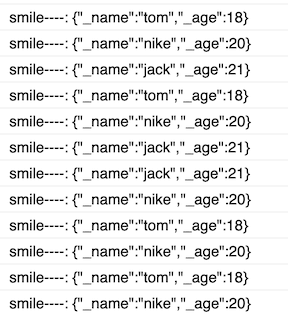

在学习过程中使用TypeScript还是遇到了很多巧妙的解决办法，下面整理一下近期遇到的很多问题，和最后使用的解决方案。有些技巧还是很实用的，节省了很多时间和精力。

<!-- more -->

### 如何在window 下面新添加（声明）一个新属性

我们知道TypeScript是强类型的，随便声明一个变量在全局对象window下就好编辑器报错，尝试若干次失败后，在网上找到了解决方法：

英文问题 [How do you explicitly set a new property on `window` in TypeScript?](https://stackoverflow.com/questions/12709074/how-do-you-explicitly-set-a-new-property-on-window-in-typescript)

```typescript
declare global {
    interface Window { MyNamespace: any; }
}
window.MyNamespace = window.MyNamespace || {};
```

或者:

```typescript
declare interface Window {
  MyNamespace: any;
}

window.MyNamespace = window.MyNamespace || {};
```


### 当我使用 JavaScript 文件时，为什么我会得到 error TS5055: Cannot write file 'xxx.js' because it would overwrite input file 错误？

> 对于 TypeScript 文件来说，在默认情况下，编译器将在同一目录中生成与 JavaScript 相同文件名的文件。因为 TypeScript 文件与编译后的文件总是拥有不同的后缀，这么做是安全的。然而，如果你设置 `allowJs` 编译选项为 `true` 和没有设置任何的编译输出属性（`outFile` 和 `outDir`），编译器将会尝试使用相同的规则来编译文件，这将导致发出的 JavaScript 文件与源文件具有相同的文件名。为了避免意外覆盖源文件，编译器将会发出此警告，并跳过编写输出文件。
>
> 有多种方法可以解决此问题，但所有这些方法都涉及配置编译器选项，因此建议你在项目根目录中的 tsconfig.json 文件来启用此功能。如果你不想编译 JavaScript 文件，你只需要将 `allowJs` 选项设置为 `false`；如果你确实想要包含和编译这些 JavaScript 文件，你应该设置 `outDir` 或者 `outFile` 选项，定向到其他位置，这样他们就不会与源文件冲突。如果你仅仅是想包含这些 JavaScript 文件，但是不需要编译，设置 `noEmit` 选项为 `true` 可以跳过编译检查。

参考链接 [`tsconfig.json` 的行为](https://jkchao.github.io/typescript-book-chinese/faqs/tsconfig-behavior.html)

### 如何监听一个对象所有属性的变化

```javascript
const handler = {
  get(target, prop) {
    try {
      // 还有比这更简洁的递归吗
      return new Proxy(target[prop], handler);
    } catch (error) {
      return target[prop]; // 或者是Reflect.get
    }
  },

  set(target, prop, newVal) {
    const oldVal = target[prop];
    if (oldVal !== newVal) {
      console.warn(oldVal, newVal);
    }

    target[prop] = newVal;
    
    return true;
  },
};

obj = new Proxy(obj, handler);
```

参考链接：https://juejin.im/post/5cc68feef265da036c57940a

改造版本：

```typescript
export const ProxyChangeHandler = {
    key:"",
    get(target, prop) {
        try {
            // 还有比这更简洁的递归吗
            let proxyHandler = Object.assign({},ProxyChangeHandler);
            proxyHandler.key = this.key;
            return new Proxy(target[prop], proxyHandler);
        } catch (error) {
            return target[prop]; // 或者是Reflect.get
        }
    },
    set(target, prop, newVal) {
        const oldVal = target[prop];
        if (oldVal !== newVal) {
            // console.log("target", JSON.stringify(target));
            // console.log("prop", JSON.stringify(prop));
            console.log("prop", JSON.stringify(this.key));
            console.warn(oldVal, newVal);
            LocalStorage.setItem(this.key,GameData.i[this.key]);
        }
        target[prop] = newVal;
        return true;
    },
};

//调用
  get user(): UserVO {
        if(!this._user){
            let userProxyHandler = Object.assign({},ProxyChangeHandler);
            userProxyHandler.key = GameStorageKeys.USER;
            this._user = new Proxy(new UserVO(),userProxyHandler);
        }
        return this._user;
    }
    set user(value: UserVO) {
        this._user = value;
    }
    private _user:UserVO =  null
```

### Number.MIN_VALUE小知识

Number.MIN_VALUE 属性表示在 JavaScript 中所能表示的最小的正值。

MIN_VALUE 属性是 JavaScript 里最接近 0 的正值，而不是最小的负值。

MIN_VALUE 的值约为 5e-324。小于 MIN_VALUE ("underflow values") 的值将会转换为 0。

因为 MIN_VALUE 是 Number 的一个静态属性，因此应该直接使用： Number.MIN_VALUE， 而不是作为一个创建的 Number 实例的属性。

```javascript
console.log(Number.MIN_VALUE > 0)
console.log(Number.MIN_VALUE)
```

输出:

```javascript
true
5e-324
```

参考:[Number.MIN_VALUE](https://developer.mozilla.org/zh-CN/docs/Web/JavaScript/Reference/Global_Objects/Number/MIN_VALUE)

### Typescript(泛型)单例

我自己实现两种
A 方案:

```typescript
export default class BaseSigleton{
    static get i() {
        if(!this._i)this._i = new this();
        return this._i;
    }
    private static _i;
}
```

B 方案：

```typescript
export default class BaseSigleton{
    static i<T extends {}>(this: new () => T): T {
        if(!(<any>this)._i){
            (<any>this)._i = new this();
        }
        return (<any>this)._i;
    }
    private static _i;
}
```

继承

```typescript
import BaseSigleton from "./BaseSigleton";

export default class TestChild extends  BaseSigleton{
    say(){
        console.log("----:", JSON.stringify("Hello"));
    }
}
```

调用方法:
A 方案：

```typescript
TestChild.i.say()
```

```typescript
TestChild.i().say()
```

B方案：

结果输出:

```typescript
----: "Hello"
```

个人感觉 更喜欢 A方案 无括号的版本 B方案应该是比较经典的 单例方法

参考 https://my.oschina.net/u/816723/blog/3009556


### 自定义一个简单的循环数组

代码:

```typescript
/**
 * Created by jsroads on 2020/9/3.3:15 下午
 * Note:循环数组
 */
export default class LoopArray<T> extends Array {
    /*当前索引*/
    get loopIdx(): number {
        return this._loopIdx;
    }

    set loopIdx(value: number) {
        this._loopIdx = value;
    }

    /*当前索引*/
    private _loopIdx: number = 0;

    constructor(...args) {
        super(...args);
        //参考地址：
        //https://www.jstips.co/zh_cn/javascript/make-easy-loop-on-array/
        //https://blog.csdn.net/generalfyx/article/details/103010799
      	//https://segmentfault.com/a/1190000010774159
        Object.setPrototypeOf(this, LoopArray.prototype);
    }

    /**
     * 返回当前的元素
     */
    current(): T {
        if (this.loopIdx < 0) {// 第一次检查
            this.loopIdx = this.length - 1;// 更新 loopIdx
        }

        if (this.loopIdx >= this.length) {// 第二次检查
            this.loopIdx = 0;// 更新 loopIdx
        }

        return this[this.loopIdx];//返回元素
    }

    /**
     * 增加 loopIdx 然后返回新的当前元素
     */
    next(): T {
        this.loopIdx++;
        return this.current();
    }

    /**
     * 减少 loopIdx 然后返回新的当前元素
     */
    prev(): T {
        this.loopIdx--;
        return this.current();
    }
}
```

再自定义一个类:`TestAnimal.ts`

```typescript
/**
 * Created by jsroads on 2020/9/3.7:59 下午
 * Note:
 */
export default class TestAnimal{
    get name(): string {
        return this._name;
    }

    set name(value: string) {
        this._name = value;
    }

    get age(): number {
        return this._age;
    }

    set age(value: number) {
        this._age = value;
    }
    private _name:string;
    private _age:number;
}
```

调用:

```typescript
        let loopArray:LoopArray<TestAnimal> = new LoopArray<TestAnimal>();
        let  test1 = new TestAnimal();
        test1.name = "tom";
        test1.age = 18;
        let  test2 = new TestAnimal();
        test2.name = "nike";
        test2.age = 20;
        let  test3 = new TestAnimal();
        test3.name = "jack";
        test3.age = 21;
        loopArray.push(test1, test2,test3);
        let a:TestAnimal;
        a = loopArray.current();
        console.log("smile----:", JSON.stringify(a));
        a =loopArray.next();
        console.log("smile----:", JSON.stringify(a));
        a =loopArray.next();
        console.log("smile----:", JSON.stringify(a));
        a =loopArray.next();
        console.log("smile----:", JSON.stringify(a));
        a =loopArray.next();
        console.log("smile----:", JSON.stringify(a));
        a =loopArray.next();
        console.log("smile----:", JSON.stringify(a));
        a =loopArray.pop();
        console.log("smile----:", JSON.stringify(a));
        a =loopArray.prev();
        console.log("smile----:", JSON.stringify(a));
        a =loopArray.prev();
        console.log("smile----:", JSON.stringify(a));
        a =loopArray.prev();
        console.log("smile----:", JSON.stringify(a));
        a =loopArray.prev();
        console.log("smile----:", JSON.stringify(a));
        a =loopArray.prev();
        console.log("smile----:", JSON.stringify(a));
```

输出:



思考点:ES6中的Array原生类的继承在TS中无法实现了，子类定义的方法不见丢失

参考:https://blog.csdn.net/generalfyx/article/details/103010799

> 在项目中发现，ES6中的Array原生类的继承在TS中无法实现了，子类定义的方法不见丢失了，代码编译后其实发生了变化（在2.1.5之后），至于为什么会发生这种现象，
>
> miscrosoft给出的解释是
>
> > In ES2015, constructors which return an object implicitly substitute the value of this for any callers of super(...). It is necessary for generated constructor code to capture any potential return value of super(...) and replace it with this.
> >
> > As a result, subclassing Error, Array, and others may no longer work as expected. This is due to the fact that constructor functions for Error, Array, and the like use ECMAScript 6's new.target to adjust the prototype chain; however, there is no way to ensure a value for new.target when invoking a constructor in ECMAScript 5. Other downlevel compilers generally have the same limitation by default.
>
>  简而言之就是es6中，Error， Array和其他原生类的extends需要通过super调用来完成原型链的继承，而其中最关键的一步是通过调用构造函数的target来寻找原型链，而在es5中，没法确保构造函数的target，也就无法完整查找到当前的子类的构造函数的原型实例，从而只实现父类的继承，只会返回父类this，但是原型链确断裂了。关于new.target的了解，可以跳转[MDN](https://developer.mozilla.org/zh-CN/docs/Web/JavaScript/Reference/Operators/new.target)的介绍。
>
> 解决办法
>
> 虽然TS无法为我们实现继承，但是我们可以自己为子类实现原型的继承，这样子类依然有我们子类的方法。原理呢还是利用es5的组合继承。
>
> 在子类的构造函数中调用完父类后，再把原型链指回自身。
>
> ```typescript
> constructor(m: string) {
>         super(m);
>         // Set the prototype explicitly.
>         Object.setPrototypeOf(this, FooError.prototype);
>     }
> ```
>
> 这样，在在子类上定义的方法就不会丢失，因为我们又把原型指回了子类。

这样 就可以 不断的使用这个循环数组了

### 接口有必填选项 其他动态或者可选

对于一个表示开发者的 Developer 接口来说，我们希望它的 name 属性是必填，而 age 属性是可选的，此外还支持动态地设置字符串类型的属性。针对这个需求我们可以这样做：

```typescript
interface Developer {
  name: string;
  age?: number;
  [key: string]: any
}

let developer: Developer = { name: "semlinker" };
developer.age = 30;
developer.city = "XiaMen";
```

其实除了使用 **索引签名** 之外，我们也可以使用 TypeScript 内置的工具类型 `Record` 来定义 Developer 接口：

```typescript
// type Record<K extends string | number | symbol, T> = { [P in K]: T; }
interface Developer extends Record<string, any> {
  name: string;
  age?: number;
}

let developer: Developer = { name: "semlinker" };
developer.age = 30;
developer.city = "XiaMen";
```

参考链接:https://segmentfault.com/a/1190000023858355

