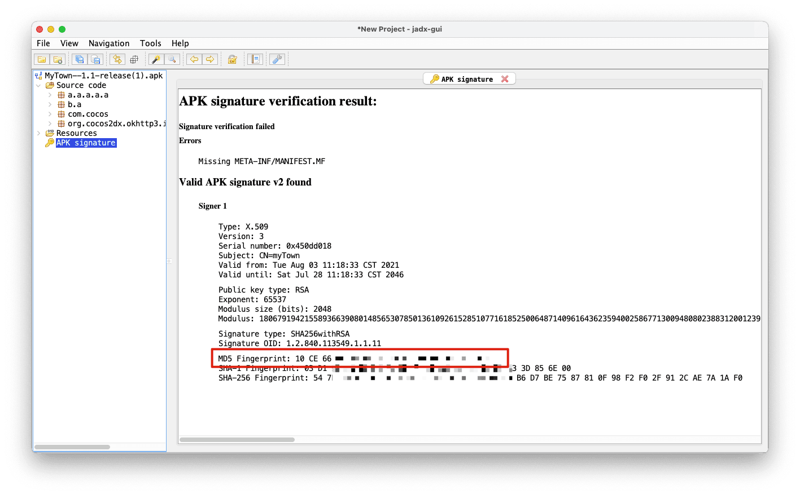
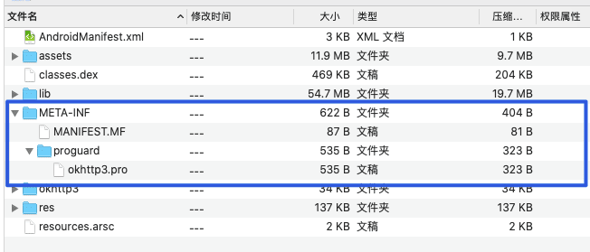
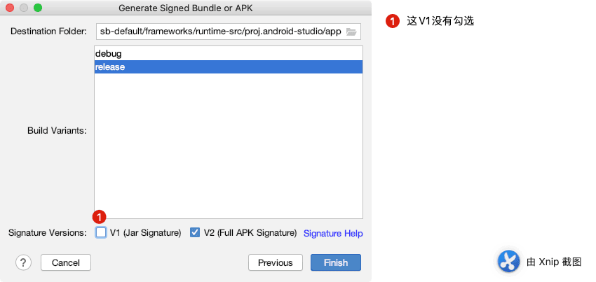

之前的文章内已经介绍了不少的关于Android环境下出Apk 包遇到的各种填坑操作，以及一些设置小技巧，但坑是未知的，今天又踩一个坑，这次的问题是和电脑环境有关的。于是下面记录一下。
<!--more-->

## 如何查看APK的MD5签名

正常来讲我们都知道，想查看APK 的MD5签名，一般是两种办法，一种是直接对我们的Android签名文件**keystore**操作，另外一种是对我们已经构建成功的Release包操作。

### 利用项目的 keystore （jks）文件

```bash
keytool -list -v -keystore  xxx.keystore
```

或者 （后缀不同而已）

```bash
 keytool -v -list -keystore xxx.jks
```

正常来讲 我们期待的结果是：


从输出的内容看到：`MD5: XXXXXXX` 就是我们要的签名内容。

### 通过CERT.RSA文件查询MD5签名

#### 解压构建的Apk得到RSA文件

 APK以zip文件方式打开，在\META-INF\目录中存在一个.RSA后缀的文件，一般名为CERT.RSA。

#### 使用keytool命令获取MD5签名

```bash
keytool -printcert -file CERT.RSA
```


## 意外情况无法显示MD5

### MD5不显示

无论是上面哪一种情况都是这样：只有SHA1和SHA256，看不到有MD5，此时我一度怀疑是不少我的签名文件生成的有问题。后面才知道原来和环境有关，后面让同事在他电脑上用同样的命令就显示成功了！


解决办法：网上先去搜索了是不是MD5 在高版本下，就被废弃什么的，无果，后面就搜了遇到的问题，还真有前人遇到和解决了，下面的评论也讨论了原因。文章链接：[jdk10.0.1使用keytool -v -list -keystore xxx.jks拿不到Md5值](https://blog.csdn.net/androidzmm/article/details/80814913)

摘抄评论：


### 查询知识

后面找从事`Android`相关的朋友帮忙询问得知原来：高版本java 移除了 这些  [Disable MD5 or MD2 signed jars](https://www.java.com/en/configure_crypto.html#disableMD5)

https://www.java.com/en/jre-jdk-cryptoroadmap.html

| 2017-04-18 | [8u131 b11](http://www.oracle.com/technetwork/java/javase/8u131-relnotes-3565278.html), [7u141 b11](http://www.oracle.com/technetwork/java/javaseproducts/documentation/javase7supportreleasenotes-1601161.html#R170_141), [6u151 b10](http://www.oracle.com/technetwork/java/javase/documentation/overview-156328.html#R160_151), [R28.3.14](https://docs.oracle.com/cd/E15289_01/JRRLN/newchanged.htm#GUID-64B46D62-4B59-42F8-831D-8D9A422F10E6) | MD5  | JAR files signed with MD5 algorithms are treated as unsigned JARs. | [Disabling MD5 signed jars](https://www.java.com/en/configure_crypto.html#disableMD5) | 2017-04-18 Released2016-12-08 Target date changed from 2017-01-17 to 2017-04-182016-10-24 Testing instructions added2016-09-30 Announced |
| ---------- | ------------------------------------------------------------ | ---- | ------------------------------------------------------------ | ------------------------------------------------------------ | ------------------------------------------------------------ |
|            |                                                              |      |                                                              |                                                              |                                                              |

好吧，于是输出了一下我的本地java环境：

```bash
smile@bogon ~ %  java -version
java version "15.0.1" 2020-10-20
Java(TM) SE Runtime Environment (build 15.0.1+9-18)
Java HotSpot(TM) 64-Bit Server VM (build 15.0.1+9-18, mixed mode, sharing)
smile@bogon ~ %
```

至此，一切真相终于浮出水面，扑所迷离的问题，终于弄明白啦。本文完毕了。

### 2021年8月4日更新

1. 后面经过寻找终于找到了一个 可以查看 MD5的神器，[jadx](https://github.com/skylot/jadx)

2. 目前最新的版本是：

> ### Download
>
> - release [v1.2.0](https://github.com/skylot/jadx/releases/tag/v1.2.0)
> - latest [unstable build](https://nightly.link/skylot/jadx/workflows/build/master)

3. 运行使用jadx-gui

   ```bash
   jadx-gui /Users/smile/Downloads/test.apk
   ```

   

   以上，就是如何查看 APK的 MD5签名。

### 拓展

### .jks 和 .keystore 的区别

二者都是用来打包的，并保证应用的唯一性！

最大的区别在于：

> keystore 是 Eclipse 打包生成的签名。
> jks 是 Android studio 生成的签名！

备注：很多第三方市场，上传 apk 时，只支持 keystore（目前我没遇到过），需要把 .jks 签名转化为 .keystore

### 标准 keystore (standard jdk keystore types)

包括 `JCEKS`，`JKS`，`PKCS12` 这几种格式。

#### 区别：

jceks : 存储对称密钥（分组密钥、私密密钥）
jks : 只能存储非对称密钥对（私钥 + x509公钥证书）
pkcs12 ： 通用格式（rsa公司标准）。微软和java 都支持。

### Android 中 keystore 生成方式

#### 第一种： 使用 Eclipse 或者 Android Studio

生成步骤在这里不做详细介绍，有兴趣的朋友可以自己查找资料。

#### 第二种：利用JDK下的keytool工具生成

keytool 位于 `..\Java\jdk1.8.0_144\bin` 目录下，
需要先安装jdk，配置环境变量后在命令窗口中使用如下命令：

```shell
keytool -genkey -alias android.keystore -keyalg RSA -validity 20000 -keystore android.keystore
```

## keytool 学习参考

### keytool 命令

```shell
smile@smiledeMacBook-Pro key % keytool
密钥和证书管理工具

命令:

 -certreq            生成证书请求
 -changealias        更改条目的别名
 -delete             删除条目
 -exportcert         导出证书
 -genkeypair         生成密钥对
 -genseckey          生成密钥
 -gencert            根据证书请求生成证书
 -importcert         导入证书或证书链
 -importpass         导入口令
 -importkeystore     从其他密钥库导入一个或所有条目
 -keypasswd          更改条目的密钥口令
 -list               列出密钥库中的条目
 -printcert          打印证书内容
 -printcertreq       打印证书请求的内容
 -printcrl           打印 CRL 文件的内容
 -storepasswd        更改密钥库的存储口令
 -showinfo           显示安全相关信息

使用 "keytool -?, -h, or --help" 可输出此帮助消息
使用 "keytool -command_name --help" 可获取 command_name 的用法。
使用 -conf <url> 选项可指定预配置的选项文件。
```

```shell
smile@smiledeMacBook-Pro key % keytool -genkey --help
keytool -genkeypair [OPTION]...

生成密钥对

选项:

 -alias <alias>          要处理的条目的别名
 -keyalg <alg>           密钥算法名称
 -keysize <size>         密钥位大小
 -groupname <name>       组名。例如，椭圆曲线名称。
 -sigalg <alg>           签名算法名称
 -dname <name>           唯一判别名
 -startdate <date>       证书有效期开始日期/时间
 -ext <value>            X.509 扩展
 -validity <days>        有效天数
 -keypass <arg>          密钥口令
 -keystore <keystore>    密钥库名称
 -storepass <arg>        密钥库口令
 -storetype <type>       密钥库类型
 -providername <name>    提供方名称
 -addprovider <name>     按名称 (例如 SunPKCS11) 添加安全提供方
   [-providerarg <arg>]    配置 -addprovider 的参数
 -providerclass <class>  按全限定类名添加安全提供方
   [-providerarg <arg>]    配置 -providerclass 的参数
 -providerpath <list>    提供方类路径
 -v                      详细输出
 -protected              通过受保护的机制的口令

使用 "keytool -?, -h, or --help" 可输出此帮助消息
```

例如:

```shell
keytool -genkey -v -keystore ysx-release-key.jks -keyalg RSA -keysize 2048 -validity 36500 -alias alias_ysx
```

### 说明

- -keystore ysx-release-key.jks （ysx-release-key.jks  签名文件名字）
- -keyalg RSA （密钥算法名称 为 RSA）
- -keysize 2048 （密钥位大小 为 2048）
- -validity 36500 （有效期为36500天）
- -alias alias_ysx （别名为 alias_ysx ）

```shell
keytool -genkey -alias android-alias -keypass 998866 -keyalg RSA -keysize 2048 -validity 36500 -keystore D:android-key-store.keystore -storepass 998866
```

- -keypass 后面 证书密码
- -storepass 998866 自定义密码

### 常用操作

#### 命令查看 keystore

```shell
keytool -list -v -keystore kotlin.keystore（要查看的keystore,也可以是 kotlin.jks）
```

#### 命令修改 keystore

##### 修改 keystore 密码：

```shell
keytool -storepasswd -keystore kotlin.keystore     (要修改的keystore)
```

执行后提示输入当前密码，新密码以及新密码确认

##### 修改 keystore 别名：

```shell
keytool -changealias -keystore kotlin.keystore(要改别名的keystore) -alias my_name(旧的别名) -destalias androiddebugkey(新的别名)
```

这个命令会先后提示输入 keystore 的密码和当前 alias 的密码。

##### 修改alias(别名的密码)

```shell
keytool -keypasswd -keystore kotlin.keystore(要修改的keystore) -alias androiddebugkey(别名)
```

执行后会提示输入keystore 密码 , alias 密码, 然后输入新的密码。

#### 查看 apk 的 keystore 信息（三方应用或是系统应用签名）

- 将apk重命名为`.rar` 文件，解压并找到 `META-INF` 目录；
- 在`META-INF` 文件夹下，shift+右键->点击 在此处打开命令窗口；
- 输入命令行 ：

```shell
keytool -printcert -file CERT.RSA 
```

## android 默认 debug.keystore

使用Android Studio 运行或测试我们的app， 它使用一个默认的`debug.keystore`进行签名。

### 默认debug.keystore的信息

```shell
keystore名字:debug.keystore
别名:androiddebugkey
keystore密码: android
alias别名密码: android
```

## Android 安装包没有签名文件问题

内容简介：当使用Android studio 打好一个release 包，上传到市场平台的时候，却被提示解析失败，没有签名文件，把打好的包改成zip格式，解压看了一下



确实签名文件应该在META-INF文件夹下，后缀名是.RSA的文件，确实是没有。

查看了一下自己的打包过程，发现了一个小问题



V2这种签名方案是 [Android](http://www.codercto.com/category/android.html) 7.0引入的，它能提供更快的应用安装时间和更多针对未授权 APK 文件更改的保护。具体请看 [这里](https://developer.android.google.cn/about/versions/nougat/android-7.0#apk_signature_v2) 。V1适用于所有android版本的机型，但在Android7.0及以上会缺少针对未授权 APK 文件更改的保护；只勾选V2，Android7.0以下的机型会报错，所以这里建议同时勾选V1，V2，以适用所有机型。

效果示意图

```shell
 keytool -genkey -alias jjpoker-release-key.jks -keyalg RSA -validity 36500 -keystore jjpoker-release-key.jks -deststoretype pkcs12
```


```shell
 keytool -list -v -keystore jjpoker-release-key.jks
```


## 参考

- [jdk10.0.1使用keytool -v -list -keystore xxx.jks拿不到Md5值-CSDN](https://blog.csdn.net/androidzmm/article/details/80814913)
- [Mac Android显示SHA1和MD5值并生成签名文件打包APK-CSND](https://blog.csdn.net/csdn_aiyang/article/details/77991642)
- [如何查看APK的MD5签名-简书](https://www.jianshu.com/p/76c566e57eb3)

- [为您的应用签名](https://developer.android.com/studio/publish/app-signing?hl=zh-cn)
- [Android studio 改为release版本后提示没有签名，无法安装](https://blog.csdn.net/pxcz110112/article/details/81662570)
- [Android打包流程](https://www.jianshu.com/p/7d2def9b93a8)

