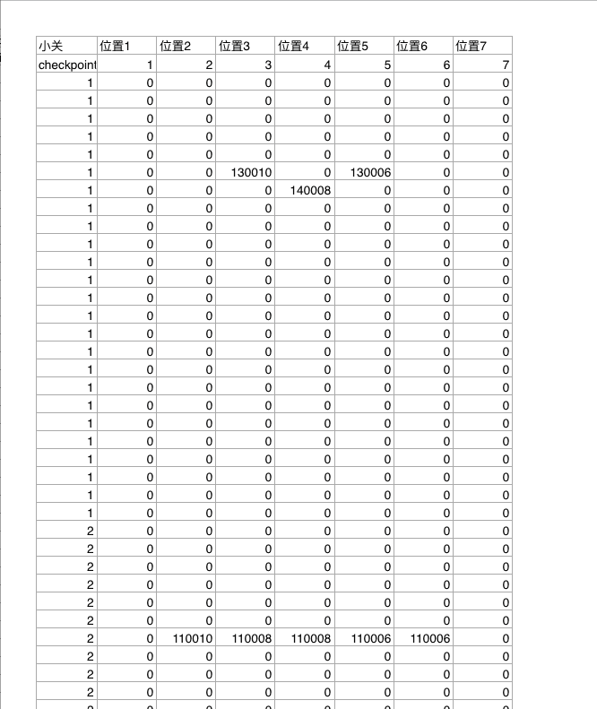
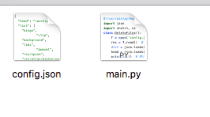

开发小游戏差不多四个月左右了，中间一直忙碌，很少有闲余时间来总结一下所感所想，今天就说说游戏里面怎么配置数据的，以前做Flash游戏的时候，那时候页游兴起，大家都用xml 作为配置文件，等到了手游时代 很多开始用json 和MySQL数据库作为配置读取文件，做小游戏之前遇到了xml 被拒绝的事情，所以我们的游戏采取了json的配置。下面就简单的说说怎么用Python读取Excel 然后保存成json格式的。

<!-- more -->

### 环境准备

- Python3环境
- 安装 Excel相关的库 xlrd
- Pycharm 编辑器（你也可以选择其他的编辑器）

### 读取 单元格输出正常的JSON

第一个是比较常规的格式：


生成的 样式是 ：


直接上代码：

```python
#!/usr/bin/python3
# -*- coding: utf-8 -*-
from __future__ import unicode_literals
import xlrd
import warnings
from collections import OrderedDict
import json
import codecs
import os
import platform
import importlib, sys
importlib.reload(sys)
warnings.filterwarnings("ignore")
# warnings.filterwarnings("utf8")

def getValue(sheet,i,j):
    ctype = sheet.cell(i,j).ctype
    value = sheet.cell_value(i,j)
    if isinstance(value, str):
        value = value
    else:
        if ctype == 2 and value % 1 == 0:
            value = int(value)
    return value

def excel2json(excelPath, path, fileName):
    wb = xlrd.open_workbook(excelPath)

    convert_list = []
    for sheetNo in range(0, len(wb.sheets())):
        sheetName = wb.sheet_by_index(sheetNo).name
        sh = wb.sheet_by_index(sheetNo)
        title = sh.row_values(1)
        result = {}

        for rownum in range(2, sh.nrows):
            rowvalue = sh.row_values(rownum)
            single = OrderedDict()
            key = getValue(sh,rownum,0)

            for colnum in range(0, len(rowvalue)):
                single[title[colnum]] =  getValue(sh,rownum,colnum)
            result[key] = single

        # print(result)
        j = json.dumps(result,ensure_ascii=False)
        jsonPath = "%s/%s.json" %(path,sheetName)
        print(jsonPath)
        with codecs.open(jsonPath, "w", "utf-8") as f:
            f.write(j)

def export(path):
    for filename in os.listdir(path):
        print(filename)
        if filename == "map.xlsx":
            continue
        if os.path.splitext(filename)[1] == '.xlsx':
            xlsxPath = "%s/%s" %(path,filename)
            excel2json(xlsxPath,path,filename)


def move2json():
    sysstr = platform.system()
    cmd = "mv -f ./*.json ../bin/json"
    if(sysstr =="Windows"):
        cmd = "move ./*.json ../bin/json"
    elif(sysstr == "Linux"):
        print ("Call Linux tasks")
    else:
        print ("Other System tasks")
    os.system(cmd)

if __name__ == "__main__":

    pathname = os.path.dirname(os.path.realpath(__file__))
    print("pathname:"+pathname)
    if len(pathname):
        os.chdir(pathname)
    export(pathname)
    move2json()


```

### 稍微复杂的导出

我们在做地图的时候，需要让策划更容易配出地图的位置和坐标，我们需要对策划配置的格子做一些修改，让生成的json文件足够小，于是在上面的基础上做了修改：



其中第一列 代表的是 地图的id 比如是1 就是第一张地图 上面大于0的都是有怪物的，为0的 表示空，其中大于0 的数字，前两位代表 怪物的类型，我们是从10 开始的，后面的数字代表血量，这样我们就知道怪物在地图上的坐标，类型，血量，然后根据信息数据去初始化。

```json
{
  "1": [
    [
      0,
      0,
      0,
      0,
      0,
      0,
      0
    ],
    [
      0,
      0,
      0,
      0,
      0,
      0,
      0
    ],
    [
      0,
      0,
      0,
      0,
      0,
      0,
      0
    ],
    [
      0,
      0,
      0,
      0,
      0,
      0,
      0
    ],
    [
      0,
      0,
      0,
      0,
      0,
      0,
      0
    ],
    [
      0,
      0,
      130010,
      0,
      130006,
      0,
      0
    ],
    [
      0,
      0,
      0,
      140008,
      0,
      0,
      0
    ]
  ],
  "2": [
    [
      0,
      0,
      0,
      0,
      0,
      0,
      0
    ],
    [
      0,
      0,
      0,
      0,
      0,
      0,
      0
    ],
    [
      0,
      0,
      0,
      0,
      0,
      0,
      0
    ],
    [
      0,
      0,
      0,
      0,
      0,
      0,
      0
    ],
    [
      0,
      0,
      0,
      0,
      0,
      0,
      0
    ],
    [
      0,
      0,
      0,
      0,
      0,
      0,
      0
    ],
    [
      0,
      110010,
      110008,
      110008,
      110006,
      110006,
      0
    ]
  ]
```

最后贴上代码

```python
# -*- coding=utf-8 -*-
import xlrd
import warnings
from collections import OrderedDict
import json
import codecs
import os
import platform
import importlib, sys
# importlib.reload(sys)
# import imp

importlib.reload(sys)

# sys.setdefaultencoding('utf8')
warnings.filterwarnings("ignore")


def getValue(sheet, i, j):
    ctype = sheet.cell(i, j).ctype
    value = sheet.cell_value(i, j)

    if ctype == 2 and value % 1 == 0:
        value = int(value)

    return value


def excel2json(excelPath, path, fileName):
    wb = xlrd.open_workbook(excelPath)
    for sheetNo in range(0, len(wb.sheets())):
        sheetName = wb.sheet_by_index(sheetNo).name
        sh = wb.sheet_by_index(sheetNo)
        title = sh.row_values(1)
        result = {}
        print("start")
        for rownum in range(2, sh.nrows):
            rowvalue = sh.row_values(rownum)
            single = OrderedDict()
            key = getValue(sh, rownum, 0)
            # print(key)
            if key in result:
                # print("hello")
                my_list = []
                for colnum in range(1, len(rowvalue)):
                    if isinstance(title[colnum], float):
                        myKey = int(title[colnum])
                    else:
                        myKey = title[colnum]
                    single[myKey] = getValue(sh, rownum, colnum)
                    my_list.append(single[myKey])
                # print(my_list)
                result[key].append(my_list)
            else:
                print("one new key:"+str(key))
                result[key] = []
                my_list = []
                for colnum in range(1, len(rowvalue)):
                    if isinstance(title[colnum], float):
                        myKey1 = int(title[colnum])
                    else:
                        myKey1 = title[colnum]
                    single[myKey1] = getValue(sh, rownum, colnum)
                    my_list.append(single[myKey1])
                # print(my_list)
                result[key].append(my_list)
        # j = json.dumps(result,sort_keys=False).decode('unicode_escape')
        # print(result)
        for key in result:
            templist = result[key]
            for x in range(len(templist)-1,-1,-1):
                if max(templist[x]) == 0:
                    templist.pop()
                else:
                    break
        j = json.dumps(result)
        jsonPath = "%s/%s.json" % (path, sheetName)
        print(jsonPath)
        with codecs.open(jsonPath, "w", "utf-8") as f:
            f.write(j)


def export(path):
    for filename in os.listdir(path):
        print(filename)
        # if os.path.splitext(filename)[1] == '.xlsx':
        if filename == 'map.xlsx':
            xlsxPath = "%s/%s" % (path, filename)
            excel2json(xlsxPath, path, filename)


def move2json():
    sysstr = platform.system()
    cmd = "mv -f ./*.json ../bin/json"
    if (sysstr == "Windows"):
        cmd = "move ./*.json ../bin/json"
    elif (sysstr == "Linux"):
        print("Call Linux tasks")
    else:
        print("Other System tasks")
    os.system(cmd)


if __name__ == "__main__":

    pathname = os.path.dirname(os.path.realpath(__file__))
    print("pathname:" + pathname)
    if len(pathname):
        os.chdir(pathname)
    export(pathname)
    move2json()
```

### 删除发布后多余的素材

我们在做小游戏，每次发布都会把bin 目录下的素材 都copy一份到 发布目录，因为微信小游戏对包体有限制，我们便把一些素材放到了服务器远端，这样我们发布后就有一些资源需要删除后才能正常上传，这样反反复复很麻烦，而且维护的小游戏多了，时间久了，容易忘记那些是需要删除的。于是用Python写了一个删除的代码。




其中 删除文件 还是用json作为配置文件  config.json

```json
{
  "head": "/workspace/TankQueen/release/wxgame/",
  "list": [
    "bingo",
	"clip",
    "background",
    "libs",
	"domxml",
    "res/spine",
    "res/atlas/background.atlas",
    "res/atlas/background.png",
    "res/atlas/magic.atlas",
    "res/atlas/magic.png",
	"res/atlas/magic1.png",
    "res/atlas/share.png",
    "res/atlas/share.atlas",
    "res/atlas/skip.atlas",
	"res/atlas/bingo.atlas",
	"res/atlas/bingo.png",
	"res/atlas/dialog.atlas",
	"res/atlas/dialog.png",
	"res/atlas/shop.atlas",
	"res/atlas/shop.png",
	"res/atlas/skip.png"
  ]
}

```

main.py 文件

```python
#!/usr/bin/python3
import json
import shutil, os
class DeleteFiles():
    f = open('config.json', encoding='utf-8')  # 打开‘product.json’的json文件
    res = f.read()  # 读文件
    dict = json.loads(res)["list"]
    head = json.loads(res)["head"]
    print(dict)  # 把json串变成python的数据类型：字典
    for key in dict:
        print(key)
        if "." in key:
            if os.path.exists(head + key):
                os.remove(head + key)
                print("delete file ok")
            else:
                print("file empty")
        else:
            if os.path.exists(head + key):
                shutil.rmtree(head + key)
                print("delete dir ok")
            else:
                print("dir empty")
hello =  DeleteFiles()
print("delete successfully")
```

Python是一门很容易上手的语言，用这个为游戏项目作为辅助，减少了很多麻烦，让开发效率增加很多。希望自己能坚持学习，为自己加油！