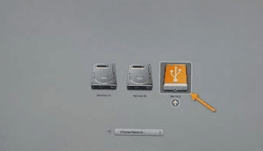
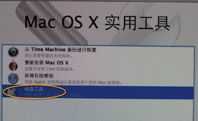
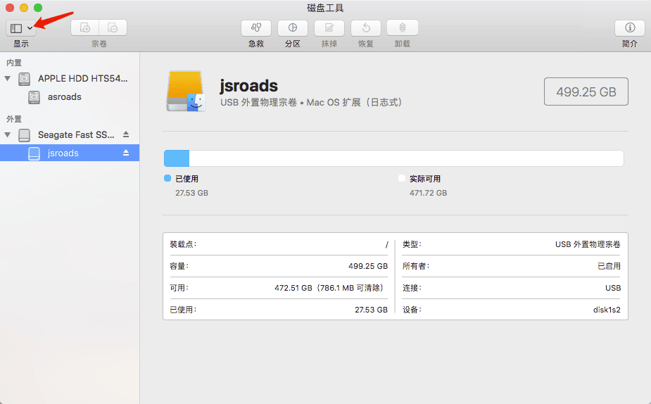
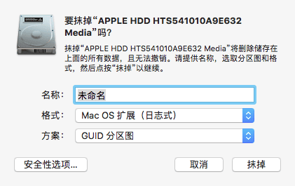

最近换了工作地方，开始用了新的Mac电脑办公，工作讲究效率，于是又买了一个新的固态移动硬盘，这样我需要把系统安装到固态硬盘里，做我的系统，之前安装了很多次Windows系统，Mac系统却很少安装。这次就自己安装一次。

<!-- more -->

### 工具

- U盘 （大于8G）
- 下载的系统 **macOS High Sierra**
- 固态硬盘一个

### U盘系统制作过程

1. 首先我们要把下载好的系统解压，或者自己下载后 放到 “Applications” 目录下面
2. 打开 “应用程序→实用工具→终端”，将下面的一段命令复制并粘贴进去,如要制作 **macOS High Sierra 启动盘**，U盘名称要改成 HighSierra (要与下面命令对应)，拷贝这段命令：

```bash
sudo /Applications/Install\ macOS\ High\ Sierra.app/Contents/Resources/createinstallmedia --volume /Volumes/HighSierra --applicationpath /Applications/Install\ macOS\ High\ Sierra.app --nointeraction
```

3. 回车并执行该命令，这时会提示让你输入管理员密码,然后开始安装。

   

4. 如果最后出现了 “Done”，说明已经安装成功。

5. 注意：我这个截图是 macOS  Catalina 我这出现的是 Install media now available at "/Volumes/Install macOS Catalina"。

### 系统安装过程

1. 重启电脑后，一直按着Option键  直到出现启动菜单选择界面
2. 
3. 开始抹掉电脑硬盘的数据



4，选择 的时候 要注意 选择   扩展(日志式） 下面的 （这个里面要选择所有设备）





5. 抹掉数据之后 开始 返回 去 安装系统
6. 此时 就能选择我们要安装的移动硬盘 作为安装 目录 开始安装 
7. 完成安装！搞定！

###  相关拓展

如要制作 **macOS Catalina 启动盘**，U盘名称要改成「Catalina」(必须与下面命令对应)，然后拷贝这段命令

```bash
sudo /Applications/Install\ macOS\ Catalina.app/Contents/Resources/createinstallmedia --volume /Volumes/Catalina /Applications/Install\ macOS\ Catalina.app --nointeraction
```

如要制作 **macOS Mojave 启动盘**，U盘名称要改成「Mojave」(必须与下面命令对应)，然后拷贝这段命令

```bash
sudo /Applications/Install\ macOS\ Mojave.app/Contents/Resources/createinstallmedia --volume /Volumes/Mojave /Applications/Install\ macOS\ Mojave.app --nointeraction
```

如要制作「**旧版本的 macOS Sierra**」，U盘名称改成 Sierra，拷贝这段命令

```bash
sudo /Applications/Install\ macOS\ Sierra.app/Contents/Resources/createinstallmedia --volume /Volumes/Sierra --applicationpath /Applications/Install\ macOS\ Sierra.app --nointeraction
```

### 参考链接

[制作 macOS Mojave U盘USB启动安装盘方法教程 (全新安装 Mac 系统)](https://www.iplaysoft.com/macos-usb-install-drive.html)

[Mac 用U盘重装系统](https://www.cnblogs.com/saytome/p/7069392.html)

